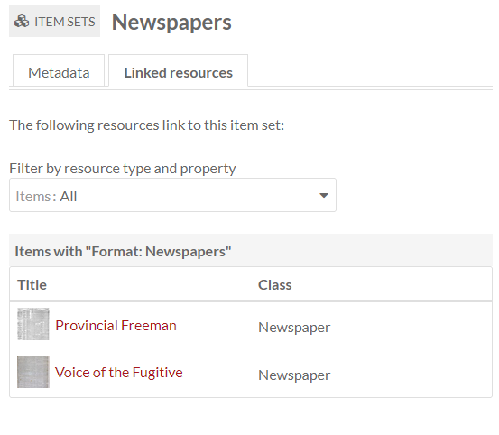
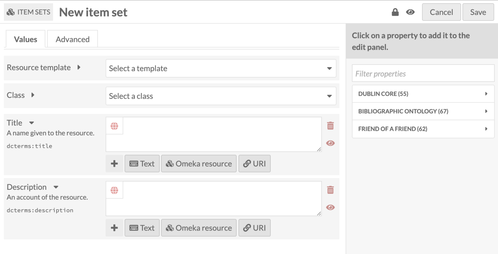
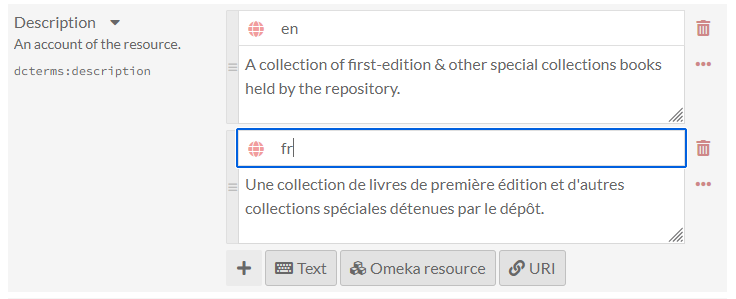
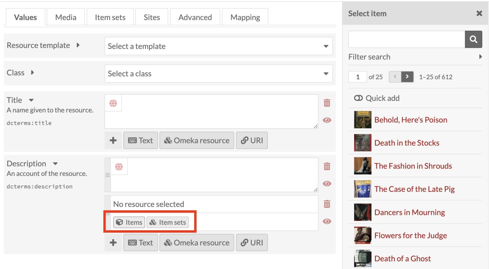
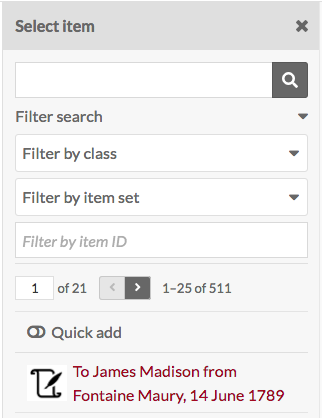
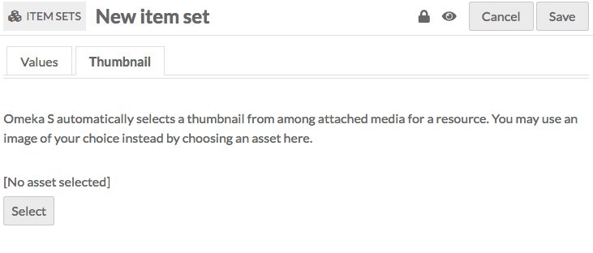
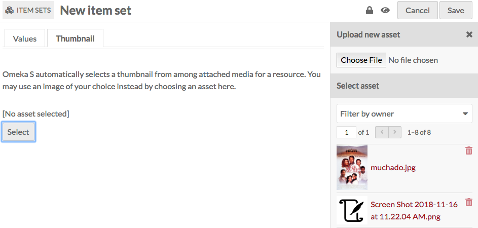
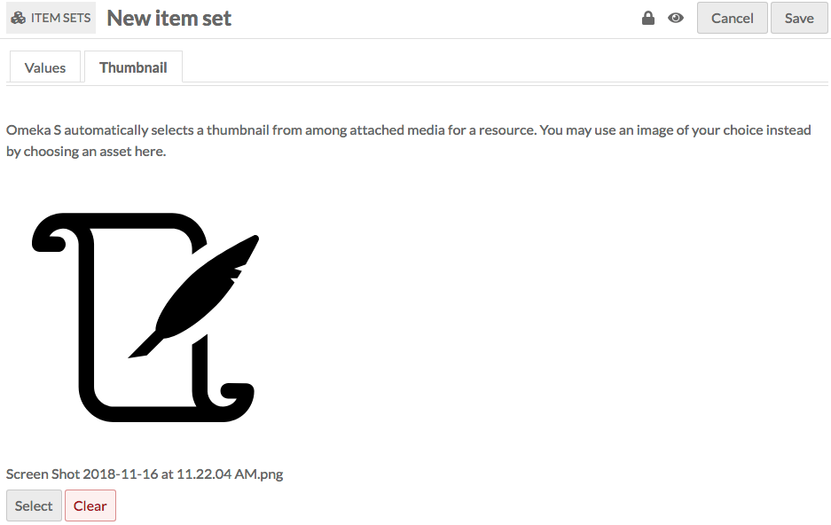
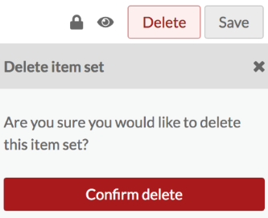
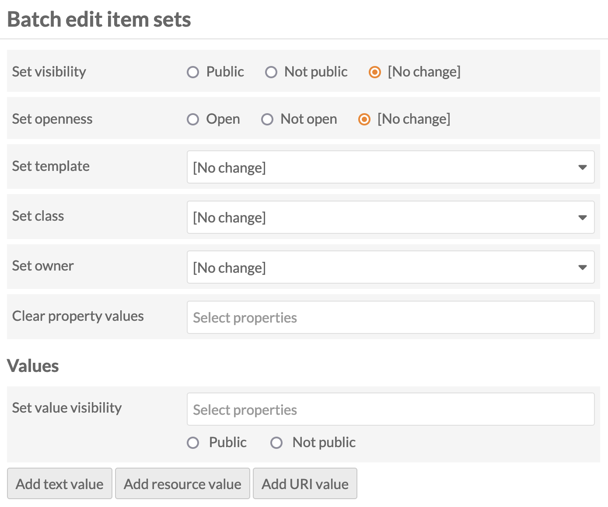

# Item Sets

Item sets are aggregations of items, similar to collections in Omeka Classic. In Omeka S, items may belong to any number of sets, and an item set can have any number of items.

Item Set permissions

When a user creates an item set, they become the "owner" of that item set. Most user levels have the ability to create item sets, and can always delete their own item sets. Only higher levels can delete item sets that others own.

Users can add items to item sets that are open to additions, and the item sets that they own (regardless of their open or closed status). Global Admins and Supervisors can add any items to any item set.

| Category | Permission | Global Admin | Supervisor | Editor | Reviewer | Author | Researcher |
|-----|-----|---|---|---|---|---|---|
| Item sets | Add | Yes | Yes | Yes | Yes | Yes | No |
| | Edit | All | All | All | All | Their own | No |
| | Delete | All | All | All | Their own | Their own | No |
| Value annotations | Add/Edit | Yes | Yes | Yes | Yes | Yes | No |
| Private objects | View | Yes | Yes | Yes | Yes | No | No |

Note that when you change a user's role, for example from an Author to a Researcher, they will still own the item sets they created when they had permission to do so. Item sets are not transferred. Deleting a user orphans their item sets - they will appear as having no owner. Only Global Admins can re-assign ownership of item sets.

## The Item Sets tab

Item sets are managed via the **Item Sets** tab (the icon of three stacked boxes) located in the left navigation of the admin dashboard.

After clicking on the tab, a table appears listing all item sets with:

- the **Title**
- icons to **edit** (pencil), **delete** (trash can), or **details** (ellipsis)
- the item set's **Class**
- the **Owner** of the set
- the date the set was **Created**.

In the top right corner of the Item Sets screen is the "Add new item set" button.

Options for navigating and creating item sets sit in the header of the table of items.

- On the left side are controls for the pages of item sets, with forward and back arrows, and a field to go a specific page of item sets.
- In the center is the button for **Advanced search**.
- On the right are options to re-order the table by **title**, **class**, **owner**, or **date created** in either **ascending** or **descending** order.

## View item sets

To quickly see information about an item set, click on the "Details" button (the ellipsis icon) for the item set on the item sets browse page. This will open a column on the right hand side of the page with the item set’s title, visibility, and number of items.

To view all the information for an item set, click on its name. On the item sets view page, there are tabs to see an item set’s **Metadata** and **Linked Resources**. On the right side of the item set’s view page is information about the date created, owner, and visibility. For item sets, visibility includes both whether the set is private or public and whether other users can add items to the set.

To view the items in an item set, either click on the number of items in the set on the item set browse page, or click the "View items" button in the upper right corner of the individual item set page.

### Linked resources

An item set's **linked resources** are other Omeka resources (items, item sets, or media) that are [linked to this item set through their properties](#omeka-resource). Note that this section only shows resources that have been linked *to* this item set (which have it for a property); resources that are linked *from* this item will display in the property they fill.

Linked resources are grouped by the property for which they use the current item. In the example below, the current item set "Newspapers" is used for the property "Format" for the linked resources.

You can filter linked resources to only display those referencing a specific property using the dropdown "Filter by property". It will only display properties actively in use.

When an item set is viewed on the public site, all linked resources are displayed in a series of tables based on the metadata property in use. Resources are sorted by resource type (item, item set, or media) and only one type is displayed at a time. An item set without any linked resources will not display these tables; item sets displaying on sites that are set to exclude resources that are not included in the site will also not display these entries.

The display of linked resources on resource pages can be configured on each site. Click on "Theme" and then click the button that reads "[Configure resource pages](../sites/site_theme.md#configure-resource-pages)", then decide if and where to display the "Linked resources" tables for each resource.

You can also control whether resources that are linked will display those links even when the resources in question are not added to the given site. Under [Site settings, in the "Show" section](../sites/site_settings.md#show), you will find a checkbox for "Exclude resources not in site."

## Add an item set

To add a new item set, click the **Item Sets** tab from the left-hand navigation of the dashboard. Click the "Add new item set" button on the right hand side of the screen.

By default, a new item set will load with the properties `dcterms:title` and `dcterms:description`. You may add other fields by selecting a property from the list on the right. Browse fields by vocabulary (Dublin Core, Bibliographic Ontology, etc.), or search in the **Filter properties** bar above the list of properties and vocabularies.

Item sets may use the same resource templates available for items to provide pre-selected fields. Common fields for item sets include a short textual description using `dcterms:Description`. This text (only the first entry, if there are multiple description entries) will display on the "Browse item sets" page by default (found at `youromekaurl/site-slug/item-set`). All metadata fields will display when a user views the item set on the public side (found at `youromekaurl/site-slug/item-set/1`, where "1" is the ID of the item set).

You may add other fields by selecting a property from the list on the right. Browse fields by vocabulary (Dublin Core, Bibliographic Ontology, etc.), or search in the **Filter properties** bar above the list of properties and vocabularies.

### Values
You may add text, a resource from the installation, or an external link in each field.  

You can set individual property values as Private or Publicly visible using the eye icon for each value. Note that properties set to private are still visible to Global Admins, Site Admins, and Editors. Authors will be able to see all properties on items they own, but will not see private properties created by other users.

In the image below, the first property (Title) is public as indicated by the open eye icon. The second property (Description) is private as indicated by the slashed-through eye icon. Clicking or hitting enter on the eye icon toggles between public and private.

#### Text

Text fields allow for unformatted text entry. No markup is allowed in these fields (e.g. bold, italic, Markdown, HTML).

You can indicate the language for the content of an input using the globe symbol above the input. Click on the globe to activate a text field, then enter the [ISO 639-1](https://en.wikipedia.org/wiki/List_of_ISO_639-1_codes){target=_blank} code for the language in which the text is written.

#### Omeka resource

These fields create an internal link between the resource you are creating and the resource that fills that field.

You have the option to use either another item or an item set.

Choosing a resource type will open a side drawer where you can browse all of those resources in the installation. You can use the search function at the top of the drawer to narrow down the list or to quickly find a specific item or item set.

Once you select an item or item set, detailed information will load, and you must click "Select resource" to finish linking the resources. You can also click the "X" button in the upper right-hand corner to go back to the list of items or item sets.

If you are using an Item resource for the property, you will have additional options for finding the item you want in the drawer. Open these options by clicking the triangle button next to the phrase "Filter search".

This will open a menu below the button with the following options to filter the items in the drawer:

- Filter by class: a dropdown where you can select any class provided by the vocabularies on the installation
- Filter by item set: a dropdown where you can limit the items displayed in the drawer to only those associated with a particular item set
- Filter by item ID: a search field where you can input the ID of the item you want to use. You can find an item's ID in the URL of its edit page; if you are editing the item and the URL is `admin/item/11547/edit` then the item's ID is 11547.

Item resources also have an option for "Quick add". When this switch is flipped, all of the items in the drawer have a checkbox. You can use these checkboxes to add multiple items as a property at once. Note that you can only edit one property at a time, so all of the items must populate the same property (e.g. Creator, or Has Part).

#### URI
URI fields link to an external website or online resource. Every URI value has the link itself, and an optional textual Label to replace the URI with something human-readable. For example, you may wish to enter in a Creator as a URI to a controlled vocabulary of artists or authors, and then include the creator's name in plain text as the Label. Omeka will not automatically pull information from the URI.

### Value annotation
When you input a value for a property associated with a resource, you are making a statement about that resource. If you choose, Omeka allows you to make statements about that statement. We call this value annotation. The advantage of value annotation is that you can choose to make ambiguous facts more concrete by annotating things like:

- Provenance: Where is this fact from?
- Time: When did this fact occur?
- Location: What is the location associated with this fact?
- Certainty: What is the confidence of this fact?
- Type: What type of concept/thing is this fact?

In the world of linked data, this process is know as [reification](https://www.w3.org/wiki/RdfReification){target=_blank}. Each value can have any number of annotations.

To create an annotation, click on the ellipsis on the right side of the value input interface, and then click on the annotation icon (the speech bubble).

The annotation sidebar will open to the right. Select any property that is available within the Omeka S installation to describe the relationship between the annotation and the value it describes. For instance, the value for associated with the property `dcterms:Contributor` might be annotated with more detail about the nature of the contribution. Or you may wish to simply include a note using the `dcterms:Description` field.

Select a data type for the annotation: a text field, a URI, or resource in your Omeka S installation. Modules may make additional data types available. Click the "Add annotation" button and a new field will appear below. Input your annotation. You can do this multiple times for the chosen value if desired. Then click "Set annotations" to finalize the process.

[Each site has a setting](../sites/site_settings.md#show) to indicate whether or not value annotations are visible to the public. This will include value annotations on items and media.

You can set controlled vocabularies for annotations using the [Custom Vocab module](../modules/customvocab.md). In this case, you do not need to apply a custom vocabulary to a property using a resource template; you can select any installed vocabulary from the value-type dropdown in the drawer. This will load your vocabulary's choices into a dropdown of terms.

### Advanced
By default, Omeka S will use the media from the first item added to an item set to generate a thumbnail for the set. If you want to use a non-media image for the thumbnail for an item set you can set it here.

The assets you select from and upload as thumbnails in this tab are the same as those created for [site logos](../../sites/site_theme/#settings-options).

To assign an asset as a thumbnail, click on the "Select" button in the main work area of the tab. This will open a drawer on the right side.

The drawer offers two options: upload a file using your browser, or select from existing assets. To select an existing asset, simply click on it and it will automatically be assigned to the item set.

To remove an asset which you have assigned as a thumbnail, click the "Clear" button below the image of the asset. To replace it, click "Select" and either choose or upload a new thumbnail asset.

### Access settings
Item sets have two settings which control their access. They can be **public** or **not public** and they can be **open** or **closed**.

Use the **make public/private** button (eye icon) to make the item set visible to the public or only to all users of the Omeka S installation (not public).

**Open** sets can be edited and added to by any user on the installation.

**Closed** sets are available and editable only by its creator, site admins, and global admins.

Open and Public: {style="display:inline;"}

Closed and Private: {style="display:inline;"}  

Note that the public/private and open/closed settings operate independently - you can have an open and private item set, for example.

## Edit an item set
Once you have created an item set, you can edit it at any time, either by clicking the edit icon (pencil button) or clicking on the item set's title and then clicking the "Edit" button in the upper right-hand corner of the screen.

Options for editing an item set are the same as for creating an item set.

To cancel out of editing, click the "Cancel" button in the upper right corner, between the "Delete" and "Save" buttons.

### Delete an item set

You can delete individual item sets, or batch-delete multiple item sets, as described below.  

Deleting item sets does not delete any items associated with the item set.

From the Item Set browse view, you can delete an item set by clicking the trash can icon in the row for the item set you want to delete. This will open a drawer on the right with a message at the top asking you to confirm that you want to delete the item set, with the metadata for the item set below the confirm delete button. Click "Confirm delete" to delete the item set, or close the drawer to cancel.

From the edit page for an Item Set, click the "Delete" button in the upper right-hand corner. This will open a drawer on the right side asking you to confirm that you want to delete the item set. Click "Confirm delete" to delete the item set, or close the drawer to cancel.

## Batch actions

From the browse page of item sets (`admin/item-set`) you can batch edit item sets, using the dropdown menu on the upper left, near the pagination options. You can select item sets manually for batch editing using the checkboxes on the left, or select all of the item sets on the page, or use the dropdown to edit all item sets that are currently in the subset. 

Editors, Supervisors, and Global Admins can batch-edit and batch-delete all item sets in the installation. Users that have Author-level permissions can batch-edit or batch-delete their own item sets, but not item sets of others. In this case, selecting all of the item sets on the page, or selecting all item sets, will only include item sets they own. Users at the Reviewer level cannot batch-delete all resources, but can batch-delete selected resources.

Batch actions are as follows:  

- Edit selected: edit only the item sets that are selected on the page
- Edit all: edit all the item sets returned by a search (default is all item sets)
- Delete selected: delete only the item sets that are selected on the page
- Delete all: delete all the item sets returned by a search (default is all item sets).

The number of results per page is set in the [installation's global settings](../admin/settings.md#general).

You can first use the "🔍 Advanced search" link to narrow down the item sets to a subset for editing. For example, you can use [Advanced search](../search.md#item-advanced-search) to limit to item sets that are owned by a specific user. 

If you perform a search, you will once again see the browse page, with your selected parameters appearing at the top of the screen. From this browse screen you can select item sets manually for batch editing using the checkboxes on the left, or select all of the item sets on the page, or use the dropdown to edit all item sets that are currently in the subset. 

If you complete a batch action from the next screen, you will return back to this same item set subset. 

### Batch editing

**Batch editing** item sets takes you to a new page. The item sets being edited will display on the right side in a drawer. Be sure to confirm the number of item sets being edited looks correct.

The batch edit form gives you the following options:  

- Set visibility: a radio button. Select from public or not public to make the item set visible or not visible to logged-out users.
- Set openness: a radio button. Select from open or not open. Open sets can be edited and added to by any user on the install; closed sets are available and editable only by its creator, site admins, and global admins.
- Set template: a dropdown. Select from the installation's resource templates. You can remove templates from the selected item sets with the "[Unset template]" option. A search bar appears at the top of the dropdown menu if you would like to type to search.
- Set class: a dropdown. Select from classes of the installed vocabularies. You can remove all classes from the selected item sets with the "[Unset class]" option. A search bar appears at the top of the dropdown menu if you would like to type to search.
- Clear property values: a dropdown and text field, with all the properties in all vocabularies. Selecting from this will remove any values in that property in the affected item sets. You can remove multiple property values at once: click in the text field again to see the remaining options. 
- Set value visibility: a dropdown and text field, with radio buttons. Set the visibility of a specific property or properties to either public or not public. Unlike the radio buttons at the top of the form, this will only affect one or more metadata fields, instead of the entire item set (for example, you may wish to hide the "Creator" value on some public item sets). Select a property from the text field (type to begin searching), and the choose either the "Public" or "Not public" radio button for this option. You can add multiple properties by clicking again within the text field, but they will all become either "Public" or "Not public".

In addition, you can use the bottoms at the bottom of the batch edit form to add properties to every item set:

- Add text value
- Add resource value
- Add URI value.  

Selecting any of these will add a block to the form where you can select a property from the installed vocabularies and enter the value for that property.

### Batch deleting

For the **delete actions**, a drawer will open on the right side of the screen telling you the number of item sets which will be deleted. Nothing will be deleted unless you click the red "Confirm Delete" button. This action cannot be undone. To opt out of deleting the item sets, click the "X" in the upper right corner of the deletion drawer. To confirm delete, check the "Are you sure" checkbox (for "Delete all" but not "Delete selected") and then click "Confirm Delete". Note that deleting the item set will not delete the items associated with that set.

