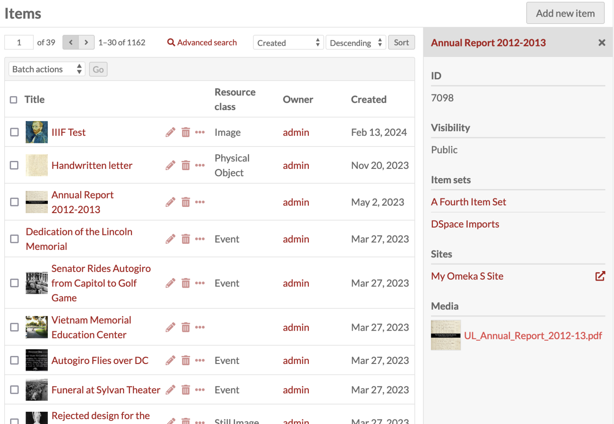
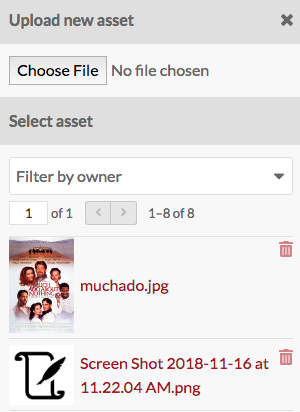
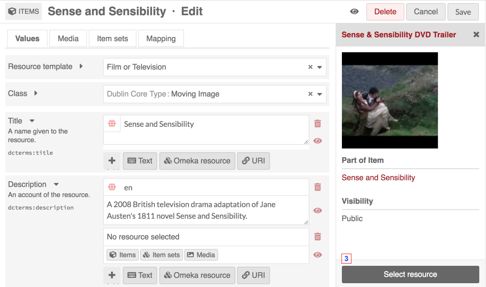
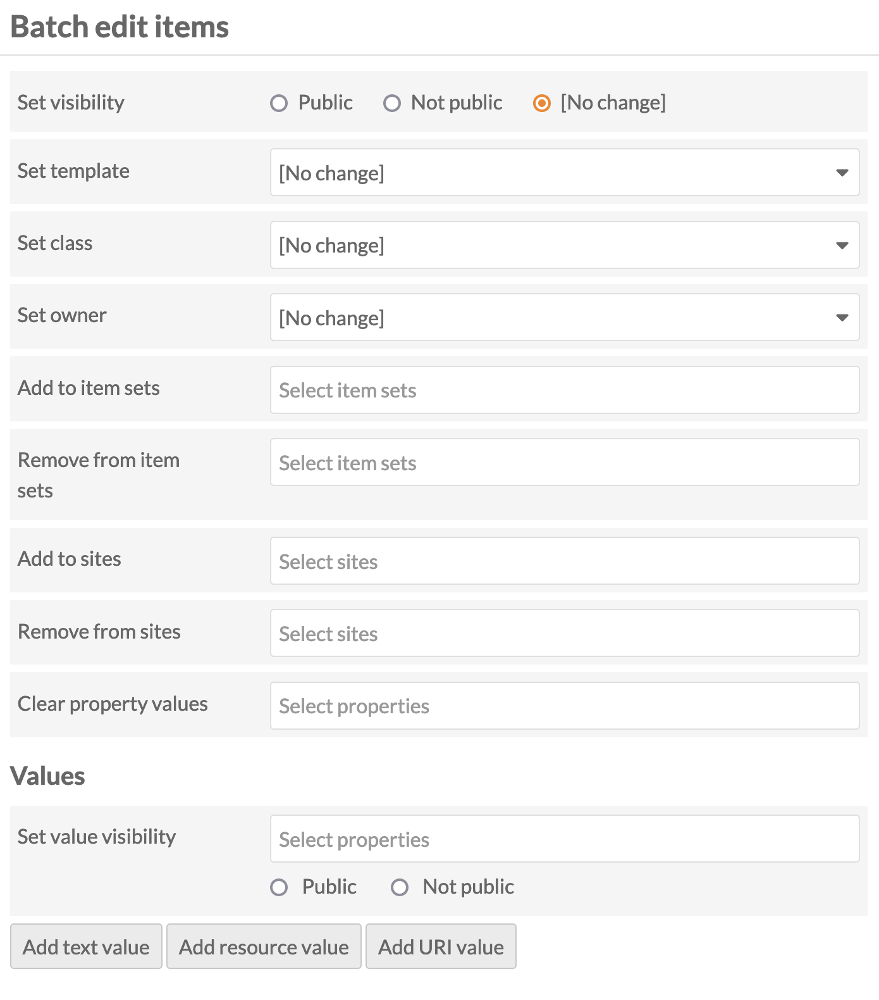

# Items

Items are the building blocks of the Omeka system. 

In Omeka S, items can be made available to you from the system administrator, and you may add items to your own site.

Items are listed in the *Items* tab (the box icon) in the left-hand navigation of the administrative dashboard. 

Each item appears as a row, with columns for:

- the *Title*
- icons to *edit* (pencil), *delete* (trash can), or *details* (ellipsis)
- the *Class*
- the item’s *Owner*
- the date the item was *Created*. 

In the top right corner of the Items screen is the *Add new item* button. 

Options for navigating and creating items sit in the header of the table of items. 

- On the left side are controls for the pages of items, with forward and back arrows, and an editable box for the current page number — enter a valid page number and hit Enter to go to that page. 

- In the center is a link for [Advanced Search](../search.md#item-advanced-search). 

- On the right are options for sorting the table of items, with two dropdown menus. By default, items in the table are sorted by most recently-added items at the top (Created & Descending). The first lets you select between *Title*, *Identifier*, *Class*, *Owner,* and *(Date) Created*; the second allows you to sort by ascending (A-Z or earliest to latest) or descending (Z-A or latest to earliest). To apply, click the *Sort* button.

Between these and the table, on the left, is a dropdown for batch actions, including edit selected, edit all, delete selected, and delete all. 

## View
To quickly view the basic information about an item, click the *Details* (ellipsis) button in the row for the item, located next to the edit and delete buttons. This will open a drawer to the right of the list which displays the item’s title,  description, visibility, any sites it is used in, and its associated media..

For a more detailed look at an individual item, click on its title in the items browse table or when viewing its details.
 
 The blue squares indicate where to click to open the full item view.

When you view an individual item , there are tabs for the item’s *Metadata* and its *Linked Resources*. The right side of the page displays the item’s media, any *item sets* to which it belongs, its creation date, owner, and visibility. 

An item’s *linked resources* (shown below) are resources, which are linked to this item through properties. Note that this section only shows resources which have been linked *to* this item (which have it for a property); resources which are linked *from* this item will display in the property which they fill.

Linked items are grouped by the property for which they use the current item. In the example below, the item William Shakespeare is used for the properties "Creator," "References," and "list of authors" for the linked resources. 

You can filter linked resources to only display those referencing a specific property using the dropdown "Filter by property." It will only display properties actively in use.

 

## Adding an Item

To add a new item, begin by selecting the the *Add new item* button. 

Before creating items, supervisors may want to create [Resource Templates](resource-template.md), which will load specific fields for various item types.

### Values
The Values tab is where you enter metadata, such as title, description, etc.

You can select a resource template from the drop-down menu. Resource templates are defined by the supervisors and editors.

- If using a resource template, the class should automatically load.
- If not using a resource template, you may select a class from the dropdown menu (these are populated from the [Vocabularies](vocabularies.md) in your installation).

Add information to the properties which load. If you do not select a resource template or class, the Dublin Core properties Title and Description will load automatically.

You may add text, a resource from the installation, or an external link in each field.  

Whether or not you use a resource template, you can add more properties to the item using the drawer on the right side of the screen. You can simply click open one of the vocabularies and click on the property you want to add, or you can use the “Filter properties” box to search for a specific property (this is helpful when you have multiple large vocabularies). 

Clicking on the property label in the drawer will automatically add it to the Item. If you add a property by accident, leave it blank and it will be removed from the item when you save changes. 

You can set individual properties as Private or Publicly visible using the eye icon for each property. Note that properties set to private are still visible to Global Admins, Supervisors, and Editors will be able to see properties even when set to private. Authors will be able to see all properties on items they own, but will not see private properties created by other users.

In the image below, the first property (Title) is public as indicated by the open eye icon. The second property (Description) is private as indicated by the slashed-through eye icon. Clicking or hitting enter on the eye icon toggles between public and private. 

#### Text
Text fields allow for unformatted text entry.

You can indicate the language for the content of an input using the globe symbol above the input (see the red arrow in the image below). Click on the globe to activate a text field, then enter the [IETF Language tag](https://en.wikipedia.org/wiki/IETF_language_tag){target=_blank} code for the language in which the text is written.

#### Omeka Resource
Omeka Resource fields create an internal link between the resource you are creating and the resource which fills that field. 

When creating an item, you have the option to use either another item or an item set. 

Choosing a resource type will open a side drawer where you can browse all of those resources in the installation. You can use the search function at the top of the drawer to narrow down the list or to quickly find a specific item. 

Once you select an item or item set, detailed information will load, and you must click *select resource* to finish linking the resources. You can also click the *X* button in the upper right-hand corner to go back to the list of items or item sets.

If you are using an Item resource for the property, you will have additional options for finding the item you want in the drawer. Open these options by clicking the triangle button next to the phrase "Filter search".

This will open a menu below the button with the following options to filter the items in the drawer:

- Filter by class: a dropdown where you can select any class provided by the vocabularies on the installation.
- Filter by item set: a dropdown where you can limit the items displayed in the drawer to only those associated with a particular item set.
- Filter by item ID: a search field where you can input the ID of the item you want to use. You can find an item's ID in the url of it's edit page; if you are editing the item and the url is `admin/item/11547/edit` then the item's ID is 11547.

Item resources also have an option for "Quick add". When this switch is flipped, all of the items in the drawer have a checkbox. You can use these checkboxes to add multiple items as a property at once. Note that you can only edit one property at a time, so all of the items must populate the same property (ex, Creator, Has Part). 

#### URI

URI fields link to an external website or online resource.

You may add other fields by selecting a property from the list on the right. Browse fields by vocabulary (Dublin Core, Bibliographic Ontology, etc.), or search in the *filter properties* bar above the list of properties and vocabularies.

#### Value annotation

When you input a value for a property associated for a resource, you are making a statement about that resource. If you choose, Omeka allows you to make statements about that statement. We call this value annotation. The advantage of value annotation is that you can choose to make ambiguous facts more concrete by annotating things like:

- Provenance: Where is this fact from?
- Time: When did this fact occur?
- Location: What is the location associated with this fact?
- Certainty: What is the confidence of this fact?
- Type: What type of concept/thing is this fact?

In the world of linked data, this process is know as [reification](https://www.w3.org/wiki/RdfReification){target=_blank}. Each value can have any number of annotations.

To create an annotation, click on the ellipsis on the right side of the value input interface, and then click on the annotation icon (a dialogue bubble). 

The annotation sidebar will open to the right. Select any property that is available within the Omeka S installation to describe the relationship between the annotation and the value it describes. For instance, the value for associated with the property DCterms:Contributor might be annotated with the property Schema:jobTitle. 

Then select a date type for the annotation: Text, URI, or and Omeka S Resource. Installed modules may make additional data types available. Click the Add Annotation button. 

Input the annotation, and click Set Annotations to finalize the process. 

Sites include a setting to indicate whether or not value annotations are visible to the public. 

#### Language 
You can indicate the language for the content of an input using the globe symbol above the input (see the red arrow in the image below). Click on the globe to activate a text field, then enter the [IETF Language tag](https://en.wikipedia.org/wiki/IETF_language_tag){target=_blank} for the language in which the text is written.

#### Value order

If you have multiple values for a property, you can reorder them by dragging and dropping. Click on the bar on the left of the value to grab that value, and drag it into the order that you want it. 

### Media

Use the *Media* tab to add images, video, or other files.
Using the buttons on the *Add New Media* menu on the right side of the screen, select a media type (Upload, URL, oEmbed, YouTube, or HTML)

- *Upload*: select a file to upload from your computer.
- *URL*: import media via a uri.
- *HTML*: add html content as a media resource for your item.
- *IIIF*: Add an IIIF image via url.
- *oEmbed*: insert an embedded representation of an external URL. Note that this will only work with content from [existing oEmbed implementations](http://oembed.com/#section7){target=_blank} - use the url in your browser’s location bar.
- *YouTube*: add a link to embed a YouTube video. Use the url from your browser’s location bar (with `/watch/` in it) rather than the `youtu.be` link.

You can edit media later by going by editing an item, navigating to the *media* tab, and clicking the edit button (pencil) for a media when editing the item. 

You can delete any media instance from the item's edit page using the delete button (trashcan) on the upper right corner of the media block.

If you have more than one media instance for an item, you can reorder them by dragging and drop each media instance block, using the icon of three lines in the upper left corner of the block as the anchor when dragging.

Omeka S uses the topmost media for an item to create thumbnail images for that item on browse and show pages. 

### Item Sets
You can only add items to existing item sets.

From the right-hand menu, click on the owner of an item set, then click the name of the item set to add the item to that set. 

You can also filter item sets using the text entry bar above the list of users.

To remove a connection between an item and item set, click the delete (trash can) button to the right of the item set title.

### Sites
Select sites to which to add your items. 

To add an item to a site, select a site from the menu in the right-hand drawer. You can filter sites by searching in the field at the top of the drawer. 

If there are sites which have "auto-assign new items" turned on in their settings, you can use this tab to remove this item from those sites. Click the trash can icon on the right side of the site's row to remove it.

### Advanced
The advanced tab has two options. One lets you set a custom thumbnail for the item. The other allows you to change which user has ownership of the item. 

**Thumbnail** 

By default, Omeka S will use the topmost media to generate a thumbnail for the item. If you want to use a non-media image for the thumbnail for an item you can set it here.

When you use an asset thumbnail instead of uploading media, the asset thumbnail does not display on the item's public show page. This makes such thumbnails useful for items which have no media but which would benefit from a thumbnail for the browse view, or for items whose media does not render an elegant thumbnail, such as audio or visual files.

The assets you select from and upload as thumbnails in this tab are the same as those created for [site logos](../../sites/site_theme/#settings-options). 

To assign an asset as a thumbnail, click on the Select button in the main work area of the tab. This will open a drawer on the right side. 

The drawer offers two options: upload a file using your browser, or select from existing assets. To select an existing asset, simply click on it and it will automatically be assigned to the item. 

To remove an asset which you have assigned as a thumbnail, click the "Clear" button below the image of the asset. To replace it, click select and either choose or upload a new thumbnail asset.

**Owner**

The ownership of an item is usually assigned to the user account which creates the item. You can use this dropdown to reassign ownership. The dropdown will load the user names (not email addresses) of users in the installation. Select a new user and save changes.  

### Visibility
Use the *make public/private* button (eye icon) to set whether the item is visible to the public or only to users of the Omeka S system. 

Item is public: {style="display:inline;"}

Item is private: {style="display:inline;"}

Note that if an item is private, all the media attached is private, but an item which is public can have attached media which are set to be either public or private.

## Edit an item
Once you have created an item, you can edit it at any time, either by clicking the edit icon (pencil button) or clicking on the item's title and then clicking the Edit button in the upper right-hand corner of the screen.

To cancel out of editing, click the Cancel button in the upper right corner, between the Delete and Save buttons. 

Editing options are the same as when creating a new item, with the addition of the ability to add any media which has been saved to an item as a property:

### Media as property 
Once you have created an item and added media to it, you will also have the option to use media *attached to that item* for a property. 

To use a media resource for a property, select the media option for the element (1). The drawer which opens will display all media attached to the item. Select the media which you want to use(2); this will switch the drawer to just that media (second image). Click the *Select Resource* button at the bottom of the drawer to complete the process (3).

## Batch actions

From the browse page of items (admin/item) you can batch edit items, using the dropdown menu on the left near the pagination buttons. You can select multiple items using the checkboxes on the left of each item's row.

Batch actions are as follows:  

- Edit selected: edit only the items that are selected on the page
- Edit all: edit all the items returned by a search (default is all items)
- Delete selected: delete only the items that are selected on the page
- Delete all: delete all the items returned by a search (default is all items)

Choose one of these options and then click *Go*.

**Batch editing** items takes you to a new page. The items being edited will display on the right side in a drawer, while the batch edit form gives you the following options:  

- set visibility: a dropdown, select from public or not public.
- set template: a dropdown, select from the installation's resource templates.
- set class: a dropdown, select from classes of the installed vocabularies.
- add to item set: a dropdown, select from item sets on the installation. Add to an additional item set click in the input box again to see the remaining options.
- remove from item set: a dropdown, select from item sets on the installation. Remove from an additional item set click in the input box again to see the remaining options.
- add to sites: a dropdown, select from sites on the installation. Add to an additional site click in the input box again to see the remaining options.
- remove from sites: a dropdown, select from sites on the installation. Remove from an additional site click in the input box again to see the remaining options.
- clear property values: a dropdown menu with all the properties in all vocabularies, selecting from this will remove any values in that property in the affected items. Clear additional properties using the *Clear another property* button.
- Set value visibility: set the visibility of a specific property to either public or not public. Unlike the radio buttons at the top of the form, this will only affect a single property instead of the entire item. Select a property from the text field (type to begin searching), and the choose either the *public* or *not public* radio button for this option.

In addition,  you can use the buttons at the bottom of the batch edit form to add properties to every item:

- add text value
- add resource value
- add URI value.  

Selecting any of these will add a block to the form where you can select a property from the installed vocabularies and enter the value for that property.

For the **delete actions**, a drawer will open on the right side of the screen telling you the number of items which will be deleted. Nothing will be deleted unless you click the red *Confirm Delete* button. This action cannot be undone. To opt out of deleting the items, click the X in the upper right corner of the deletion drawer. To confirm delete, check the "Are you sure" checkbox and then click *Confirm Delete*

Individual modules may also add batch edit actions. Those options are noted within the documentation for each module.
