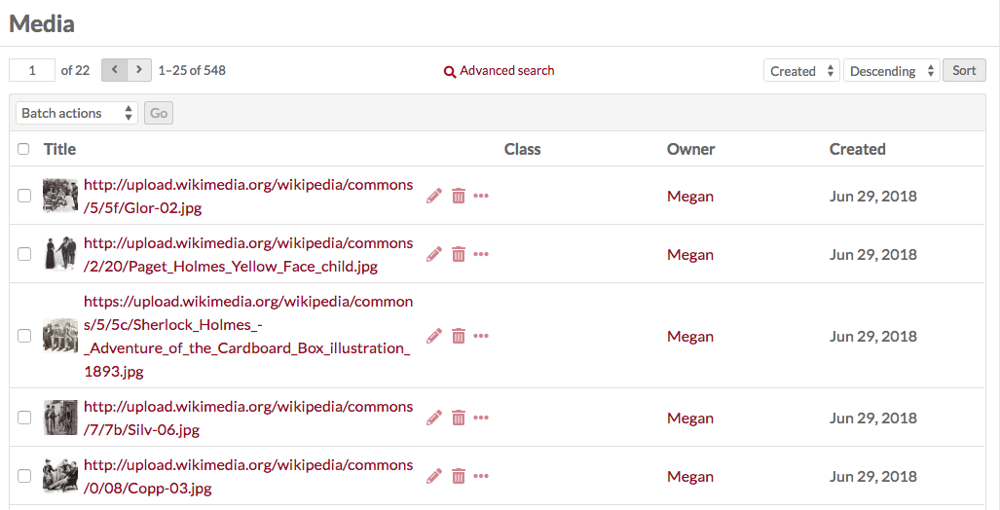
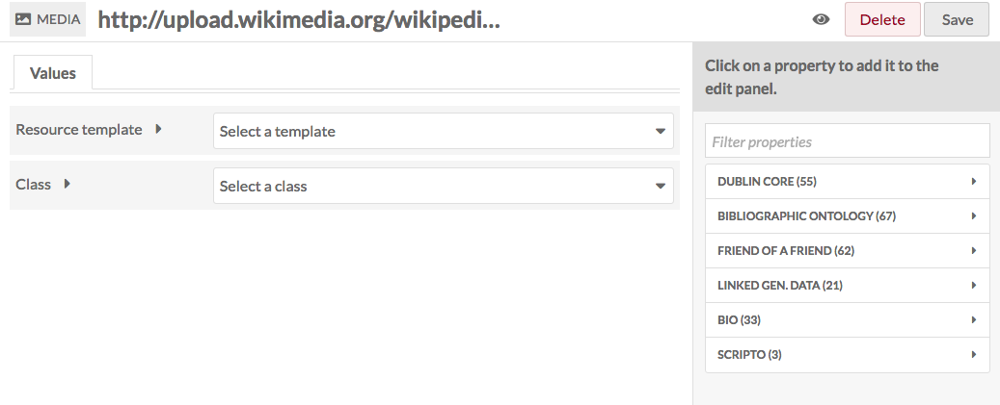
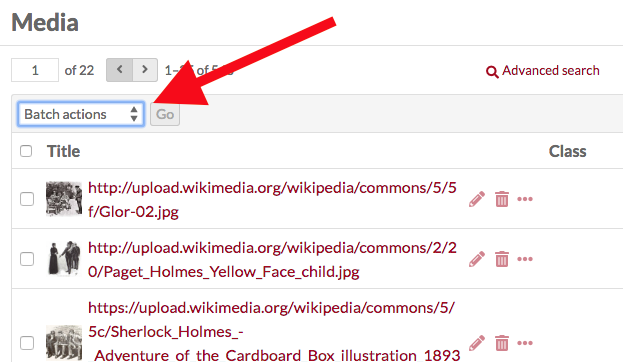
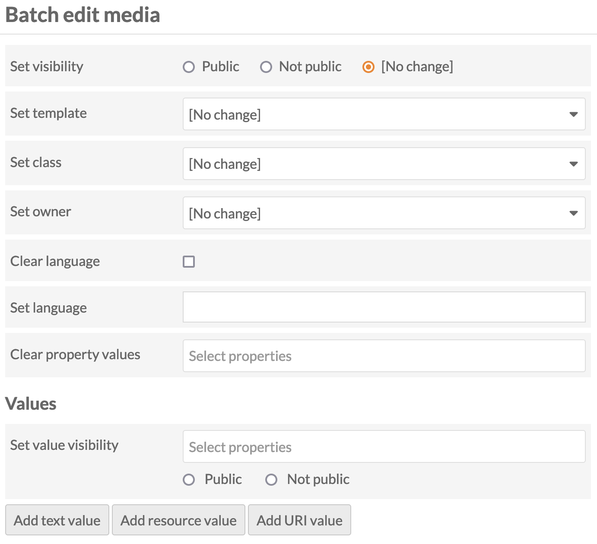
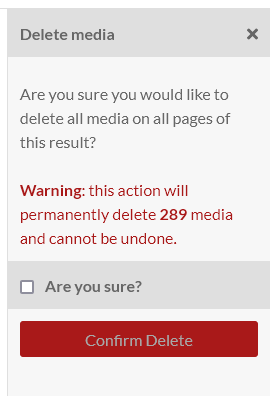

# Media

Omeka S accepts most files and file types, and can be customized to accept or reject file types of your choice. You may wish to format your multimedia files according to what can best be embedded and streamed in modern browsers; see the [Media file types section at the end of this page](#media-file-types). If you are having difficulty or are seeing file-validation errors, you can adjust the accepted file types and extensions in the [Allowed media and files options of the Security Settings](../admin/settings.md#security).

Media are only created by adding them to an item; media cannot exist independently. If you wish to upload files unattached to items, see the [Assets page](../admin/assets.md). 

To view the media associated with an item, click on the media’s name in the right-hand sidebar on the item view page.

To view all media in the installation, navigate to the **Items** section first. The **Media** subsection will appear below Items in the left-hand navigation.

## Media permissions

When a user attaches a media to an item, they become the "owner" of that media. Most user levels have the ability to create media, and can always delete their own media. Only higher levels can delete media that others own. 

| Category | Permission | Global Admin | Supervisor | Editor | Reviewer | Author | Researcher |
|-----|-----|---|---|---|---|---|---|
| Items & media | Add | Yes | Yes | Yes | Yes | Yes | No |
| | Edit | All | All | All | All | Their own | No |
| | Delete | All | All | All | Their own | Their own | No |
| Value annotations | Add/Edit | Yes | Yes | Yes | Yes | Yes | No |
| Private objects | View | Yes | Yes | Yes | Yes | No | No |

Media ownership is not automatically the same as the attached item's ownership. A media's owner can be changed by a Global Admin or Supervisor on the media's Advanced tab.

Note that when you change a user's role, for example from an Author to a Researcher, they will still own the media they created when they had permission to do so. Deleting a user orphans their media - they will appear as having no owner.

## View media
To browse media, first click on Items in the left-hand navigation. In that sidebar, an option for Media will appear under the Item button (you may have to click on the triangle to expand the menu below Items).

Media are displayed in a table. Each media is a row, with columns for:

- a checkbox to select the media
- the **Title**
- icons to **edit** (pencil), **delete** (trash can), or see **details** (ellipsis)
- the media's **Class**
- the media's **Owner**
- and the date the media was **Created**. 

Options for navigating and creating items display above the table of items:

- On the left side is a display for the number of pages of media, with forward and back arrows. The current page number is an editable field - enter any valid page number and hit return/enter on your keyboard to go to that page. 
- In the center top is a button for [Advanced Search](../../search#media-advanced-search). 
- Just above the table on the right are options for sorting media, with two dropdown menus. The first lets you select between **Title**, **Class**, **Owner**, **(date) Created**, and **Size**; the second allows you to sort ascending or descending. To apply, click the "Sort" button.

Clicking on the title of any media will take you to its metadata page. This page displays any metadata in the main work area, with a sidebar on the right listing the visibility, associated item (an active link), date created, MIME type, Size, Ingester, Source, and links to the file derivatives.

## Add media

Media can only be added via an [item](../content/items.md). Options for adding media to your items include uploading a file, or directly attaching content with a URL, [oEmbed](https://oembed.com/){target=_blank}, YouTube URL, [IIIF URL](https://iiif.io/guides/using_iiif_resources/){target=_blank}, or by writing HTML using the HTML editor.

At the media adding stage, the only metadata that can be entered is a Title. If you wish to further describe each file, you can edit it after it has been uploaded.

### Media thumbnails

Thumbnails are automatically created for many file types. Thumbnail creation relies on the ability of your [chosen thumbnail utility](../configuration.md#thumbnails) (the default being ImageMagick) and which file types it can process. Look up the utility you are using (such as ImageMagick, Imagick, or GD) to find out which file types it supports.

If you wish your item to have a generic thumbnail (such as an icon of a book, or a musical note for an audio file), you can upload those default images as [assets](../admin/assets.md), then attach them manually to files using the [Advanced tab in the Item editing screen](../content/items.md#advanced).

### File size limitations

Omeka S imposes no file size limitations. Your server, however, may have restrictions on file upload sizes or speeds that may be causing problems. These limitations vary from server to server and we cannot change this for you. If you have a problem uploading media, please first check with your hosting service or your local server administrator. 

## Edit media
To edit existing media, you can:

- Go to the Media browse page and click the pencil/edit icon for the media's row
- Go to the Media browse page, click on the title to view the media's metadata, then click the "Edit media" button in the upper right hand corner
- Click on the media's name in the right-hand sidebar of an item's page to go to the media's metadata, then click on "Edit media" from there.

Automatically generated metadata, such as source, date created, and part of item, cannot be edited. 

Editing media is very similar to editing [items](../../content/items) or [item sets](../../content/item-sets).

Use the **make public/private** button (eye icon) to set whether the media is visible to the public or only to users of the Omeka S install. 

Media is public: {style="display:inline;"}

Media is private: {style="display:inline;"}

Note that if an item is private, all the media attached is private, but an item that is public can have attached media which are set to be either public or private.

### Values

If desired, you can select a resource template from the drop-down menu. Resource templates are defined by site administrators and editors.

- If using a resource template, the media class should automatically load.
- If not using a resource template, you may select a class from the dropdown menu (these are populated from the [Vocabularies](vocabularies.md) in your installation).

Add information to the properties that load. If you do not select a resource template or class, no other fields will load automatically.

Whether or not you use a resource template, you can add more properties to the item using the drawer on the right side of the screen. You can simply open one of the vocabularies (Dublin Core, Bibliographic Ontology, etc.) and click on the property you want to add, or you can use the "Filter properties" box to search for a specific property (this is helpful when you have multiple large vocabularies). 

Clicking on the property label in the drawer will automatically add it to the item. If you add a property by accident, leave it blank and it will be removed from the item when you save your changes. 

You may add text, a resource from the installation, or an external link in each field.  

Note that if you add the property `dcterms:title`, its contents will replace the autogenerated title of the media. This is useful if dealing with URL or media uploads with auto-generated names.  

You can set individual properties as **private or public** using the eye icon for each property. Note that properties set to private are still visible to Global Admins, Site Admins, and Editors. Authors will be able to see all properties on items they own, but will not see private properties created by other users.

In the image below, the first property (Title) is public as indicated by the open eye icon. The second property (Description) is private as indicated by the slashed-through eye icon. Clicking or hitting enter on the eye icon toggles between public and private. 

#### Text
Text fields allow for unformatted text entry.

You can indicate the language for the content of an input using the globe symbol above the input (see the red arrow in the image below). Click on the globe icon to activate a text field, then enter the [ISO 639-1](https://en.wikipedia.org/wiki/List_of_ISO_639-1_codes){target=_blank} code for the language in which the text is written.

#### Omeka resource
Omeka resource fields create an internal link between the resource you are creating and the resource that fills that field. 

You have the option to use either an item, another media, or an item set. Once you select an item or item set, detailed information will load, and you must click "Select resource" to finish linking the resources. You can also click the "X" button in the upper right-hand corner to go back to the list of items or item sets.

If you are using an Item resource for the property, you will have additional options for finding the item you want in the drawer. Open these options by clicking the triangle button next to the phrase "Filter search".

This will open a menu below the button with the following options to filter the items in the drawer:

- Filter by class: a dropdown where you can select any class provided by the vocabularies on the installation;
- Filter by item set: a dropdown where you can limit the items displayed in the drawer to only those associated with a particular item set
- Filter by item ID: a search field where you can input the ID of the item you want to use. You can find an item's ID in the url of it's edit page; if you are editing the item and the url is `admin/item/11547/edit` then the item's ID is 11547.

Item resources also have an option for "Quick add". When this switch is flipped, all of the items in the drawer have a checkbox. You can use these checkboxes to add multiple items as a property at once. Note that you can only edit one property at a time, so all of the items must populate the same property (e.g. Creator, Has Part). 

#### URI

URI fields link to an external website or online resource. Every URI value has the link itself, and an optional textual Label to replace the URI with something human-readable. For example, you may wish to enter in a Creator as a URI to a controlled vocabulary of artists or authors, and then include the creator's name in plain text as the Label. Omeka will not automatically pull information from the URI.

#### Value annotation

When you input a value for a property associated for a resource, you are making a statement about that resource. If you choose, Omeka allows you to make statements about that statement. We call this value annotation. The advantage of value annotation is that you can choose to make ambiguous facts more concrete by annotating things like:

- Provenance: Where is this fact from?
- Time: When did this fact occur?
- Location: What is the location associated with this fact?
- Certainty: What is the confidence of this fact?
- Type: What type of concept/thing is this fact?

In the world of linked data, this process is know as [reification](https://www.w3.org/wiki/RdfReification){target=_blank}. Each value can have any number of annotations.

To create an annotation, click on the ellipsis on the right side of the value input interface, and then click on the annotation icon (the speech bubble). 

The annotation sidebar will open to the right. Select any property that is available within the Omeka S installation to describe the relationship between the annotation and the value it describes. For instance, the value for associated with the property `dcterms:Contributor` might be annotated with more detail about the nature of the contribution. Or you may wish to simply include a note using the `dcterms:Description` field.

Select a data type for the annotation: a text field, a URI, or resource in your Omeka S installation. Modules may make additional data types available. Click the "Add annotation" button and a new field will appear below. Input your annotation. You can do this multiple times for the chosen value if desired. Then click "Set annotations" to finalize the process. 

[Each site has a setting](../sites/site_settings.md#show) to indicate whether or not value annotations are visible to the public. This will include value annotations on items and item sets.

You can set controlled vocabularies for annotations using the [Custom Vocab module](../modules/customvocab.md). In this case, you do not need to apply a custom vocabulary to a property using a resource template; you can select any installed vocabulary from the value-type dropdown in the drawer. This will load your vocabulary's choices into a dropdown of terms.

### Advanced

**Thumbnail** 

Not all media generate elegant thumbnails, for example PDF or text file documents, or some video files. You can use this option to set a representative thumbnail for the media which will be used on browse pages but not on the page for the item or its media.

The assets you select from or upload as thumbnails in this tab are the same as those created for [site logos](../admin/assets.md). A thumbnail uploaded as an asset will become available to all users of all sites. If you wish to upload a video still as a thumbnail for a specific video, you may wish to upload it as a media file attached to the item instead of as an asset. 

To assign an asset as a thumbnail, click on the "Select" button in the main work area of the tab. This will open a drawer on the right side. 

The drawer offers two options: upload a file using your browser, or select from existing assets. To select an existing asset, simply click on it and it will automatically be assigned to the media. 

To remove an asset which you have assigned as a thumbnail, click the "Clear" button below the image of the asset. To replace it, click select and either choose or upload a new thumbnail asset.

**Owner** 

You can assign an owner for the media by selecting from the dropdown menu.

**Alt Text** 

You can provide alternate text for all media by typing descriptive text into the input area.

## Batch editing

From the media browse page, you can batch edit media, using the dropdown menu on left just above the table of media. You can select multiple items using the checkboxes on the left of each item's row.

Batch actions are as follows:  

- Edit selected: edit only the items that are selected on the page
- Edit all: edit all the items returned by a search (default is all items)
- Delete selected: delete only the items that are selected on the page
- Delete all: delete all the items returned by a search (default is all items).

Choose one of these options and then click "Go".

**Batch editing** media takes you to a new page. The media being edited will display on the right side in a drawer, while the batch edit form gives you the following options:  

- Set visibility: radio buttons, select from Public, Not public, or No change.
- Set template: a dropdown, select from the installation's resource templates.
- Set class: a dropdown, select from classes of the installed vocabularies.
- Clear language: a checkbox.
- Set language: a text entry box.
- Clear property values: a dropdown menu with all the properties in all vocabularies, selecting from this will remove any values in that property in the affected items. Clear additional properties using the "Clear another property" button.

In addition, you can use the bottoms at the bottom of the batch edit form to add properties to every media:

- add text value
- add resource value
- add URI value.  

Selecting any of these will add a block to the form where you can select a property from the installed vocabularies and enter the value for that property.

For the **delete actions**, a drawer will open on the right side of the screen telling you the number of media which will be deleted. Nothing will be deleted unless you click the red "Confirm Delete" button. This action cannot be undone. To opt out of deleting the media, click the "X" in the upper right corner of the deletion drawer. To confirm delete, check the "Are you sure" checkbox and then click "Confirm Delete".

## Media file types

Omeka S uses HTML 5 audio and video tags when embedding audio and video. This means generally better support on newer browsers, but worse support on older ones and for older video formats especially.

By choosing from a few well-supported formats for audio and video files, you can provide a much better experience for your users across different platforms and devices.

### Video

#### MP4
The MP4 container (.mp4 or .m4v) is the best-supported video format across browsers and platforms. By far the best choice for video that will work well across different browsers are .mp4 files with H.264 video and AAC audio.

.mp4 files can contain other types of video (or audio), including newer ones like H.265, and older ones like MPEG-4 Visual. Any video codec other than H.264 has *much* worse browser support.

#### Other formats
The WebM (.webm) container with VP8 or VP9 video is supported by several browsers, but Internet Explorer and Safari are notable and significant exceptions.

The Ogg (.ogg, .ogv) container and Theora video are supported by some browsers, but there is little support among mobile browsers and no support at all on IE or Safari.

### Audio

#### MP3
MP3 (.mp3) is one of the most common formats for compressed audio, and it enjoys wide support across browsers and from desktop to mobile.

#### AAC

AAC is a somewhat newer format than MP3, but it also is well supported in most browsers. The widest support is for AAC in an MP4 container (this usually carries the file extension .m4a), with somewhat lesser support for other containers and formats (often found with a .aac extension).

#### Other formats

WAV or WAVE (.wav) audio is supported by most browsers (with the notable exception of Internet Explorer). The major downside for use on the Web is that WAV audio is uncompressed, so it takes up vastly more storage space and bandwidth than the compressed formats listed above. If feasible, it’s best to use one of those instead of WAV.

Ogg Vorbis audio (.ogg, .oga) is a compressed format like MP3 and AAC, but it has much less widespread support. Expect Vorbis audio to only work on Firefox, Chrome, and Android.

Opus (.opus) is one of the newer available audio formats. For the time being, it has a similar problem as Vorbis: a lack of support among browsers, but there are signs that Opus could gain more support in the future.

### Legacy formats
There are a lot of media files out there that aren’t in any of the formats listed here. With certain add-ons or on certain platforms (like Safari on the Mac in many cases), it can be possible to embed some of those files with HTML 5, but expect many or most users to be unable to play them. Browser plugins can also play many file types, but browsers are steadily reducing and removing their support for these kinds of plugins.

For old media, often the best choice is to just present a download link so the viewer can play or convert the file locally. This is what Omeka does when it doesn’t recognize a file type or when a browser reports that it can’t play a file.

File formats which result in a download link, rather than an embedded playback, include: 

- Video: .avi, .wmv
- Audio: .aiff (except Safari), .midi, .wha

If you do not see a format listed here that you think should be, try it out and let us know the results.

