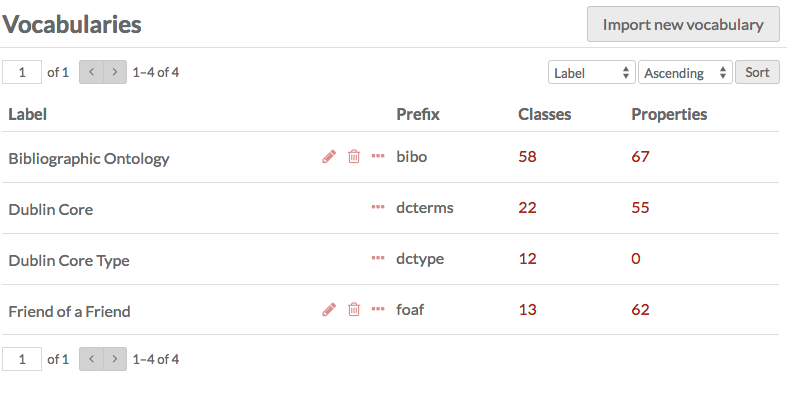
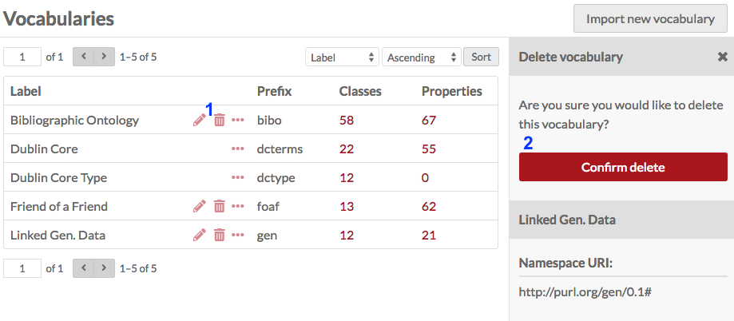

# Vocabularies

Vocabularies are a collection of published RDF metadata Classes and Properties for describing a Resource of a particular type. Linked open vocabularies are created externally to Omeka, and, because they are openly available, can be imported (with some limitations) into Omeka S for use throughout the installation. If you have special and uncommon item types or classes, you may wish to find and import a linked open vocabulary to standardize the description of those particular items. These vocabularies are sometimes referred to as ontologies. 

For example, you can find ontologies for describing [audio signals](https://lov.linkeddata.es/dataset/lov/vocabs/af), [air traffic data](https://lov.linkeddata.es/dataset/lov/vocabs/atd), and [algorithms](https://lov.linkeddata.es/dataset/lov/vocabs/algo), by providing metadata fields particular to those object types. 

> *"A vocabulary in LOV gathers definitions of a set of classes and properties (together simply called terms of the vocabulary), useful to describe specific types of things, or things in a given domain or industry, or things at large but for a specific usage." (Source: <https://lov.linkeddata.es/dataset/lov/about>)*

The most-used [Linked Open Vocabulary](https://lov.linkeddata.es/dataset/lov/about){target=_blank} is Dublin Core Terms (`dcterms:`). 

!!! note
	Vocabularies in Omeka S are not the same thing as controlled vocabularies or authority files, which consist of terms and concepts, rather than Classes and Properties. In Omeka S, controlled vocabularies can be managed using the [Value Suggest](../modules/valuesuggest.md) and [Custom Vocab](../modules/customvocab.md) modules.  

Global Administrators can manage their installation’s vocabularies from the **Vocabularies** tab on the left hand navigation of the Admin Dashboard. Supervisors can add, edit, and delete their own vocabularies. 

Omeka S comes pre-loaded with the following vocabularies: [Dublin Core](http://purl.org/dc/terms/){target=_blank}; [Dublin Core Type](http://purl.org/dc/dcmitype/){target=_blank}; [Bibliographic Ontology](https://bibliontology.com/){target=_blank}; and [Friend of a Friend](https://en.wikipedia.org/wiki/FOAF_(ontology)){target=_blank}. 

This [screencast](https://vimeo.com/449764902){target=_blank} walks through managing and adding vocabularies.

## View vocabularies
The main view of the **Vocabularies** tab in the Admin Dashboard displays the existing vocabularies for the Omeka S installation. 

Vocabularies are displayed in a table with headings for **Label** (name of vocabulary), **Prefix** (used by the database), **Classes** (number of classes in the vocabulary), and **Properties** (number of properties in the vocabulary). You can sort vocabularies by these columns using the up and down arrows at the right end of each column. 

You can use the icons at the right of the Label field to manage individual vocabularies. The edit icon (pencil) takes you to the edit page for that vocabulary, the delete icon (trash can) opens a sidebar to delete the vocabulary, and the details icon (ellipsis) opens a sidebar with information about the vocabulary.

When editing a vocabulary, you can make changes to the **label** and add **comments**. 

## Add a vocabulary
New vocabularies must be imported from an existing metadata standard source. In order to import a new vocabulary, you must have a vocabulary file or a stable link to a vocabulary.

The New vocabulary page has three sections: Basic Info, File, and Advanced. 

Note that you may have to research in order to find the prefix, namespace URI, and label for the vocabulary, as these are not standardized. In addition to the vocabulary's website, you might consult <https://lov.linkeddata.es/dataset/lov/vocabs>{target=_blank}.

After you have imported a vocabulary, you can use the Edit function to modify the vocabulary's Label and Comment, and to upload an updated vocabulary RDF file. 

### Basic info
This section contains the basic information for the vocabulary

- Label (required): the display name for the vocabulary in lists (e.g., "Dublin Core," "Friend of a Friend").
- Comment: any comments you have. 
- Namespace URI (required): this should be provided by the vocabulary.
- Namespace prefix (required): This will display before the property, indicating which vocabulary (e.g., the prefix for Dublin Core is dcterms).

### File
This section deals with the file for the vocabulary.

- Vocabulary file: Upload a file from your computer *or*
- Vocabulary URL: Enter the vocabulary's URL here. 
- File format: a dropdown, select from:
	- Autodetect
	- JSON-LD (.jsonld)
	- N-Triples (.nt)
	- Notation3 (.n3)
	- RDF/XML (.rdf)
	- Turtle (.ttl).

### Advanced

This section has advanced vocabulary settings.

- Language: Enter the preferred language of the labels and comments using an IETF language tag. 
- Label property: if this vocabulary uses an unconventional property for labels, enter the full property URI in angle brackets (`<`, `>`)in this field.
- Comment property: if you are using the above label property, enter the corresponding property URI in angle brackets (`<`, `>`) in this field. 

## Edit a vocabulary
You can edit existing vocabularies by clicking the edit button (pencil icon) on the table of vocabularies.

You can also update the vocabulary by either uploading a new vocabulary file or entering the vocabulary URL and saving changes. You will be able to review any changes when updating a vocabulary.
If you decide you do not wish to save your changes, or clicked on the edit button by mistake, you can click the "Cancel" button next to the "Save" button.

### Vocabulary import
Omeka S will import properly formatted vocabularies/ontologies. `rdfs:Class` and `rdfs:Property` data will be available. 

For Web Ontology Language (OWL) data, Omeka S will store only the RDF/S super-Properties and -Classes. Omeka S does not enforce any declaration or inferencing rules from OWL. Thus, for example, an `owl:Class` is treated in Omeka S like an `rdfs:Class`.

Similarly, the following are all treated only as `rdfs:Property`. OWL domains and ranges are also not enforced or stored:

* `owl:ObjectProperty`
* `owl:DatatypeProperty`
* `owl:SymmetricProperty`
* `owl:TransitiveProperty`
* `owl:FunctionalProperty`
* `owl:ObjectProperty`
* `owl:DatatypeProperty`
* `owl:SymmetricProperty`
* `owl:TransitiveProperty`
* `owl:FunctionalProperty`
* `owl:InverseFunctionalProperty`.

For example, an imported ontology with an `owl:ObjectProperty` is not restricted to having objects that are URIs; Omeka S will accept a Literal value without complaint. You can use [resource template](../content/resource-template.md) settings to require a data type on properties, so that someone filling out, for example, the `owl:ObjectProperty` field in a template is required to enter a URI value.

It is up to the person entering metadata to adhere to the standards as best they can.

## Delete a vocabulary

With the exception of Dublin Core and Dublin Core Type, Global Administrators can delete any vocabulary from the Omeka S installation, either from the Vocabulary browse or the Vocabulary edit page. Supervisors can delete vocabularies they have imported, but not others' vocabularies or the default ones included with Omeka S.

From the Vocabulary browse page, click the trash can/delete icon in the row for the vocabulary you want to delete (labelled as 1 in the image below). A drawer will open on the right side of the browser asking you to confirm that you want to delete the vocabulary (labelled as 2 in the image below). To delete, click the "Confirm delete" button, and to cancel, simply close the drawer. 

From the Edit Vocabulary page, you can click the large red "Delete" button in the upper right-hand corner of the page. This will open a drawer which will ask you to confirm the deletion. To delete, click the "Confirm delete" button, or to cancel, simply close the drawer. 

