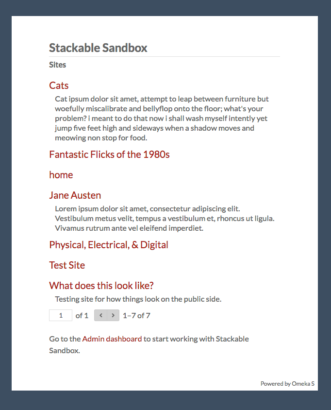

# Front Page

Omeka S allows users to build multiple distinct sites within one installation that are not necessarily connected to each other. Each installation has, by default, a front page which lists all of the sites in the installation. This page is accessed by going to the main URL of your Omeka S installation; if your [admin dashboard](admin-dashboard.md) was at `yourdomain.net/omekas/admin`, then you would find this page at `yourdomain.net/omekas/`.

The page displays all sites that a user has permission to see, along with the site's summary if one exists. If someone is not logged in, they will only see public sites. A logged-in Global Admin, by contrast, would see all existing sites on the installation.

If a Site Administrator or Global Administrator wants this index page to be hidden from site visitors, you can select a public site on your installation to which visitors will be redirected when they navigate to your base URL (`yourdomain.net/omekas/`). To do so:

- Go to Settings (the gear icon), then the General tab.
- Under the "Default site" option, use the dropdown menu to select one of your current sites. 
- To remove a selected site and revert back to the index page, click the small X on the right side of the dropdown.

You can use the Default Site option in conjunction with the [site page block](sites/site_pages.md#page-blocks) "List of sites" to create a branded site index and to add an about page for the overall installation. 

<!--- how? do you have to make a whole site with one page and then point the Default site option to the site with one page? --->
