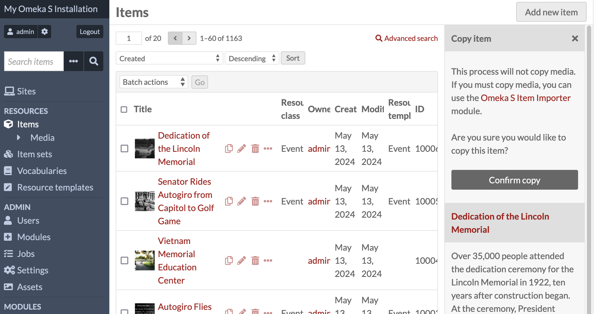

# Copy Resources

The [Copy Resources module](https://omeka.org/s/modules/CopyResources){target=_blank} allows you to duplicate Omeka S sites, site pages, items, and item sets.

Once activated on the [modules](https://omeka.org/s/docs/user-manual/modules/){target=_blank} section of the admin dashboard, Copy Resources inserts a "copy" button into the interface of several pages in the admin side, including the table of sites, each site's table of pages, and the items and item sets tables. 

Items and item sets will get a new unique identifier, but have all their metadata fields duplicated, including data captured by modules, such as geolocation data in Mapping. Pages (and therefore their sites) will have all their page blocks duplicated, including page blocks added by modules. 

### Permissions

Global Administrators and Supervisors can use this module to copy sites, site pages, items, and item sets.

Users at the Author level and above (Author, Reviewer, Editor) can copy items and item sets. 

Users with site-specific permissions of Creator and Manager can copy pages. 

Site-specific permissions do not affect a user's ability to copy sites. Site copying is reserved for Global Administrators and Supervisors. 

When a resource is copied, its owner will change to the user who made the duplicate; it will not retain the owner of the original. 

### Requirements

Copy Resources depends on versions of those modules that have been updated since Copy Resources' release, specifically:

- Mapping version 2.0 and above
- Scripto version 1.5
- Collecting (when the form is used in sites' pages) version 1.2
- Data Visualization version 1.3
- Item Carousel Block (when the page block is used in sites' pages) version 1.3
- Faceted Browse version 1.5.

## Copying resources

When copying an item or item set, the "copy" button appears to the left of the "edit" button (pencil icon) in each row in the resource table. Items and item sets can be copied manually, one at a time (not in bulk). 

When the "copy" button is clicked, a confirmation will appear in the right-hand drawer. 

!!! note
	Items will be copied without their media, in order to limit server processing and space use. If you need to copy an item's media, use the [Omeka S Item Importer](osii.md) module, which has the ability to copy items along with their media. Enter in your own site's API to access existing items. Recall that media only exist through association with a single item; you cannot "add" existing media to a second item.

When the resource has been successfully copied, you will be taken to the new resource's view page. 

You can also copy resources when viewing them individually - a "Copy" button will appear in the top right corner of the screen:

!!! note
	Note that duplicated resources will have the same [links to other Omeka S resources](../content/items.md#linked-resources), but anything that links to the original resource will not automatically link to its duplicate. You will have to manually establish these links if desired, or use modules such as [Inverse Properties](inverseproperties.md). 

## Copying sites and pages

### Sites

When copying a site, you can find the "copy" button in the table of sites, or on an individual site's view page.

The module will duplicate every page, every navigation entry, every site and theme setting, and every user permission. All resources added to the original site will be carried over to the duplicate site. 

When copying a site, pages will maintain their unique slugs; the site itself will have the original site's slug with "-1" appended to the end. You may then rename and re-slug the site in its settings. 

Where other modules introduce site-specific data (such as Metadata Browse, Sharing, Data Visualization, Collecting, Faceted Browse, Item Carousel Block, etc.) this information will be copied, [as long as the corresponding module is updated where applicable (see the Requirements section above)](#requirements). 

Be sure to check over a duplicated site thoroughly to ensure everything has copied correctly. Some pages, page blocks, or module data may not have copied as intended, and may need manual re-setting, such as items chosen in the media embed page block, or pages set in the navigation. 

### Pages

When copying pages within a single site, the duplicated page will have the original slug with "-1" appended to the end. You may then rename and re-slug the page. 

All page blocks should copy over, including page blocks introduced by modules, [as long as the corresponding module is updated where applicable (see the Requirements section above)](#requirements).

Duplicated pages will need to be manually added to the site navigation in order to display publically; this module does not add newly copied pages to the site navigation.

