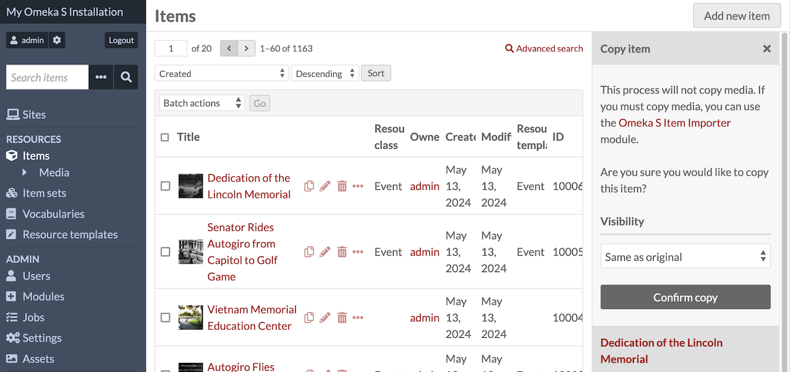
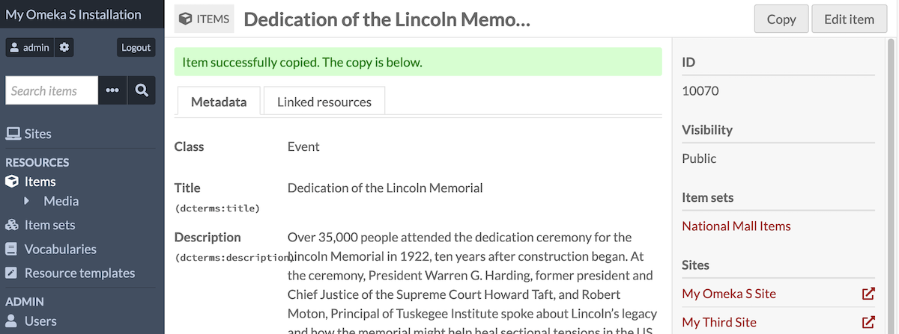
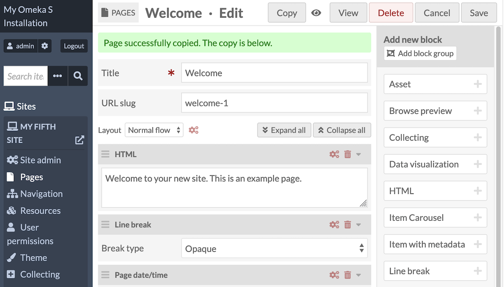
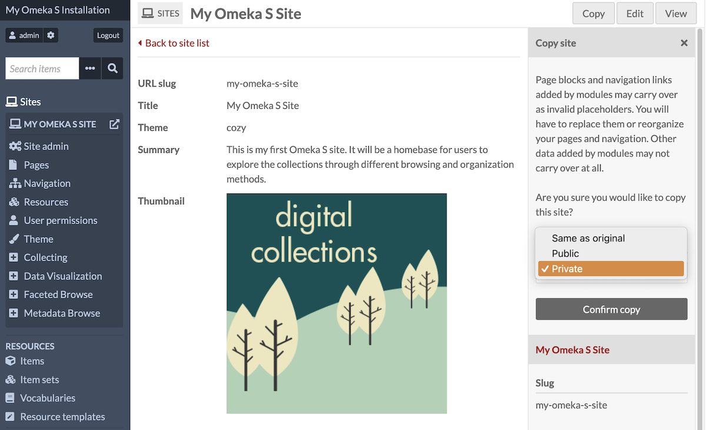
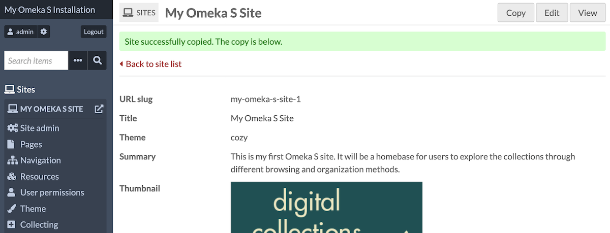

# Copy Resources

The [Copy Resources module](https://omeka.org/s/modules/CopyResources){target=_blank} allows you to duplicate Omeka S sites, site pages, items, and item sets.

Once activated on the [modules](https://omeka.org/s/docs/user-manual/modules/){target=_blank} section of the admin dashboard, Copy Resources inserts a "copy" button into the interface of several pages in the admin side, including when viewing the resource, and on the table of sites, each site's table of pages, and the items and item sets tables. 

Items and item sets will get a new unique identifier, but have all their metadata fields duplicated, including data captured by modules, such as geolocation data in Mapping. Duplicate items will be added to the same item sets as the originals; duplicated resources will be added to the same sites as the originals. However, duplicated items will have no media copied with them.

Sites and site pages will have the same name, but their URL slugs will be unique. Pages will have all their page blocks duplicated, including blocks added by modules, and those blocks' settings.

Some content will not copy exactly - be sure you review duplicated resources thoroughly and look for anything missing before making the new resource public. 

### Permissions

Global Administrators, Supervisors, and Editors can use this module to copy items, item sets, sites, and site pages.

Users at Author and Reviewer levels can copy items and item sets. 

Site-specific permissions do not affect a user's ability to copy sites. Site copying is reserved for Global Administrators, Supervisors, and Editors. 

Users with site-specific permissions of Creator and Manager can copy pages. 

Users can copy resources that they do not own. When a resource is copied, the user who made the duplicate will become its owner; the resource will not retain the owner of the original. 

### Requirements

Copy Resources requires Omeka S 4.1.1. In order to work with the following modules, Copy Resoures depends on versions of those modules that have been updated since Copy Resources' release, specifically:

- Mapping version 2.0 and above
- Scripto version 1.5
- Collecting version 1.2
- Data Visualization version 1.3
- Item Carousel Block version 1.3
- Faceted Browse version 1.5.

## Copying resources

When copying an item or item set, the "copy" button appears to the left of the "edit" button (pencil icon) in each row in the resource table. Items and item sets can be copied manually, one at a time (not in bulk). 

When the "copy" button is clicked, a confirmation will appear in the right-hand drawer. This confirmation window will allow you to set the visibility of the duplicate resource - the options are "Same as original", "Private", or "Public". 

!!! note
	Items will be copied without their media, in order to limit server processing and space use. If you need to copy an item's media, use the [Omeka S Item Importer](ositemimporter.md) module, which has the ability to copy items along with their media. Enter in your own installation's API to access existing items. Recall that media only exist through association with a single item; you cannot "add" existing media to a second item.

When the resource has been successfully copied, you will be taken to the new resource's view page. 

You can also copy resources when viewing them individually - a "Copy" button will appear in the top right corner of the screen.

!!! note
	Note that duplicated resources will have the same [links to other Omeka S resources](../content/items.md#linked-resources), but anything that links to the original resource will not automatically link to its duplicate. You will have to manually establish these links if desired, or use modules such as [Inverse Properties](inverseproperties.md). 

## Copying sites and pages

### Pages

Pages can be copied from the table of pages in each site, or from the individual page editing interface. 

When the "copy" button is clicked, a confirmation will appear in the right-hand drawer. This confirmation window will allow you to set the visibility of the duplicate resource - the options are "Same as original", "Private", or "Public". 

When copying pages, the duplicated page will have the original slug with "-1" appended to the end. You may then rename and re-slug the page. 

All page blocks should copy over, including page blocks introduced by modules, [as long as the corresponding module is updated where applicable (see the Requirements section above)](#requirements).

This module does not add newly copied pages to the site navigation; duplicated pages will need to be manually added. 

You cannot use this module to copy a page from one site to another.

### Sites

When copying a site, you can find the "copy" button in the table of sites, or on an individual site's view page.

When the "copy" button is clicked, a confirmation will appear in the right-hand drawer. This confirmation window will allow you to set the visibility of the duplicate site - the options are "Same as original", "Private", or "Public". 

The module will duplicate every page, every navigation entry, every site and theme setting, and every user permission. All resources added to the original site will be carried over to the duplicate site. The new site will point to the same assets (logo, banner, etc.) that the original site did.

When copying a site, pages will maintain their unique slugs; the site itself will have the original site's slug with "-1" appended to the end. You may then rename and re-slug the site in its settings. 

Where other modules introduce site-specific data (such as Metadata Browse, Sharing, Data Visualization, Collecting, Faceted Browse, Item Carousel Block, etc.) this information will be copied, [as long as the corresponding module is updated where applicable (see the Requirements section above)](#requirements). 

#### After you duplicate a site

Be sure to check over a duplicated site thoroughly to ensure everything has copied correctly. Some pages, page blocks, or module data may not have copied as intended, and may need manual re-setting, such as items chosen in the media embed page block, or pages set in the navigation. 

Copying an entire site is a complicated process; sites contain large varieties of data, including from modules and themes. Copying a site may result in errors that need to be fixed before the site can be made public, and some data may need to be manually recreated from the original site before you can have a perfect copy. 

Some issues you may run into:

- A site whose navigation has missing page entries may cause errors until the missing pages are cleared or fixed. This may include problems changing the site theme, name, or slug. If you see the errors "Invalid navigation: page link missing page ID" or "Invalid navigation: invalid link data", check your Navigation for entires displaying "[Missing page]".
- [Data visualizations](datavisualization.md) may be copied over as drafts, not as published diagrams and generated datasets. That is, all the settings will persist, but you will need to generate the datasets for the new site in order for the data visualizations to appear on the public side. You may notice that on the original site, the data visualizations are appearing with "View dataset" and "View diagram" icons in the table, whereas on the duplicate site they are only appearing with "Edit" (pencil) icons in the table.  
- Some sites with the [Faceted Browse](facetedbrowse.md) module in use may show errors if the user duplicating the site does not have permissions to use Faceted Browse (Global Administrators and Supervisors can, but Editors cannot). 
- The ["List of pages" page block](../sites/site_pages.md#list-of-pages) can sometimes be copied before all of the site's pages are duplicated, which means the pages listed in the block may be broken. Remove all entries and replace them in any pages using this block. 