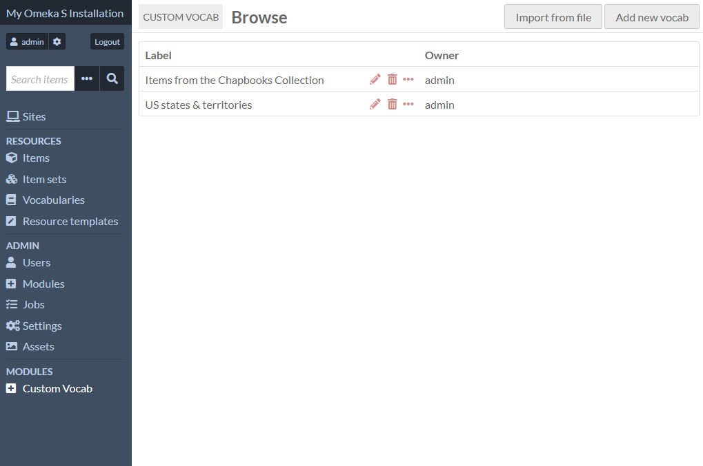

# Custom Vocab

The [Custom Vocab module](https://omeka.org/s/modules/CustomVocab){target=_blank} allows you to create a controlled vocabulary and add it to a specific property in a resource template. When using that template for an item, the property will load with a dropdown limited to the options of the controlled vocabulary, rather than a text entry box.

For example, you may want to create an institution-specific list of locations that correspond to different collections on your campus, or a controlled list of people or places related to your holdings. This can help reduce typos and name variations, and can allow you to offer [metadata browsing](../modules/metadatabrowse.md) for more fields.

Custom Vocab is available to users who are at the [Editor role and above](../admin/users.md).

## Create a custom vocab

Once you have installed and activated the module, go to the Custom Vocab section in the left-hand navigation, under Modules.

Click the "Add new vocab" button in the upper right-hand corner of the window.

The Add Custom Vocab page has four fields: Label, Language, Vocab Type, and Terms/Items/URI input.

- **Label**: A name for the vocabulary, which you will use to find it when adding to a resource template.
- **Language** (optional): The language of the vocab, using the [ISO 639-1 language code](http://www.iso.org/iso/language_codes){target=_blank}.

You can set the controlled vocabulary terms to a list of entered terms, to a list of existing items, or to a list of external URIs with or without labels:

- **Terms**: a list of plain-text terms, one word or phrase per line. This populates the property as text.
- **Items**: a drop-down of Item Sets in your Omeka S installation. Choosing one of these will create a custom vocab populated by items from that item set. When used, the property is populated as an Omeka Resource, not text.
- **URIs**: a list of URIs with or without labels, one URI per line. To include a label, add a space and the label after the URI (for example, "https://youromekainstall.org/item/1119 Canada"). When used, the property will populate as a link to the external resource.

!!! note
	Note that manually entered terms or URIs do not need to be unique when entered; the module will only retain unique entries when saved. If you are entering identical URIs with different labels, only the final entry will be retained and earlier labels will be ignored.

Hit "Submit" to save changes.

## Manage custom vocabs

Once you have created at least one vocabulary, the Custom Vocab tab will display a table of your existing vocabularies. The table displays the Label, the buttons for edit, delete, and display information (ellipsis), and the Owner or creator of the vocabulary. 

There is also a button to "Import" a vocabulary using a file, in the top right. Note that importing will add a new listing to the table. If you are attmepting to update an existing vocabulary in your installation, do not use the "Import from file" button. Update the vocabulary from its entry in the table.

Clicking the ellipsis will show you the language of a vocabulary as well as a full listing of its terms. There are two buttons that allow you to "Export" a vocabulary, which can then be shared with other Omeka installations, or to "Update" the existing vocabulary from a file. Note that Items-type vocabularies cannot be exported or imported, as these vocabularies work as Omeka resources and could not replicated on another site.

When editing a custom vocabulary, you can change the label, language, or terms.

## Using a custom vocab

Custom Vocabularies are applied through [resource templates](../content/resource-template.md).

Go to the Resource Templates and either add new or edit an existing template. Once you are editing the template:

1. Add the property to which you want to apply the Custom Vocab.
1. Edit the property.
1. In the drawer which opens on the right, go to the Other options section and find the Data type dropdown.
1. Scroll through the dropdown and select the Custom Vocabulary you want to use.
1. Click set changes at the bottom of the drawer.

Be sure to save your changes.

When you click the title of a Resource Template to see its details, the Custom Vocab will show up in the Data Type table heading.

When this Resource Template is used in an Item or Item Set, the designated properties will always load as a drop down menu with the values from the custom vocabulary.

In this image, the Resource Template modified earlier is loaded for a new item. See that Spatial Coverage has a "select below" message and arrows indicating the property input is a drop down menu.

This image shows the dropdown open, displaying the values from the "US states & territories" vocabulary.

