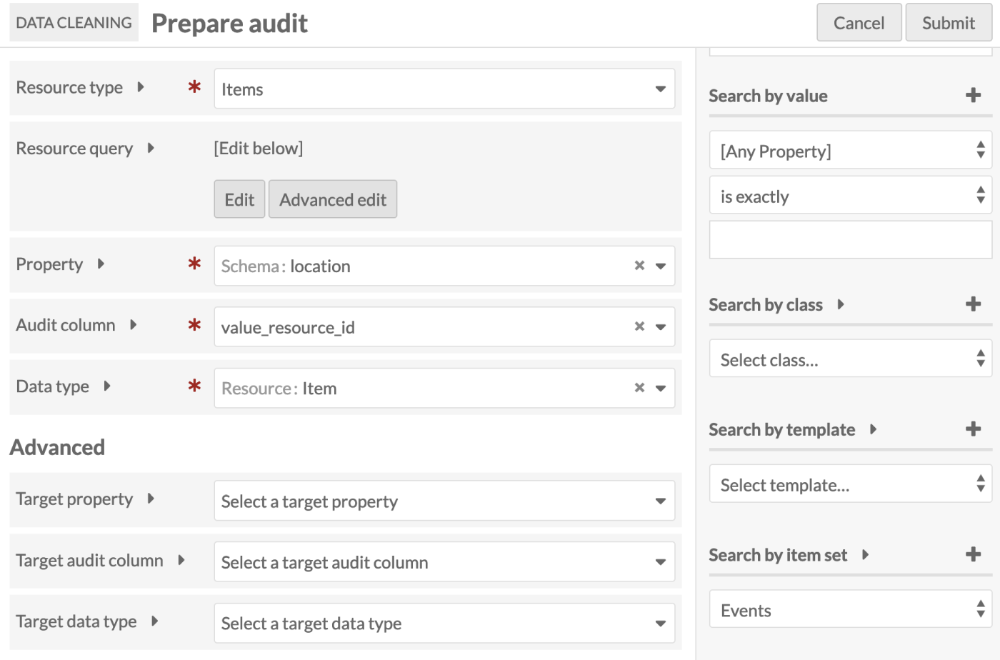
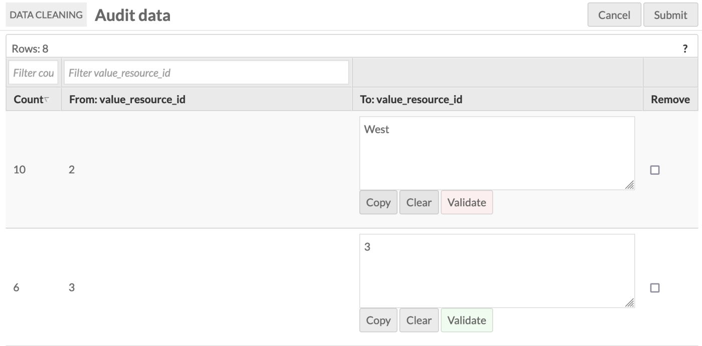

# Data Cleaning

The [Data Cleaning module](https://omeka.org/s/modules/DataCleaning){target=_blank} is for low-level auditing and cleaning of resource metadata. It is designed to prepare resource metadata for use in visualizations.

Changes made by Data Cleaning cannot be easily undone, and can be destructive. Due to the powerful nature of the module, it can only be used by Global Administrators. 

!!! note
	Before running any audit, make sure you have a recent backup of your data. Backing up your SQL database can be done with many hosts, and you can back up your entire Omeka installation if you installed through an app manager.

Once you have [installed](index.md#installing-modules) Data Cleaning, it will be added to the modules available on the left-hand navigation of your administrative view.

## Running an audit
From the section for Data Cleaning under Modules, click the "Prepare new audit" button in the upper right corner of the page. 

### Prepare audit
This will open the "Prepare audit" form, which allows you to zero in on the data you want to review and perhaps correct. The form has the following Basic options: 

- **Resource type**: Select the resource type you want to audit from a dropdown. Options are items, item sets, or media.

- **Resource query**: Click the "Edit" button to reveal the Query Builder interface in the right sidebar. Use the form to set the universe of resources you want to audit. You can click the Advanced edit button to reveal and edit the query string.

- **Property**: Selects the property to audit. This dropdown will load all properties from all vocabularies on your installation. When open, the top of the dropdown functions as a search to allow you to locate a property more quickly. 

- **Audit column**: Sets what kind of data be audited with in the resource pool. Select from a dropdown for `value`, `uri`, or `value-resource-id`. In general, data types may use these columns for different reasons. But, in particular, the "literal" data type uses the `value` column to store the value; the "uri" data type uses the `uri` column to store the URI and the _value_ column to store the URI label; and the "resource" data type uses the `value-resource-id` to store the resource ID. Modules that add data types assign data to one or more of these three columns. 

- **Data type**: Select from a dropdown of data types to audit. This includes standard data types for Omeka S, as well as any additional data types added by other modules, for example Numeric Data Types. 

#### Advanced Options

Should you want to audit the data contained in one property but store the corrected data in a different location within the resources, you can use the "target" options to do so.
 
- **Target property**: Select the property as which you want corrections to be stored. You do not need to select a target if it is the same as the property above. This dropdown will load all properties from all vocabularies on your installation. When open, the top of the dropdown functions as a search to allow you to locate a property more quickly. 

- **Target audit column**: Select the column in which corrections will be stored. You do not need to select a target if it is the same as the audit column above. Options are `value`, `uri`, or `value_resource_id`. 

- **Target data type**: Select the data type that corrections will be stored as. You do not need to select a target if it is the same as the data type above. This dropdown includes standard data types for Omeka S, as well as any additional data types added by other modules, for example Numeric Data Types. 

Once you have entered information in all relevant fields, click the "Submit" button in the upper right corner. 

You can exit out at any time by clicking the "Cancel" button. 

### Audit data
Clicking submit in the Prepare audit page will take you to the Audit Data page. 

At the top of the page, just under the header, will be a message telling you how many unique strings you are editing and for how many resources. The number of resources is a link to the resources returned by the search query you entered on the previous page. 

Below this message is a table stating the data being audited. There are three columns: Audit Column, Property, and Data Type.  There are two rows, From and To. Be sure to double check the information in this table before proceeding. 

 

Below you will see a row of buttons that allow you to operate on all of the strings you are auditing.

- **Copy all**: Copies the data in the "From" column to the "To" column for all of the unique strings.
- **Clear all**: Removes all of the data from the "To" column.
- **Validate all**: Checks all of the proposed changes to make sure that they are possible within the bounds of the current column and data type, i.e. you cannot set a `value_resource_id` to a literal string of text because the data type is looking for a number. The validation only checks that the input is structurally possible, not that the inputted edit exists, i.e. one could change a `value_resource_id` to a number that did not correspond to an actual Omeka S ID.
- **Remove all**: Checks the "Remove" box for all of the unique strings. This will set the data from the property being audited to null. Use extreme caution when applying this option.
- **Unremove all**: Unchecks the "Remove" box for all of the unique strings.

Next you will see a table of all of the unique strings within your audit. If you have an audit result with a lot of unique strings, you can use the filters to zero in on the strings that you wish to edit. Additionally, the columns with current audit data can be sorted by clicking on the column header.

The table provides you with a Count of the number of resources per string, the unique string as it currently exists (From:), an input box to edit the current strings (To:), and a remove check box to set the data to null. The edit input cell for each row also has buttons to allow you to copy, clear, and validate your proposed changes.

Once you have carefully edited the content in your _To_ column, click the "Submit" button to execute the update of your data. Given the powerful nature of the module, you will be asked to confirm your decisions. The data cleaning process will run in the background, and while the job can be reviewed, it cannot be undone.

## Sample workflow
This is a sample workflow for a user who wants to audit the titles of items in a specific item set:

- In the left-hand navigation, go to the Data Cleaning module.
- Click on "Prepare new audit" button (top right).
- Select criteria (expand arrows for info):
	- Resource type: "Item"
	- Resource query: item_set_id[]=1234
	- Property: "Dublin Core: Title"
	- Audit column: "value"
	- Data type: "Text".
- Ignore the "Advanced" section.
- Click "Submit" (top right).
- Audit the "From: value" column for potential corrections or removals.
- Make corrections by entering the correct text into the "To: value" column.
- Make removals by checking the "Remove" checkbox.
- Click "Submit" (top right).
- Click to confirm the submission.
- Refresh the "Past audits" page until the job is marked as "Completed".
- Check the items to see if the values were corrected and removed.