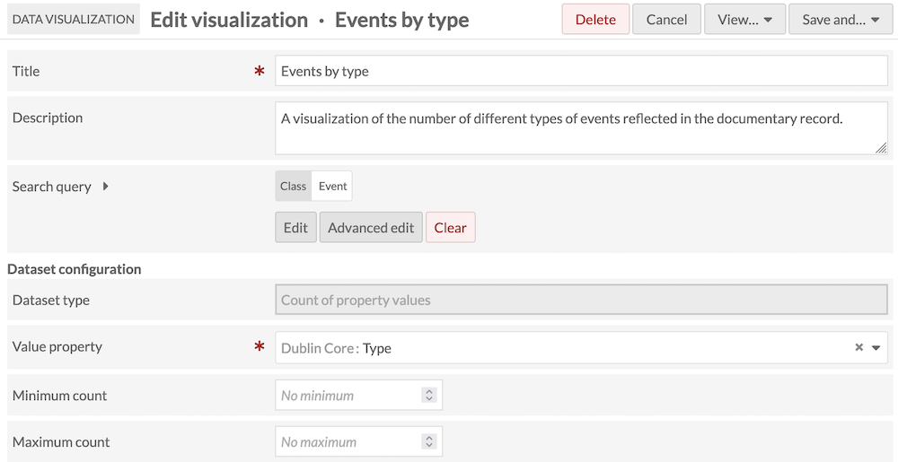
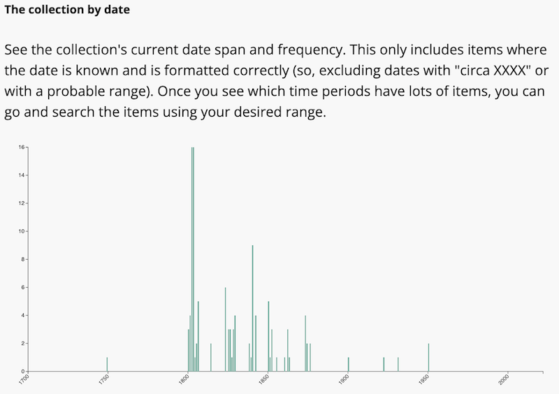
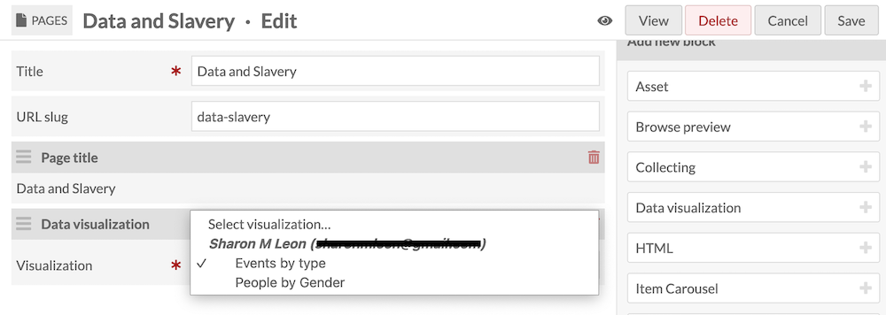

# Data Visualization

The [Data Visualization module](https://omeka.org/s/modules/Datavis){target=_blank} allows site administrators to generate datasets and render diagrams that reflect the complexities of their collections. Once installed and activated on the Modules section of the admin dashboard, Data Visualization is managed on a site-by-site basis. You can add your data diagrams to site pages using page blocks.

Some visualizations allow users to interact and navigate through to items or sets; others are static representations of site information. Some will require you to reformat or convert your metadata to make it readable by Data Visualization. 

## Data visualizations by site
A section for Data Visualization will appear in the menu for individual sites. Clicking this link will take you to a list of all visualizations created for the site. 

You can sort the visualizations by either date or title in ascending or descending order. You cannot batch-edit visualizations, including deletion, nor can you duplicate existing visualizations, or copy them to other sites.

### Add a data visualization

After clicking the Data Visualization link under a site, click the "Add new visualization" button.

You will then have the option select what you would like to visualize. The five options include:

1. **Count of items with classes**, which visualizes the count of items that are instances of selected resource classes.
1. **Count of items in item sets**, which visualizes the count of items that are assigned to selected item sets.
1. **Count of items with properties**, which visualizes the count of items that have selected properties.
1. **Count of items with property values**, which visualizes the count of items that have selected values of a selected property.
1. **County of property values**, which visualizes the count of values of a selected property.
1. **Count of items with property values in a time series**, which visualizes the count of items that have selected values of a selected property over a selected period of time.
1. **Count of items in a time series**, which visualizes the count of items over a selected period of time.
1. **Count of property values**, which visualizes the count of values of a selected property.
1. **Item relationships**, which visualizes the relationships between items via their resource values.

Once you select what you would like to visualize, click the "Next" button. You will then be able to describe and configure this visualization.

- Each visualization requires a Title.
- You may add a prose Description of the visualization. This will appear under the title on the visualization's page and in the page block. 
- Use the Search Query interface to set the pool of resources to be visualized. If you choose to leave this blank, the visualization will incorporate all resources assigned to that site.
    - If you select "Edit", a sidebar will open allowing you to search full-text, by value, by class, by template, by item set, and/or by owner. You can combine multiple parameters with "AND" or "OR". You can either "Preview", "Reset", or "Apply" your search by selecting the corresponding button at the bottom of the search sidebar.
    - If you select "Advanced edit", you can edit or paste in a search string from a URL (which you can create by searching your resources on the site's front-end).

#### Data configuration
The options for configuring this dataset will reflect the "Dataset type" you selected initially, and may need to be modified depending on the diagram you wish to display:

##### Count of items with classes
If you are creating a count of items with classes, you will be able to select the classes by clicking inside the classes box and selecting from the dropdown menu. If you do not complete this step, you will receive an error when attempting to generate your data set.

##### Count of items in item sets
If you are creating a count of items in a item set, you will be able to select the item sets by clicking inside the item sets box and selecting from the dropdown menu. If you do not complete this step, you will receive an error when attempting to generate your data set.

##### Count of items with properties
If you are creating a count of items with properties, you will be able to select the property by clicking inside the "Property" box and selecting from the dropdown menu. You may add more than one property. If you do not complete this step, you will receive an error when attempting to generate your data set.

##### Count of items with property values
There are two fields you need to complete under "Dataset configuration" when creating a count of items with properties: "Value property" and "Values". First, you must use the drop down menu to select the value property from the dropdown menu. Then, you can enter the specific values, separated by new lines, into the textbox. If you fail to fill out either of these fields you will receive an error when attempting to generate your data set.

##### Count of property values

When configuring your dataset for counting property values, you must select a value property from the dropdown menu. If you do not complete this step, you will receive an error when attempting to generate your dataset. There are two other optional configuration fields: Minimum count and Maximum count. You can set these values by typing or by increasing or decreasing with the arrows.

##### Count of items with property values in a time series

This option visualizes the count of items that have selected values of one selected property within a specified range of time. Enter in desired values in a list. (You may find it useful to copy values for this list from the Faceted Browse module, as it can load all available values of a given faceted property.)

Each entry in the list of values will have a separate colour. The graph will display instances of each value in each date bucket (e.g. each year, or each ten-year span). 

Line (no points), Points (no line), Line and points.

Line options are:

- Linear
- MonotoneX
- Natural
- Step
- StepAfter
- StepBefore.

For a simpler version of this option, choose "Count of items in a time series" below.

##### Count of items in a time series

visualizes the count of items over a selected period of time.
This visualization does not provide links to items included in the visualization; it only reports a count of the items inside a given bucket. 

##### Count of property values
visualizes the count of values of a selected property.

##### Item relationships
visualizes the relationships between items via their resource values.

!!! note
	If you make changes to any of the settings above this line, you will need to re-generate your dataset in order to see the results in your diagram. Changes made below this point in the configuration page do not require refreshing the dataset. 

#### Diagram configuration
Under Diagram Configuration, you will be able to select the kind of diagram you would like to produce for your visualization. 

##### "Count of" diagrams
Options include bar chart, column chart, and pie chart.

If you select **bar chart** or **column chart**, you will be asked to input the width and height of your visualization as well as the top, right, bottom, and left margins. Additionally, you will be able to use a dropdown menu to order your data by value (ascending), by value (descending), by label (ascending), or by label (descending).

If you select **pie chart**, you will only be asked to input the width, height, and margins.

##### Date-based diagrams

Date - Property value: "Grouped line chart (time series)"

Date: Line chart (time series) or Histogram (time series)

###### Histograms

##### Relationship diagrams

###### Arc diagrams

Arc diagrams display items in a column on the left-hand side of the diagram, with relationships between those items represented as large arcing semi-circles connecting two items. One item may have many arcs. Items are colored based on the group assigned in your settings (either the item's class or template, or a property value you selected), and the arcs are the color of the item with the outbound linked resource provided in a property value. For example, if you were showing the relationship between creators and their creations, using the resource templates (e.g. People and Books) as your groups, you would have people coloured in orange and books coloured in blue, with blue arcs connecting the books to the people provided in their "Creator" fields. If items have reciprocal (inverse) relationships with each other, you may see what looks like one arc that is the combined color of the two arcs. 

###### Network relationship diagrams

Network relationship diagrams display items with links to one another in a tree visualization. 

#### Finalize your visualization

If you edit your visualization to change the Diagram Configuration after your initial visualization is produced, you will lose your current diagram configuration.

You can only generate one diagram per dataset; if you wish to present multiple diagrams of the same information, create more visualizations with the same queries and settings.

## Generate your visualization
Once you have configured your visualization, click the "Save and..." button, select the box to "Generate dataset" and click "Stay on this visualization."

Once your visualization is complete, you can click the "View..." button and select "Dataset" or "Diagram."

If you select "Dataset," a new browser tab will open that displays your dataset in JSON. You may find it useful to "Expand all" at the top of the page to quickly scan the loaded values.

If you select "Diagram," a new browser tab will open to a new public page on your site, containing your diagram. This page will continue to be publicly available on your site as long as the visualization exists, but you don't need to link to it from anywhere. You can insert your visualizations as page blocks instead (see below).

You can save your work and select "Return to Visualizations," which will bring you to a browse list of all of your visualizations, where you can view the diagram or dataset, or edit the visualization.

### Troubleshooting your diagram

You may find that your diagram width and height does not display the results appropriately. Diagrams are generated via SVG, which means some things (such as the vertical lines in the histogram) are being drawn at narrower than 1 pixel relative to the sizes and parameters provided. You can fix this by widening the diagram, narrowing the parameters on either axis (such as the date range), or broadening the buckets.

!!! note
	Your diagram should be drawn at the width and height desired in the context of the page you eventually plan to display it in. You may wish to create a draft version of the page and refresh it whenever you make changes to the diagram's settings. Some diagrams may be unsuitable depending on your page layout, such as a tall and narrow diagram floating on the right side of the page. Not all diagram choices have settings that make flexible display possible.

If the text is cramped in the axes of your graph, go back and adjust the margins. Text labels do not have overflow or line-wrapping options, so some long item titles may be cut off. You can adjust the font size on some diagrams (from extra-extra-small to extra-extra-extra-large), but it may be constrained by the ultimate width of the diagram, which itself will be dependent on the layout of the page and your Omeka site's theme. 

## Publish your visualization

Data visualizations are primarily published by adding them to site pages as page blocks. 

While editing a new or existing page, add a "Data visualization" block. In the new block, use the dropdown menu to select the visualization you would like to add to the page. Then save the page edits. Remember to add the page to your site navigation, if new.

You can also use the "View diagram" buttons on each visualization to get a direct URL to a page containing the title, description, and visualization. 

You can add these pages to your site navigation under the "Navigation" settings. Look for a "Data visualization +" option in the right sidebar. 