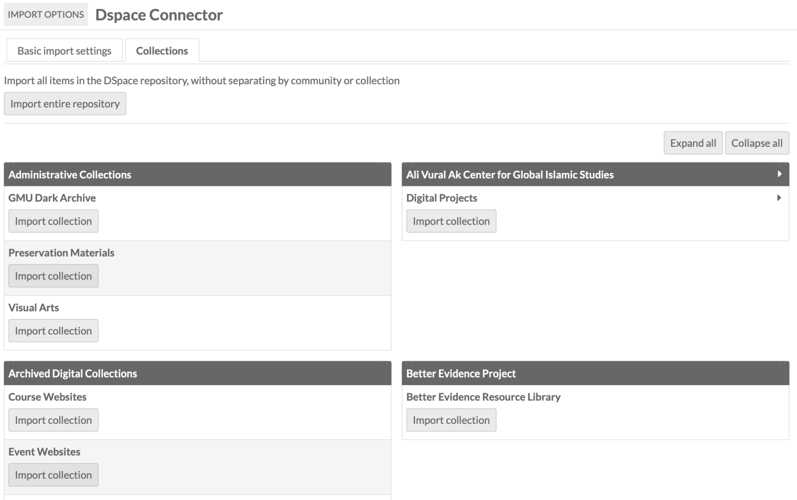

# DSpace Connector

The [DSpace Connector module](https://omeka.org/s/modules/DspaceConnector){target=_blank} allows you to connect an Omeka S instance to a [DSpace repository](https://duraspace.org/dspace/){target=_blank} to import items from that repository. In addition to importing information, the Omeka S item will include a link back to the original item.

Note that DSpace Connector only works with DSpace versions 5.6 and higher. This connector relies on the DSpace API and its site-by-site configuration.

## Import data

Navigate to the tab labelled "DSpace Connector" under Modules.

On the first form, enter the following information:

* **DSpace site URL** for the repository - the entire URL, including the `http://`
* **Endpoint** for the API (by default this is "rest" but may be changed in the DSpace instance)
* **Limit** or maximum number of results to retrieve at once.

Click the "Get collections and communities" button. If the information above has been correctly entered, you will proceed to the DSpace Connector Import Options page. This has "Basic import settings" and "Collections" tabs.

### Basic import settings
This tab has five options:

* **Import files into Omeka S**: click this checkbox to import files in addition to metadata.
* **Item Set**: select an item set from the dropdown into which to import the items, or create a new item set named for the imported DSpace collection.
* **Sites**: add the imported items to the specified site or sites. Global and user-specific default sites will be pre-selected here.
* **Ignored Fields**: DSpace metadata fields to ignore on import, separated by commas.
* **Comment**: comments to attach to the import batch, which will appear on the "Past DSpace Imports" page.

### Collections
This tab will display the list of collections for the DSpace repository, organized by the containing community. You can import either one collection at a time or the entire DSpace repository.

To import a single collection, click the "Import" button to the left of its name. This will automatically begin the import.

To import the entire repository, click "Import entire repository" at the top of the form.

**NOTE:** Importing an entire DSpace repository with a large number of items (more than 5,000) is likely to flood the DSpace hosting server with requests until failure. Consider importing collection by collection. If you still wish to import an entire large repository at once, the following might help:

* On the initial "Import Settings" menu, set **Limit** to a smaller number, such as 50 or 25.
* Run the import at night and/or whenever there may be less traffic on the DSpace server.
* Consider temporarily inserting [a `sleep()` function](https://www.w3schools.com/php/func_misc_sleep.asp){target=_blank} between the import of each record in `Import.php` to slow the process down slightly (not recommended for production).

You can track the status of imports by navigating to the DSpace Connector "Past Imports" tab, or on the [Jobs](../admin/jobs.md) page of the admin dashboard.

!!! note
	Are your jobs starting and not completing? You might need to [set the path for PHP](../configuration.md) so that your system can perform the background process to make the items.

## Review imports

The "Past DSpace Imports" page displays a table of past DSpace imports, with a checkbox option to **Undo**, the **Job ID** for the import, the repository’s **Dspace Collection Link** (not showing the full URL), any **Comments** made during import, the number of **Items** imported, the **Date** of the import, the import **Status**, and the **Owner**, or user who initiated the import.

## Update imported resources

To manually update resources created using the DSpace Connector, simply re-run an import from the same source. The resources will be updated, not re-imported. This allows you to use the Connector to sync data between DSpace and Omeka S installations.

## Undo an import

You can view past imports from the "Past DSpace Imports" page. To undo a completed import and remove all associated items, check the box for each import you wish to undo and click the "Submit" button.
