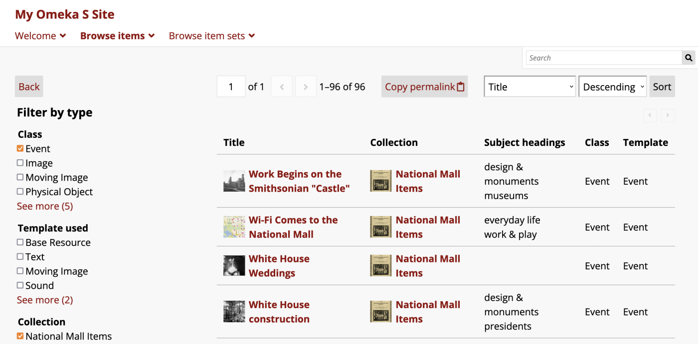
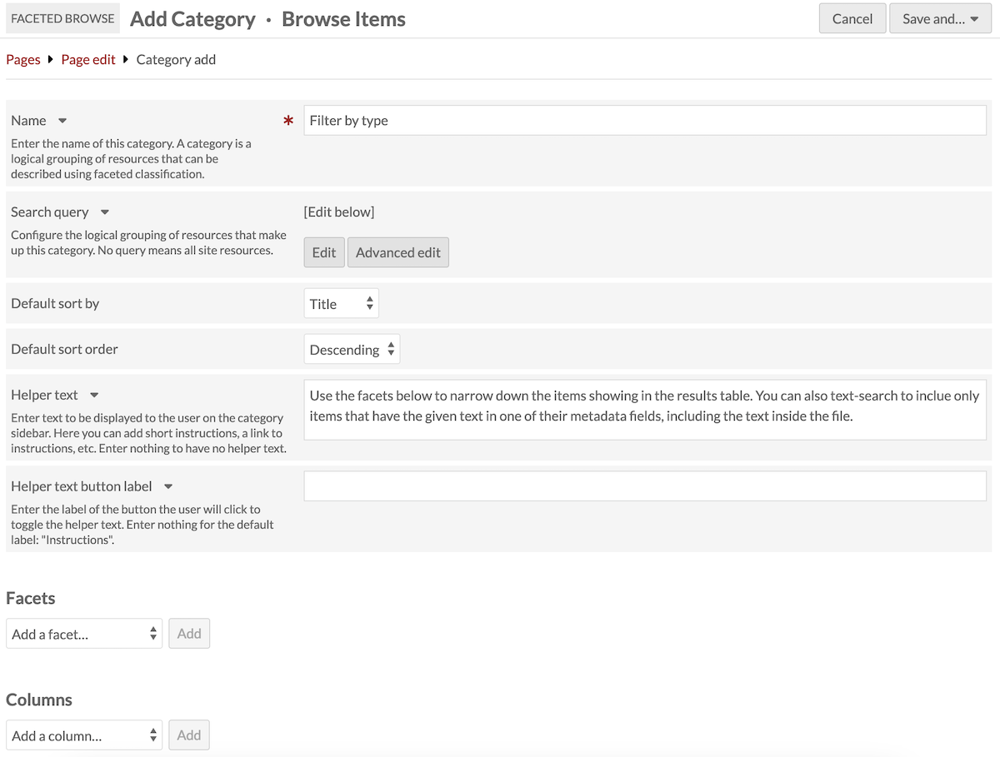
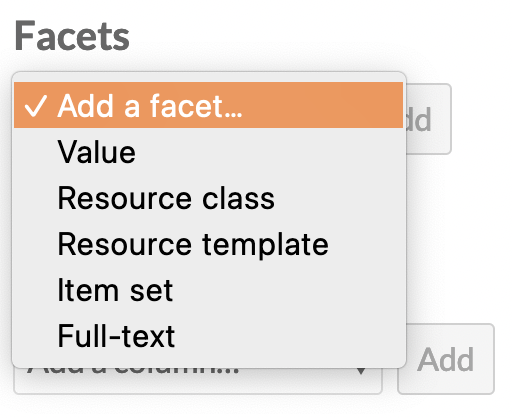
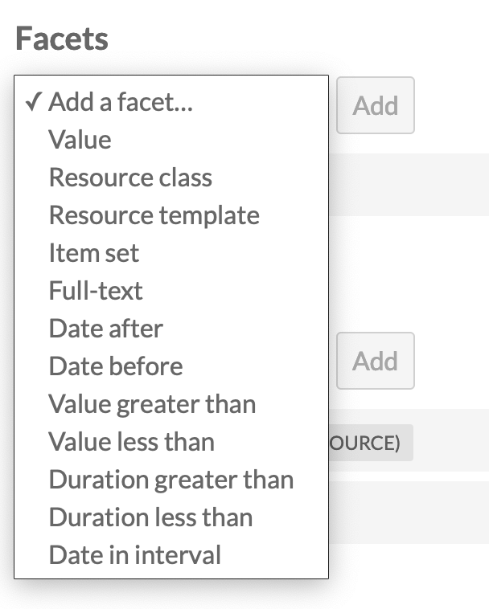
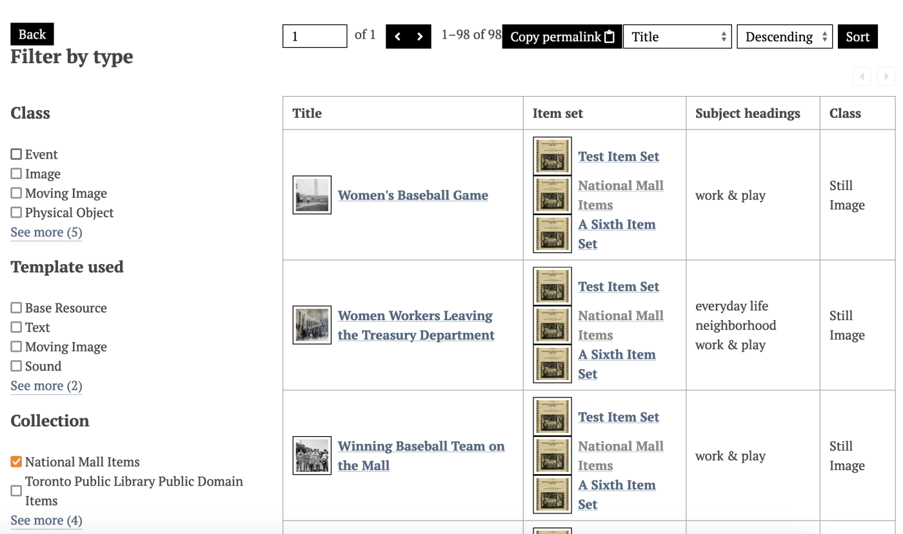
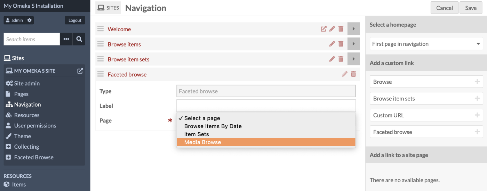
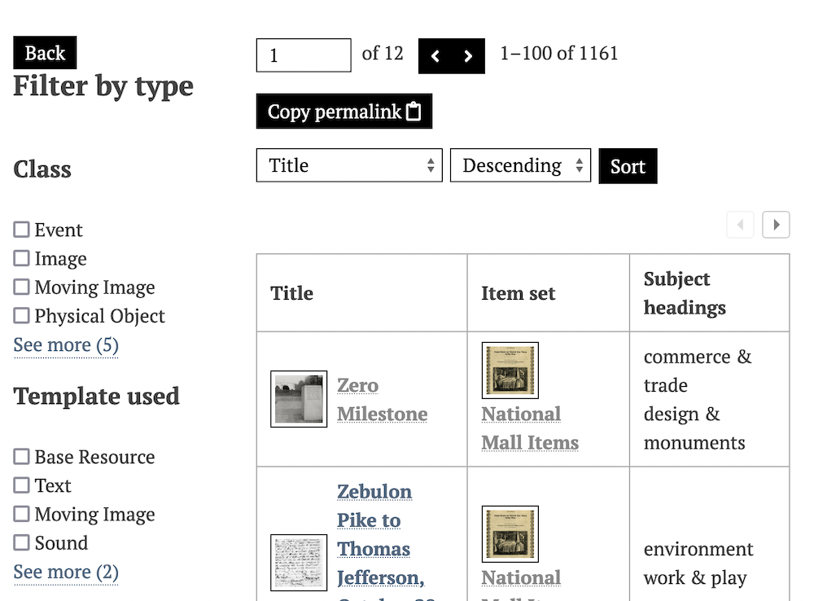
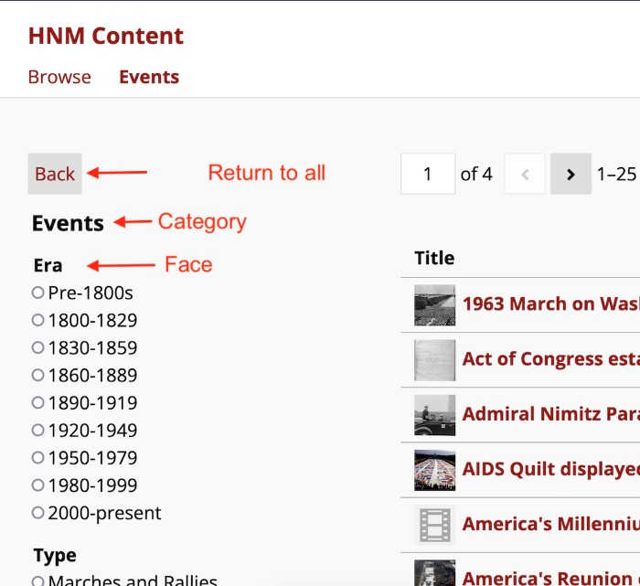
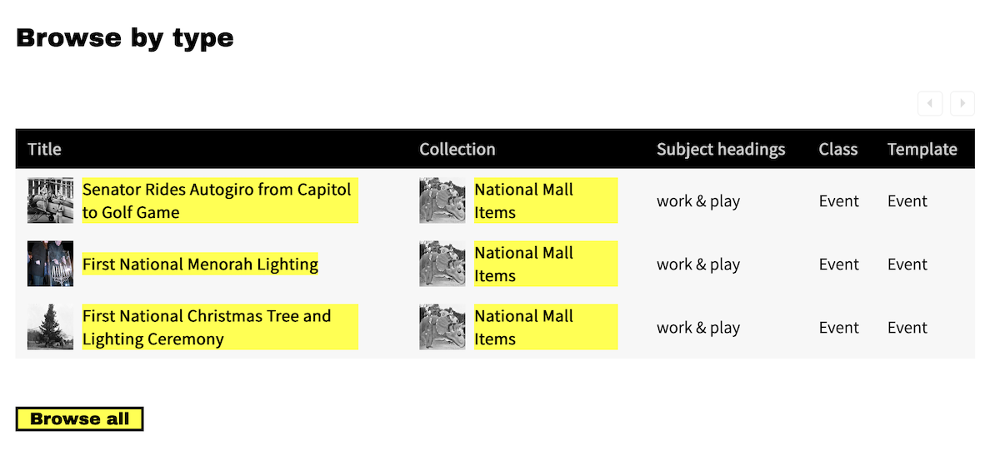

# Faceted Browse

The [Faceted Browse module](https://omeka.org/s/modules/FacetedBrowse){target=_blank} lets you create "browse resource" pages with facets - filter and sort functions - that site visitors can use to explore your collections. Faceted Browse pages can be made for items, items sets, or media. 

With this module, site managers are able to configure faceted browse pages and add them to their site's [navigation](../sites/site_navigation.md). End users are then able to browse through resources and use the facets to narrow the results in a logical and intuitive manner. This functionality is similar to the filtering options on many websites and should be easy for users to manage as long as you have clear language.

The [public view](#public-views) section below shows how these facets display for single and multi-category pages.

Faceted browse pages exist as separate [pages](../sites/site_pages.md). You can [add faceted browsing to a page as a block](#faceted-browse-page-block) that will preview the FB page, but not have its full functionality. 

Once activated, Faceted Browse is configured on a site-by-site basis.

## Terminology

A quick guide to the terms used to describe the aspects of a faceted browse page:

- Category: a group of resources (items, item sets, or media) to which facets are applied on a specific page. You can use a query to narrow the resources, or leave it blank to show all of that resource type. 
- Facet: an aspect of a resource - usually part of the metadata - which becomes a way to filter the resources in the category. Faceted browsing works best when you have some controlled vocabularies in your metadata values, or when unique values can be sorted into buckets (such as dates browsed by century). 
- Column: information to display for each resource in the results. Columns are optional. Once you have set at least one column, the items will display in a table form (not a grid). When no columns are set, your site's browsing default will display (e.g. title, thumbnail, and description for each resource).
- Select: When a facet is browseable, you should allow your visitors the most appropriate means of sorting or searching those facets. You can allow them to, for example, exclude or include strings in the results, match full values exactly, or, with numerical data types, bucket the values into groupings that you set. 

In the example public view above, the title "Browse items" is used for the page's appearance in the navigation; "Filter by type" is the category name in the left-hand sidebar of the page. Facets in the category include "Class", "Template used", and "Collection". In these examples the Select used is "Multiple (list)", which results in checkboxes for each option, and the visible options are truncated at 4.

## Create Faceted Browse pages

Once the Faceted Browse module is active, a tab for Faceted Browse will appear in the context menu for every site. Clicking on this tab will take you to a list of all of your Faceted Browse pages for that site.

Site managers must create Faceted Browse pages before they can be added to the site's navigation.

### Add a Faceted Browse page

Create a new page by clicking the "Add a page" button. This takes you to a new page where you can add basic information for the page and start adding categories. 

The **page title** is required and will display on browser tabs and be sent in the page metadata. You can set a separate label in the site navigation. Most themes will not display this title visibly on the page. When one category is in use, its title will show on the page; when two or more categories are set, the word "Browse" will appear above the category links in the sidebar. 

Use the **resource type** dropdown to select the resource type that you would like to let users browse on this page: Items, Item Sets, or Media. This cannot be edited after page creation.

Select "Save and... Stay on this page" to continue creating the faceted browse.

You can also save your edits and leave without working on categories and facets by selecting "Save and... Return to pages".

### Categories

Once the page has been created, the user must create a Category, which can narrow down the resources to browse with facets. 

Click the "Add" button and give your category a name.

Use the search query interface to set the pool of resources that users will browse. The "Edit" button opens a drawer on the right hand side of the browser window which works exactly like [advanced search forms](../search.md#item-advanced-search) for items, media, and item sets. The "Advanced edit" button allows you to input a query string. You can leave the query blank to include all of the site's resources of that type. 

You can also set a default sorting method to use when a site visitor starts to browse using this category. The dropdown menu will show "Created" and "Title" at first, but will update to reflect the columns you customize for your browsing table below. You will need to save your columns settings to see this menu updated. Note that you cannot set a default sort by an Item Set column. 

You can also include some text to guide your users on how to navigate the Faceted Browse page. This text will appear in the left-hand sidebar along with your facets in this category. There will be a button to contract the text (which is expanded by default); the button says "Instructions" by default, but you can change this label. If you add no helper text, this button and text area will not appear. 

After setting the pool of resources, you can create facets and set columns for your browse display. Once you are done creating your facets and setting your display columns, save your category.

You can have more than one category per page. See [Multiple categories on one page](#multiple-categories-on-one-page) for how this functions on the public view.

### Facets

Facets work within the categories you have created. You can have one or more facets for each category. These are the selections that site visitors will use to narrow down the list of items.

You can create facets from the following options: 

- Value
- Resource class
- Resource template
- Item set (for items only)
- Full-text.

Once the type is selected, click the "Add" button. A drawer will open on the right side of the browser window with options to configure the facet. Facet names are always required and will display in the public interface. 

Other facet options are described below.

The image below shows the drawer options for the Value facet:

 

For the Single (list) and Multiple (list) Select types, page creators can choose to truncate the values on the list that is visible to the site visitor, by setting a number in the "Truncate values" option. Leaving the input blank will display all values. Entering in a number will display only that number of facets, in order, with a "See more (X)" link displaying the number of further facets. 

Do not forget to click the "Set facet" button to save your work, and then save the category.

##### **Value** 

Value facets correspond to the [values](../content/items.md#values) within a specific property for each item.

Use the dropdown to select which property to use for the facet. For example, you may wish to select your description field, and allow users to search within those description texts. Or you may wish to select the subject field, and allow users to see all the controlled values you are using as subject headings. You can leave this blank to provide searching or browsing options across all of the resources' properties.

Set the Select type for the browse faceting. This sets how site visitors interact with the options in the field:

- Single (list). Visitors can select only one; all options are displayed in a list of radio buttons.
- Multiple (list). Visitors can select multiple; all options are displayed in a list of checkboxes. Multiple selections by site visitors will narrow (Option 1 AND Option 2) the search results. 
- Single (dropdown menu). Visitors can select only one; all options are displayed in a dropdown menu.
- Text input. Visitors can type in text to include or exclude resources that include that text in their values.

For Select types that include a list or a dropdown menu, you can set a Query type (queries are available for value facets only; not for classes, templates, item sets, etc.). The options are:

- "Is exactly": Visitors pick a value that is an exact match to the property value. 
	- For example, visitors can check a box next to an available subject value and see all items with that exact value in their subject property. Exact text is not case-sensitive.
- "Is not exactly": Visitors pick a value that exactly matches items to be excluded from the results. 
	- For example, visitors can check a box next to an available subject value and see all items that do not have that exact value in their subject property.
- "Contains": Visitors can pick a value that appears in any part of the property value.
- "Does not contain": Visitors can pick a value to be excluded from any part of the property value.
-  "Is resource with ID": Visitors will select a resource to be included. 
	- If you then "Add all available values", visitors will see a list of resources that are [used as values on other items (that is, linked resources)](../content/items.md#linked-resources). You can employ this option without selecting a single property; then all linked resource values will be included. Note that IDs will not show on the public interface, although they are displayed in the administrative side.
-  "Is not resource with ID": Visitors will select a resource to be excluded. 
	- If you then "Add all available values", visitors will see a list of resources that are used as values on other items. You can employ this option without selecting a single property; then all linked resource values will be included. Note that IDs will not show on the public interface, although they are displayed in the administrative side.
-  "Has any value": Visitors will select the property. 
	- This will erase the property you chose in the steps above. If you then "Add all available values", visitors will see a list of properties that have values in them (in the format "Dublin Core: Language"). 
-  "Has no values": Visitors will select the property. 
	- This will erase the property you chose in the steps above. If you then "Add all available values", visitors will see a list of properties that have empty values (in the format "Dublin Core: Language"). 

For the text input Select type, you can set a specific property to search, or leave it blank to search all properties. Exact text is not case-sensitive. The options are:

- "Is exactly": Visitors enter a value that is an exact match to the full property value. 
- "Is not exactly": Visitors enter an exact value to be excluded from the the property values.
- "Contains": Visitors enter a value that matches any part of the property value. For example, they can search within item descriptions for a family name or a place.
- "Does not contain": Visitors enter a value to be excluded from any part of the property value. For example, they can exclude all items that mention a specific first name or place.

You cannot leave the query blank. You may wish to provide multiple types of Select queries for the same field, in order to offer more granularity to site visitors.

For the Single (list) and Multiple (list) Select types, Page creators can choose to truncate the values available on this list that is visible to the site visitor by setting a number in the "Truncate values" option. Leaving the input blank will display all values. Entering in a number will display only that number of facets, in order, with a "See more (X)" link displaying the number of further facets.

Next, enter the values that will make up the facets. Each value should be on a separate line.

Check the "Show all available values" box to get a sense of the data that is available for input. This will return existing values in the property you selected above, or from all properties. You may click the "Add all" button to populate the list of values. 

The order of your available values (from most to least frequent) will not persist when you use the "Add all" button. Properties will rearrange themselves according to an internal order, as will resource templates, classes, and resources by ID. 

The formatting of the value input will depend up on the query type selected above. If the query type is

-  "Is exactly": enter a value that is an exact match to the property value.
-  "Contains": enter a value that matches any part of the property value.
-  "Is resource with ID": enter the resource ID followed by any value (usually the resource title), separated by a single space.
-  "Has any value": enter the property ID followed by any value (usually the property label), separated by a single space.

When you are satisfied with your settings, click the "Set facet" button.

For example, you may wish to load all the "Subject" property's values and allow people to browse items using the subject headings currently in use. If you select "Show all available values" you will see a list of subjects currently in use, from most frequent to least. Note that you may wish to clean up your data and consolidate similar values, or fix typos and variations, to make faceted browsing more useful. You can use the [Value Suggest module](../modules/valuesuggest.md) in tandem with Faceted Browse to view and clean messy data.

!!! note
	Note that "All available values" facets do not dynamically update when new values are added to the corpus, or when values are edited. You must reload the options using "Show all available values" and "Add all" in the facet to update the browsing list's content. We recommend doing this regularly when new items are being added.

##### **Resource class** 

Allows visitors to narrow items by their resource class.

Set the Select type for the browse faceting. For the "Multiple (list)" option, multiple selections by site visitors will broaden (Option 1 OR Option 2) the search results. 

Select the classes that will make up the facets from the dropdown menu.

Check the "Show all available classes" box to get a sense of the data that is available for input.

##### **Resource template** 

Allows visitors to narrow items by their [resource template](../content/resource-template.md).

Set the Select type for the browse faceting. For the "Multiple (list)" option, multiple selections by site visitors will broaden (Option 1 OR Option 2) the search results. 

Select the resource templates that will make up the facets.

Check the "Show all available templates" box to get a sense of the data that is available for input.

##### **Item set** 

Allows visitors to narrow items by [item sets](../content/item-sets.md).

Set the Select type for the browse faceting. For the "Multiple (list)" option, multiple selections by site visitors will broaden (Option 1 OR Option 2) the search results. 

Select the item sets that will make up the facets.

Check the "Show all available item sets" box to get a sense of the data that is available for input.

##### **Full-text** 

Adds a text search bar that will narrow down the results based on what the visitor inputs. This will include all values, including title, description, class, and any extracted text. 

### Numeric Data Types integration

If you are using the [Numeric Data Types module](../modules/numericdatatypes.md), you will have additional facet types to work with, including Date after, Date before, Value greater than, Value less than, Duration greater than, Duration less than, Date in interval.

Once you have selected a facet type, you will be able to configure the facet to operate with the properties that use a numeric data type. Only properties with the exact data type set (Integer, Date, Duration, or Interval) will display in the dropdown.

In the public view, the faceting will be controlled through a dropdown menu.

### Columns

The items on the page will initially display in the [default format for your site (grid or list)](../sites/site_theme.md#layout-for-browse-pages). This list of results displays the title, description, and thumbnail for each resource, just as is the case with other browse lists. These rows may be truncated (overly long text will be hidden). 

You can configure the information displayed about the results by adding columns of metadata to the display for your faceted browse. This will convert the display into a table with a row for each resource in the results. Columns are set on a category-by-category basis. Depending on whether your page has one category or multiple categories, the display of the initial page may change.

On the public view of a facted browse, users can sort by a column by selecting it from the dropdown menu. Each column can be sorted in ascending or descending order. If you would like to prevent users from sorting by a certain column, you can check the "Exclude sort by" checkbox when configuring that column to exclude it from the dropdown menu.

!!! note
	If a value is very long, such as the resource title or description, you may end up with very tall table rows, with the largest field occupying the widest column and other columns narrowed down to compensate. You can use the [CSS Editor module](csseditor.md) to implement a truncation where overflowing text is hidden.

Select a type of column to add from the dropdown menu: 

- Title (link to resource) 
- Value
- Resource class
- Resource template 
- Item set 
- ID.

Once the type is selected, click the "Add" button. A drawer will open with options to configure the column. 

For each column, a title is required, to be displayed in the header of the table. You can also exclude each column from being sortable by site visitors. Other settings are described below.

Remember to click the "Set column" button or your work will not be saved.

#### **Value**

Select a Property to be displayed (required). 

Then, set the maximum number of values for that property. To display all values, leave the input blank. This may cause very tall rows in your table, if items have multiple values for the selected property, or if some value are very long. 

#### **Item set**

Set the maximum number of item sets to be displayed. To display all values, leave the input blank. This may cause very tall rows in your table, if items are in a number of item sets. 

Item sets will display with small thumbnails and links to the item sets. 

## Add Faceted Browse pages to the navigation

Click on the [Navigation tab](../sites/site_navigation.md) for your site. From the "Add a custom link" list in the page sidebar, select the "Faceted browse" option.

Give your custom link a label (optional), and select from your dropdown list of faceted browse pages (required). If the label is blank, the page title will be used.

You may add as many Faceted Browse custom links as you desire.

Drag and drop your pages into the desired place in your site navigation, and then save your work.

## Public views

The public view of a faceted browse should look familiar to many viewers:

In this image, the facet is Era, displayed as a single-choice list. The items for this page are displayed in columns with the title and era for each item.

Depending on your columns settings on each category, you may have more columns than the user's browser window can accommodate. If so, they will see only the number of columns that can fit their contents on the page without overflow, and see left and right arrows above the top-right corner of the table to scroll the hidden columns into view. Note that text in columns that are not showing on the page will not come up if the user text-searches the page.

### Multiple categories on one page

When there are multiple categories on a page, it will load with all of the resources from all categories displayed and will show links to the categories available in a submenu.

Once a user clicks on a category, the resource list will change to display only that category's resources, the column display you have set, and its facets in the submenu. Users can use a "Back" button on the page to return to the full list of categories and clear their filters.

### Faceted Browse page block

You can add a "Faceted browse preview" page block to pages in Omeka sites. This page block will show the first few items that appear on the full FB page, without any of the sidebar facets or navigation tools available on the page. 

The page block comes with the following settings:

* Page category: Select from the dropdown showing each FB page and all of its categories. You can only choose one category to display per page block, but you can have multiple page blocks. 
* Limit: Choose the maximum number of items to show from the FB category's default results. Check the FB page itself to see which items will be shown based on its current settings. 
* Preview title: Enter in a title to display at the top of the page block. 
* Link text: Enter in text to display on a button at the bottom of the page block. This will link the users to the full FB page. 

