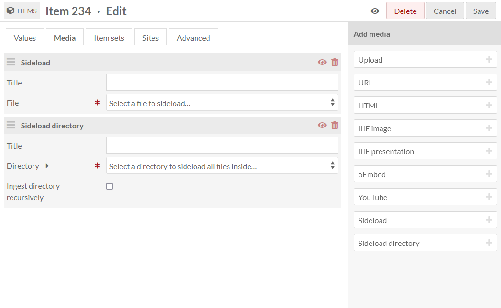
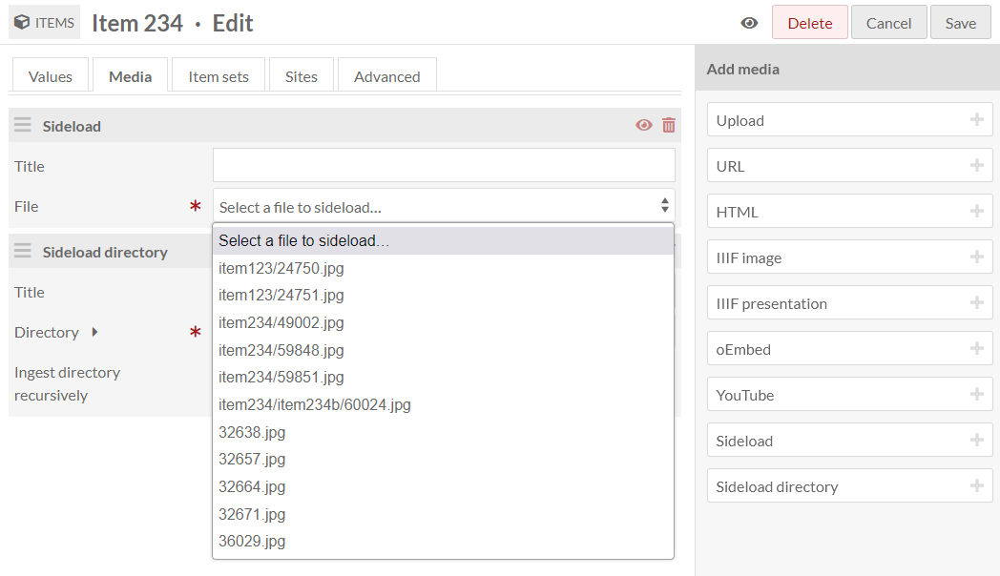

# File Sideload

The [File Sideload module](https://omeka.org/s/modules/FileSideload){target=_blank} adds the ability to add media files that are already stored on the server where your Omeka S installation lives.

File Sideload is compatible with [CSV Import](../modules/csvimport.md). When installed, your CSV Import options will include the ability to add media via filenames in your Sideload directory. Be sure to disable file deletion in the File Sideload module when using it with CSV Import.

## Create a directory

Create a directory (folder) on your server. It can be within the File Sideload module directory or on the same level as the Omeka S installation.

Upload files into this directory. All files or directories must be in this directory to be accessible.

Note that when browsing these files from the module to add as media, you will only see the filenames, so you should name the files as clearly as possible (for example, "StudyInScarlet_coverpage.jpg" will be more helpful than "img001.jpg").

## Configuration

After installing the module, you will need to configure the module to tell it where the directory is located.

From the Modules page of the left-hand navigation, scroll to File Sideload in the list and click the "Configure" button.

The File Sideload module has two configuration options.

**Sideload Directory**: the path, **relative to the server root**, of the directory in which the files are stored. This should look something like:

- `/var/www/html/yourinstallationpath/omeka-s/modules/FileSideload/sideload`
- `/home/yourusername/yourwebsite.org/omeka-s/sideload` for shared hosting
- `/home/yourusername/public_html/omeka-s/modules/FileSideload/sideload` for cPanel users.

If you have shell access to the directory via terminal, you can copy and paste the results of the command `pwd`.

If you are using an FTP application, copy out the remote site path in the location bar of the application.

**Delete sideloaded file?**

- If checked, any file added to an item as media will be deleted from the Sideload directory, as the file is now saved as media in the Omeka S installation.
- If unchecked, the files will remain in the directory, and will be available to be added as media to any item, until you manually remove them.

Add a sideload file to an item
------------------------------
With File Sideload installed and configured, and files in the directory, you can now use the module to add media to items.

When editing an item, go to the Media tab. The Add New Media sidebar now includes a button for Sideload (below the core options).

Clicking on the button adds a Sideload media block. There are two fields:

- **Title**: Give the media file a new title (optional).
- **File**: select a file from this dropdown menu. The menu will load the file names as they appear in the directory. Select one from the dropdown and save changes.

## CSV Import integration

With CSV Import, you can add media to items via File Sideload. Provide a column with the filenames, not full URLs, pointing to the files in your Sideload directory. Add the mapping to Media source > Sideload.

When using CSV Import with your Sideload directory, we recommend you un-check the file deletion setting in the File Sideload module configuration. CSV Import may delete files from your Sideload directory even if an import job has failed or stalled. You should always manually check the results of CSV Import before deleting the files it has imported. 
