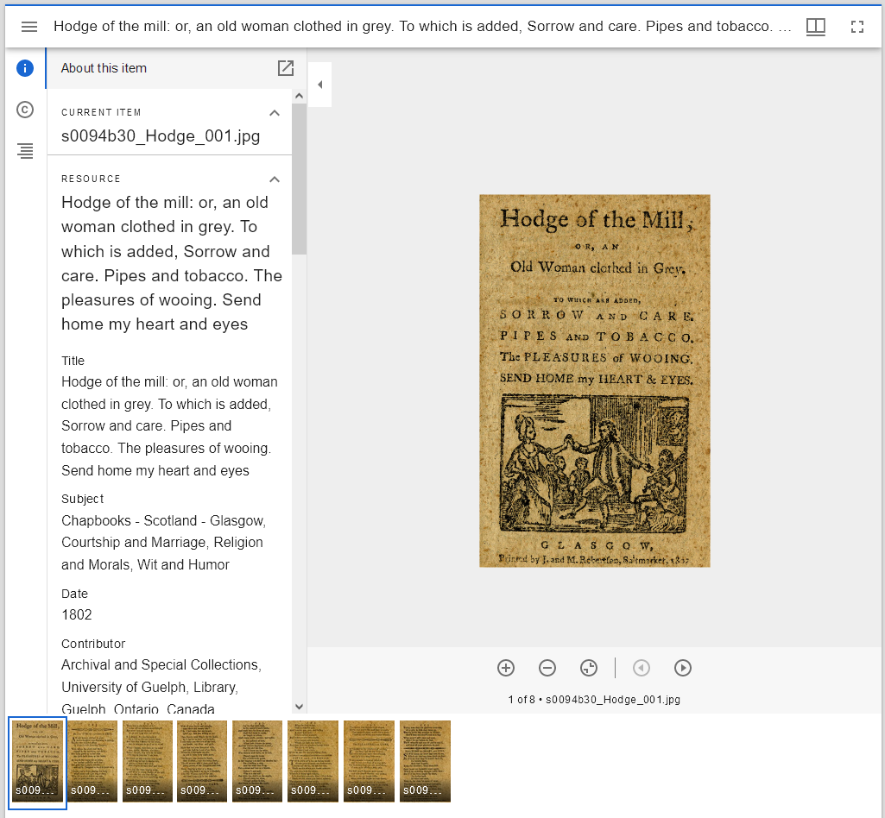
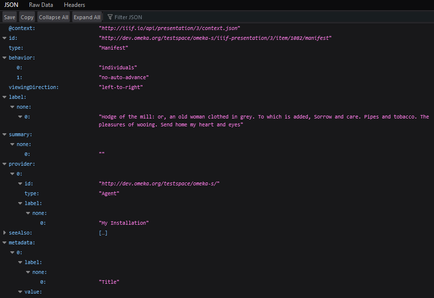

# IIIF Presentation

The [IIIF Presentation module](https://omeka.org/s/modules/IIIFPresentation/){target=_blank} allows installations to offer [IIIF Presentation API endpoints & viewers](https://iiif.io/api/presentation/3.0/){target=_blank} for their Omeka S items and item sets. These API endpoints are automatically available for all items and item sets when the module is installed and active. 

Omeka S offers the [Mirador IIIF viewer](https://projectmirador.org/){target=_blank} in its core code, which is what allows Omeka to [input and display IIIF media](../content/media.md#add-media) from around the web. This can be useful for institutions that host their digital collections elsewhere but wish to use those materials in Omeka virtual exhibits, or for educators who wish to use publicly-shared materials for teaching. 

This module adds the ability to send an Omeka S installation's items or item sets to other IIIF viewers for display, and to load IIIF viewers on the installation for previewing and configuration. This can be used by others who wish to display your Omeka resources on their own sites. 

A IIIF viewer can be set to display any item, a set of multiple items, any item set, or a set of multiple item sets, simply by creating the desired URL. The module has no settings or added admin interface options. 

## Using the module

After installation, manifest and viewer URLs are created using your base Omeka S installation URL, not for any particular site on the installation. So, users can find the IIIF viewer URL for each item at 

`
https://example.com/omeka-s/iiif-presentation/3/item/123/
`

and the manifest URL at 

`
https://example.com/omeka-s/iiif-presentation/3/item/123/manifest
`

where 

- `https://example.com/omeka-s/` is your base installation URL (do not include the URL to any particular site, or the `/s/` that comes before a site)
- `iiif-presentation/3/` indicates that you are offering the version 3.0 type of an IIIF manifest
- `item` indicates that the object is an Omeka S item
- `123` is the particular item ID.

Similarly, each item set URL is

`
https://example.com/omeka-s/iiif-presentation/3/item-set/45
`

where `45` is the item set ID.

You can serve more than one item ID, or more than one item set ID, by including the values separated by commas in the same place, for example:

`
https://example.com/omeka-s/iiif-presentation/3/item/6,7,8,9
`

The values can be in any order, and will appear in the viewer in the given order.

You can test that the module is working correctly by going directly to a viewer or manifest URL in your browser. 

For the viewer, you should see your item's media load in the viewer with metadata in the sidebar. The URL will be redirected to something in the form of 

`
https://example.com/omeka-s/iiif-viewer?url=https://example.com/omeka-s/iiif-presentation/3/item/1082/manifest
`

For the manifest, you should see a page of JSON loading where "Manifest" appears early on as the type. 

You can also use validator tools such as [https://presentation-validator.iiif.io/](https://presentation-validator.iiif.io/){target=_blank}.

## Endpoints

### IIIF Presentation v3

These endpoints are available for version 3 of the IIIF Presentation API.

- `/iiif-presentation/3/item/:item-id/manifest`
    Get the IIIF manifest resource for an Omeka item. Outputs JSON-LD.
    - `:item-id`: The Omeka item ID
- `/iiif-presentation/3/item/:item-id`
    View the IIIF manifest resource for an Omeka item. Redirects to the Omeka S IIIF viewer (Mirador).
    - `:item-id`: The Omeka item ID
- `/iiif-presentation/3/item/:item-ids/collection`
    Get the IIIF collection resource for two or more Omeka items. Outputs JSON-LD.
    - `:item-ids`: The Omeka item IDs, delimited by commas
- `/iiif-presentation/3/item/:item-ids`
    View the IIIF collection resource for two or more Omeka items. Redirects to the Omeka IIIF viewer (Mirador).
    - `:item-ids`: The Omeka item IDs, delimited by commas
- `/iiif-presentation/3/item-set/:item-set-id/collection`
    Get the IIIF collection resource for an Omeka item set. Outputs JSON-LD.
    - `:item-set-id`: The Omeka item set ID
- `/iiif-presentation/3/item-set/:item-set-id`
    View the IIIF collection resource for an Omeka item set. Redirects to the Omeka S IIIF viewer (Mirador).
    - `:item-set-id`: The Omeka item set ID
- `/iiif-presentation/3/item-set/:item-set-ids/collection`
    Get the IIIF collection resource for two or more Omeka item sets. Outputs JSON-LD.
    - `:item-set-ids`: The Omeka item set IDs, delimited by commas
- `/iiif-presentation/3/item-set/:item-set-ids`
    View the IIIF collection resource for two or more Omeka item sets. Redirects to the Omeka IIIF viewer (Mirador).
    - `:item-set-ids`: The Omeka item set IDs, delimited by commas.

### IIIF Presentation v2

These endpoints are available for version 2 of the IIIF Presentation API.

- `/iiif-presentation/2/item/:item-id/manifest`
    Get the IIIF manifest resource for an Omeka item. Outputs JSON-LD.
    - `:item-id`: The Omeka item ID
- `/iiif-presentation/2/item/:item-id`
    View the IIIF manifest resource for an Omeka item. Redirects to the Omeka S IIIF viewer (Mirador).
    - `:item-id`: The Omeka item ID
- `/iiif-presentation/2/item/:item-ids/collection`
    Get the IIIF collection resource for two or more Omeka items. Outputs JSON-LD.
    - `:item-ids`: The Omeka item IDs, delimited by commas
- `/iiif-presentation/2/item/:item-ids`
    View the IIIF collection resource for two or more Omeka items. Redirects to the Omeka IIIF viewer (Mirador).
    - `:item-ids`: The Omeka item IDs, delimited by commas
- `/iiif-presentation/2/item-set/:item-set-id/collection`
    Get the IIIF collection resource for an Omeka item set. Outputs JSON-LD.
    - `:item-set-id`: The Omeka item set ID
- `/iiif-presentation/2/item-set/:item-set-id`
    View the IIIF collection resource for an Omeka item set. Redirects to the Omeka S IIIF viewer (Mirador).
    - `:item-set-id`: The Omeka item set ID
- `/iiif-presentation/2/item-set/:item-set-ids/collection`
    Get the IIIF collection resource for two or more Omeka item sets. Outputs JSON-LD.
    - `:item-set-ids`: The Omeka item set IDs, delimited by commas
- `/iiif-presentation/2/item-set/:item-set-ids`
    View the IIIF collection resource for two or more Omeka item sets. Redirects to the Omeka IIIF viewer (Mirador).
    - `:item-set-ids`: The Omeka item set IDs, delimited by commas.

## Events

This module triggers these events during the composition of certain IIIF Presentation resources (manifest, canvas, collection, etc.). Use the event's `getTarget()` method to get the current controller.

### IIIF Presentation v3

These events are available for version 3 of the IIIF Presentation API.

- `iiif_presentation.3.media.canvas`
    Triggered after composing a media canvas array. To modify the canvas, handlers may modify the `canvas` parameter and set it back to the event.
    - `canvas`: The canvas array
    - `canvas_type`: The canvas type service object
    - `media_id`: The media ID
- `iiif_presentation.3.item.manifest`
    Triggered after composing an item manifest array. To modify the manifest, handlers may modify the `manifest` parameter and set it back to the event.
    - `manifest`: The manifest array
    - `item_id`: The item ID
- `iiif_presentation.3.item.collection`
    Triggered after composing an item collection array. To modify the collection, handlers may modify the `collection` parameter and set it back to the event.
    - `collection`: The collection array
    - `item_ids`: The item IDs in the collection
- `iiif_presentation.3.item_set.collection`
    Triggered after composing an item set collection array. To modify the collection, handlers may modify the `collection` parameter and set it back to the event.
    - `collection`: The collection array
    - `item_set_id`: The item set ID
- `iiif_presentation.3.item_set.collections`
    Triggered after composing an item set collections array. To modify the collection, handlers may modify the `collection` parameter and set it back to the event.
    - `collection`: The collection array
    - `item_set_ids`: The item set IDs in the collection.

### IIIF Presentation v2

These events are available for version 2 of the IIIF Presentation API.

- `iiif_presentation.2.media.canvas`
    Triggered after composing a media canvas array. To modify the canvas, handlers may modify the `canvas` parameter and set it back to the event.
    - `canvas`: The canvas array
    - `canvas_type`: The canvas type service object
    - `media_id`: The media ID
- `iiif_presentation.2.item.manifest`
    Triggered after composing an item manifest array. To modify the manifest, handlers may modify the `manifest` parameter and set it back to the event.
    - `manifest`: The manifest array
    - `item_id`: The item ID
- `iiif_presentation.2.item.collection`
    Triggered after composing an item collection array. To modify the collection, handlers may modify the `collection` parameter and set it back to the event.
    - `collection`: The collection array
    - `item_ids`: The item IDs in the collection
- `iiif_presentation.2.item_set.collection`
    Triggered after composing an item set collection array. To modify the collection, handlers may modify the `collection` parameter and set it back to the event.
    - `collection`: The collection array
    - `item_set_id`: The item set ID
- `iiif_presentation.2.item_set.collections`
    Triggered after composing an item set collections array. To modify the collection, handlers may modify the `collection` parameter and set it back to the event.
    - `collection`: The collection array
    - `item_set_ids`: The item set IDs in the collection.