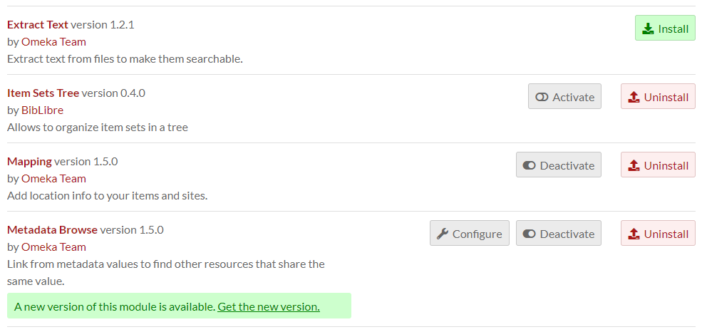
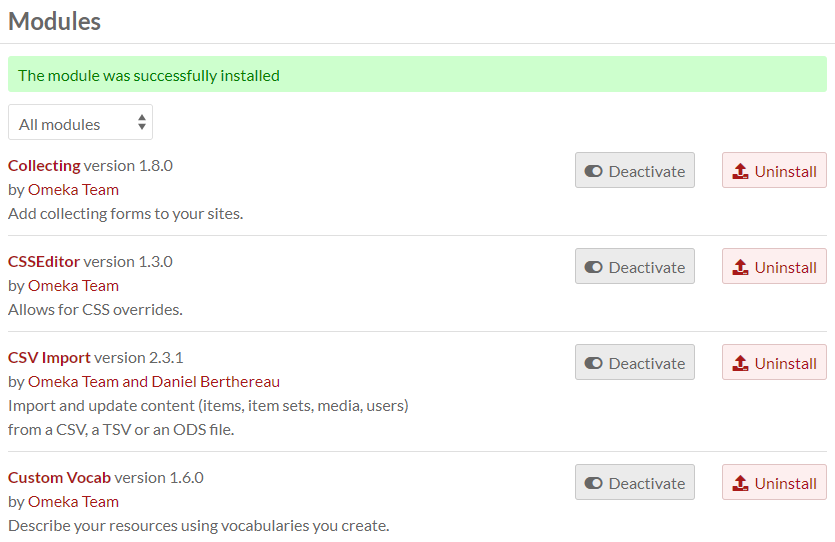

# Modules Management

Modules extend the functionality of your Omeka S installation and sites. A list of modules available for download is on the [Modules Directory](https://omeka.org/s/modules/){target=_blank}. Instructions are available on each module's documentation page.

!!! Note
    Not every module will work with every version of Omeka, especially newer modules on old installations. Older versions of modules may be available on their Github pages. Use the Modules Directory to find the "Github" link on the right side of the screen for each plugin, then look on the right hand side of the Github page for the "Releases" section.

To manage the modules installed on your Omeka S site, click on the **Modules** section in the left-hand navigation of your [admin dashboard](../admin-dashboard.md).

Note that only [Global Administrators](../admin/users.md) can install and manage modules; Supervisors can browse installed modules but not modify them. Other users do not have access to this tab.

| Category | Permission | Global Admin | Supervisor | Editor | Reviewer | Author | Researcher |
|-----|-----|---|---|---|---|---|---|
| Modules | Install/Configure | Yes | No | No | No | No | No |
|  | Use | Yes | Yes | No | No | No | No |

Any modules that have been uploaded into the `/modules` folder of the installation should appear in the list of modules. Each module displays the name of the module with the version number, creator, and a summary of its function.

Multiple buttons can appear to the right of a module’s label. Each button has both an icon and a label describing its action:

- **Configure** (a wrench icon): some modules have settings which can be adjusted. Click this icon to adjust settings for the module in this row.
- **Activate/Deactivate** (sliding switch): when a module is active, the slider area background is transparent and the switch is to the left. When inactive, the background of the slider area background is opaque and the switch is to the right.
- **Install/Uninstall** (arrow and rectangle): use this button to install or uninstall a module. When the button is green and the arrow points down, you can install the module. When the button is red and the arrow points up, you can uninstall the module.

When a module has a new release, it will display on the browse page with a message in green stating "A new version of this module is available. Get the new version." There will be a link to the download page for the module. [Follow the steps below to update a module](#updating-a-module). These warnings only show up on installed and activated modules. You can [toggle these notifications on the settings page](../admin/settings.md#general).

## Adding modules to Omeka S
In order to appear in the **Modules** section of the admin dashboard for your Omeka S installation, module files must be manually added to the `/modules` folder of the installation, using an FTP program or SSH connection.

Modules registered with Omeka are available on the [Modules](https://omeka.org/s/modules/){target=_blank} directory of the Omeka S site. Other modules may be made available by their authors in other locations.

To add a module to the site using FTP:

1. Download the zipped module to your computer.
1. Open your FTP client, log on to the server that houses the Omeka S install, and navigate to the `/modules` folder (this should be located in the main folder of the install).
1. Upload the zipped module to the `/modules` folder .
1. Unzip the module.

!!! note
	The folder that appears in the `/modules` folder should show the name of the module, without any version numbers. If you are having issues installing a module, check that you have unzipped the module correctly, without creating extra folder levels.

Please note that if you are downloading the folder for a module from GitHub rather than the [Module Directory](https://omeka.org/s/modules/){target=_blank}, you need to be sure to download the [latest release](https://help.github.com/en/articles/linking-to-releases){target=_blank} rather than the version in active development. If you are unsure how to do this, please consult the [GitHub help files](https://help.github.com/en){target=_blank}.

You can also use SSH to clone a module directly from that module's git repository. Do this only if you are comfortable with git, GitHub, and working with SSH.

### Installing modules
To install a module, navigate to the Modules tab on the left-hand navigation of the admin dashboard of your Omeka S installation.

Find the module in the table and click the "Install" button. The module is now installed and will automatically be activated. For modules with configuration options, you will be taken to the configuration page for that module. For modules without configuration options, the Modules page will simply reload, with a success message at the top.

### Activating a module

If you have a module which is installed but inactive, click the "Activate" button to use the module. You should see a success message once the page reloads. The "Activate" button will now read "Deactivate".

## Configuring a module
Some, but not all, modules include the option to configure settings for that module. If an active module displays the "Configure" button with a wrench icon, you should click through to understand the configuration settings for that module.

Information regarding configuration options for individual modules can be found on the documentation page for those modules.

## Uninstalling a module

If a module is removed properly from an Omeka installation, all of the tables it created in the database will be deleted, and you will lose any data that has been generated in conjunction with that module while it was installed. For example, if you use the Mapping module to add geolocation data to all of your items, all of those fields will be deleted if you uninstall Mapping. 

Removing a module is essentially installing in reverse:

1. Deactivate the module by clicking the "Deactivate" button.
1. Uninstall the module by clicking the "Uninstall" button.
1. A drawer will open on the right side of the window asking you to confirm that you want to uninstall the module. Click "Confirm uninstall" to continue.

The uninstalled module will continue to appear on your Modules page (with the option to install it) unless the folder for the module is removed from the `/modules` folder on the Omeka S installation, which can be done via FTP or SSH.

## Updating a module
To update a module using FTP:

1. From the Modules tab on your Omeka S installation, deactivate the module you're going to update.
1. Download the latest release of the module to your computer.
1. Open your FTP client and log on to the server that houses the Omeka S install.
1. Navigate to the `/modules` folder (this should be located in the main folder of the install).
1. Move the old copy of the module to your computer.
1. Upload the zipped folder for the latest version of the module to the `/modules` folder.
1. In your FTP client, unzip the new version module.
1. On the Omeka S installation dashboard, go to the Modules tab and activate the new version of the module.
1. Check to be sure your settings have been preserved and there are no errors. After this, you can safely delete the old module folder that you saved to your computer.

If you are concerned about problems with the update, be sure to keep the older version of the module on your local machine in case you have to switch them back. Follow the same update steps with the earlier version of the module.

If you run into problems while updating, turn on [error logging](../errorLogging) and post on the [Omeka Forum](https://forum.omeka.org/c/omeka-s/modules){target=_blank}.
