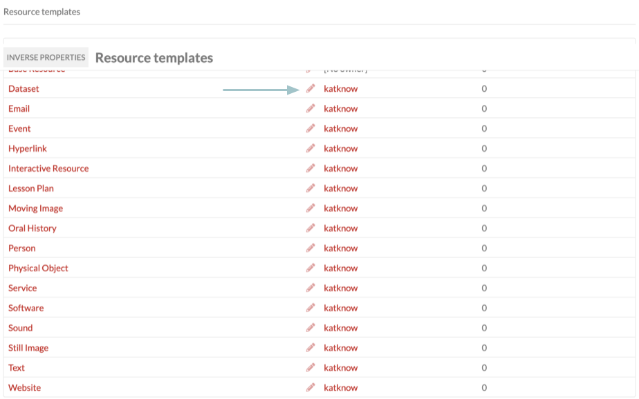
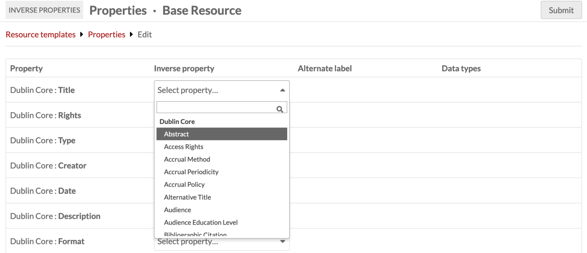
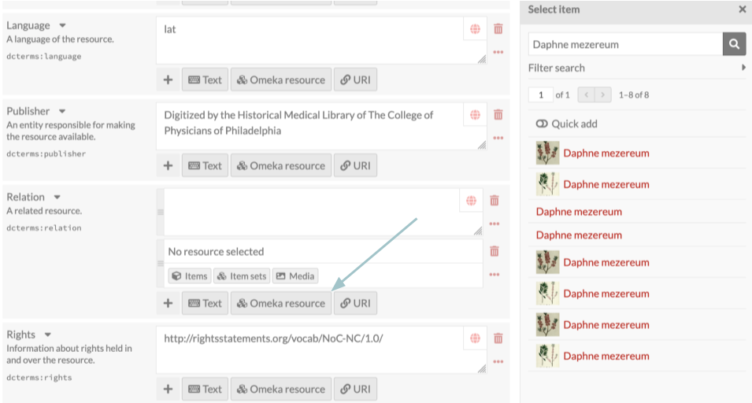
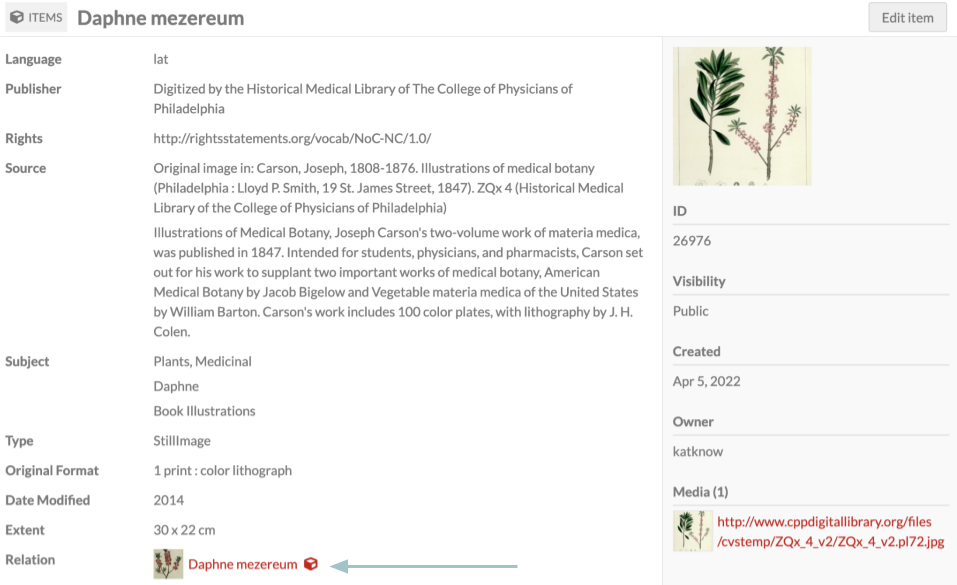

# Inverse Properties

The Inverse Properties module allows administrators to define inverse properties between resources (items, item sets, media) so that property values can be concretely linked in both directions. 

To install Inverse Properties, follow the instructions for [Installing Modules](https://omeka.org/s/docs/user-manual/modules/#installing-modules) on the Modules documentation.

## Assigning Inverse Properties in Resource Templates

To use Inverse Properties, you must already have at least one resource template that has properties using the default or resource data types. Once the module is installed, it should appear in the left-hand navigation. When you select Inverse Properties, you will be taken to a table of available resource templates. In addition to label and owner, there is a column indicating each template's inverse property count. To add inverse properties to a resource template, click edit (pencil icon).

To assign an inverse property, select an inverse for that property from the dropdown menu. You can either scroll through the list of options or use the search bar to jump to a specific property. You can select a property from any vocabulary. A property cannot be the inverse of itself.

Once you have selected all the inverse properties for that resource template, click "Submit" in the upper right corner to save your changes.

## Adding Inverse Properties to Items

To add an inverse property to an item, click "Omeka resource" in the appropriate metadata field. Then, click "Item" and select the item you wish to add from the drawer. After selecting the item, be sure to click "Select resource" at the bottom of the drawer to add the item to the metadata field.

Once you have finished adding your inverse properties to the item, click "Save". The items you added as inverse properties should now appear on the item's show page.

If you click on the resource you just linked, you should see that the inverse property value was created automatically.

