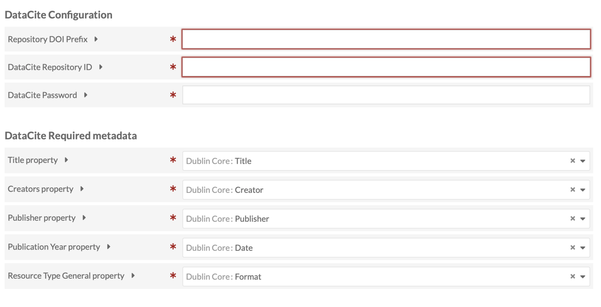
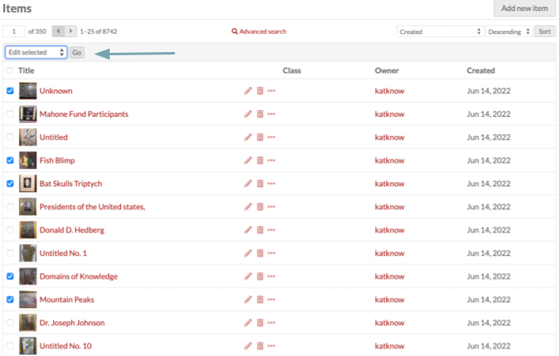
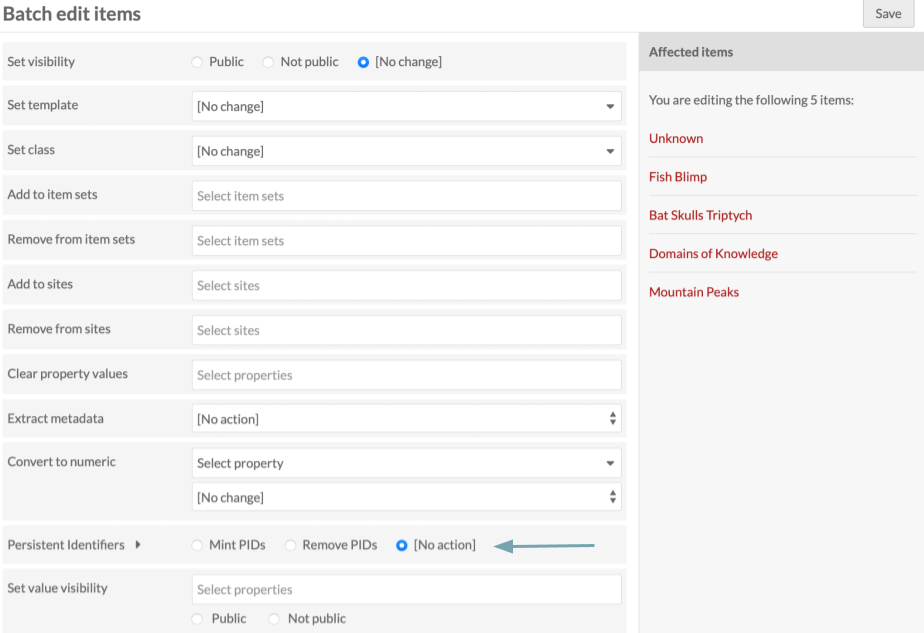

# Persistent Identifiers 

The Persistent Identifiers module allows users to create or import persistent identifiers (PIDs) and assign them to Omeka S items. These PIDs can be assigned at item creation, via the item edit screen, or by batch edit. They can also be removed using the item edit or batch edit screens. PIDs may also be "extracted" from existing metadata fields. Once assigned, accessing an item's PID in browser resolves to a stable, non-site-specific landing page containing the item's metadata, media, and any sites the item is assigned to.

The current PID services available for this module are:

+ EZID (used to mint and manage ARKs)
+ DataCite (used to mint and manage DOIs)

## General Settings

After installation, _Persistent Identifiers_ should appear in the left-hand navigation under **Modules**. The _Settings_ subpage features general settings, including:

+ **PID Service:** Select which of the available PID services to use for minting or extraction. Only one PID service may be used at a time to mint and assign PIDs to items. 
+ **Assign PID to New Items:** Check this box to automatically newly mint or extract an existing PID and assign to every new item in Omeka S, whether it is created in Omeka S or imported.
+ **Fields with Existing PIDs:** A list of metadata fields separated by commas that may contain PID values within a newly created or imported item. If found, the existing PID will be assigned to the item instead of a new PID.

## EZID Configuration

When completing the configuration process for EZID, you will need to provide the:

+ **NAAN & Shoulder Namespace:** The Name Assigning Authority Number (NAAN) and ARK shoulder value uniquely assigned to an organization, which will appear in every ARK generated. 
+ **EZID Username:** The EZID user who has permission to create and update identifiers for the above namespace. 
+ **EZID Password:** The password for the above EZID user. Note that for security reasons this password doesn't persist in the form, so if changes are made to the **NAAN & Shoulder Namespace** or **EZID Username** you must also re-enter the password before pressing "submit".

## DataCite Configuration

When completing the configuration process for DataCite, you will need to provide the:

+ **Repository DOI Prefix:** The prefix assigned to an institution's DOI minting and management repository. 
+ **DataCite Repository ID:** The unique identifier assigned to an institution's DOI repository. 
+ **DataCite Password:** The password associated with the above **DataCite Repository ID**. Note that for security reasons this password doesn't persist in the form, so if changes are made to any field on the DataCite Configuration screen, you must also re-enter the password before pressing "submit".

### DataCite Required Metadata
DataCite requires five descriptive metadata values in order to generate a DOI: Title, Creators, Publisher, Publication Year, and Resource Type. All of these fields must be mapped to an existing metadata field that you select from the list of available vocabularies in your Omeka S instance. The Resource Type General property must conform to a [ResourceTypeGeneral controlled vocabulary](https://support.datacite.org/docs/datacite-metadata-schema-v44-mandatory-properties#101-resourcetypegeneral) value exactly.

## Minting and Removing PIDs

To mint a PID from the item edit page, click on an item and select "Edit Item." Navigate to the Advanced tab, and click "Mint PID." 

After a few moments, the ARK or DOI should appear. The "Mint PID" button should now be a "Remove PID" button. Click here to remove the PID.

If you select "Remove PID," a drawer will open on the right warning you that this will remove the PID and break any incoming links. Click "Confirm Remove PID" to delete the PID.

Click "Save" before navigating away from the page when both minting and removing PIDs.

## Batch editing PIDs

You can batch edit PIDs from the Items page. Select the items with PIDs you wish to edit via the checkboxes, then choose "Edit Selected" before pressing "Go."

Near the bottom of the Batch Edit Items screen, you should see a Persistent Identifiers row. Here, you can mint or remove PIDs for all selected items. If you are batch editing other fields and would like PIDs to remain unaffected, you can select [no action].

When you have made all desired edits, click "Save" in the upper right corner.
