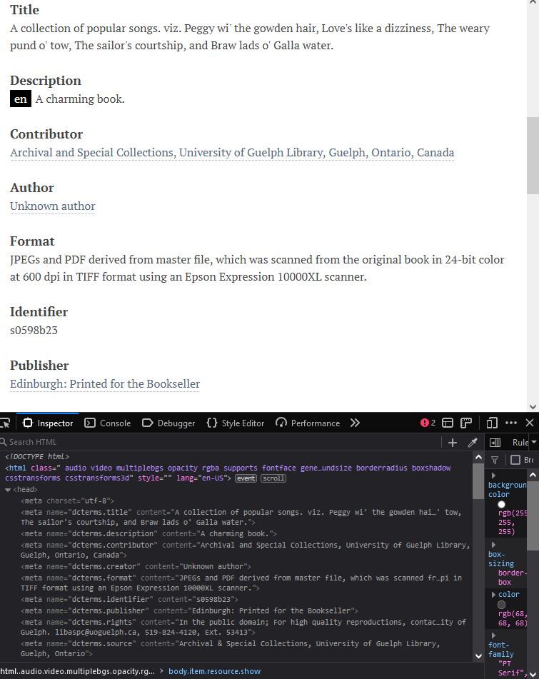
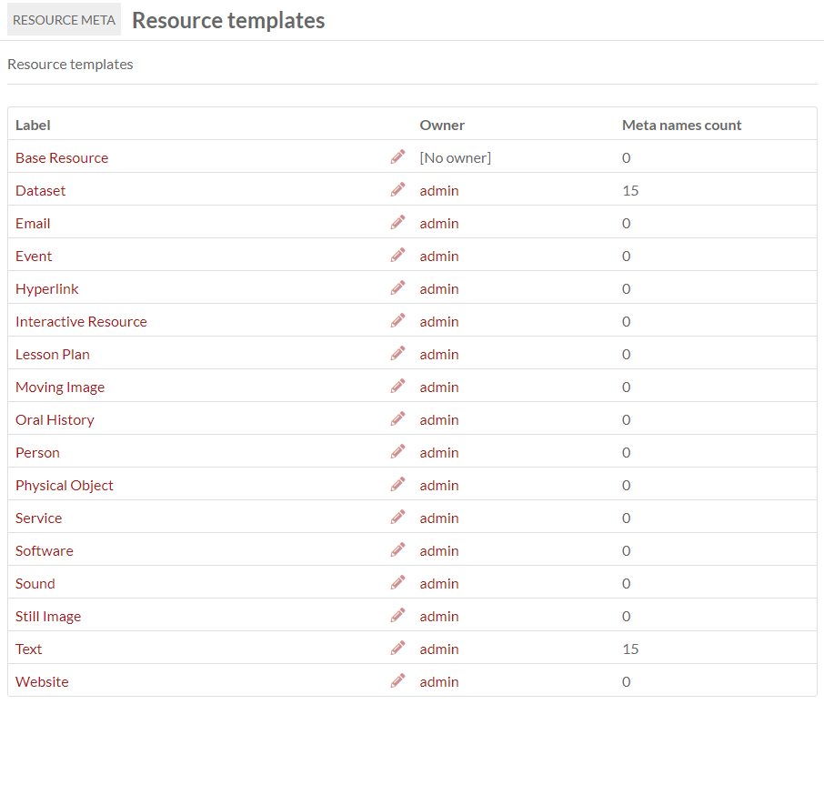
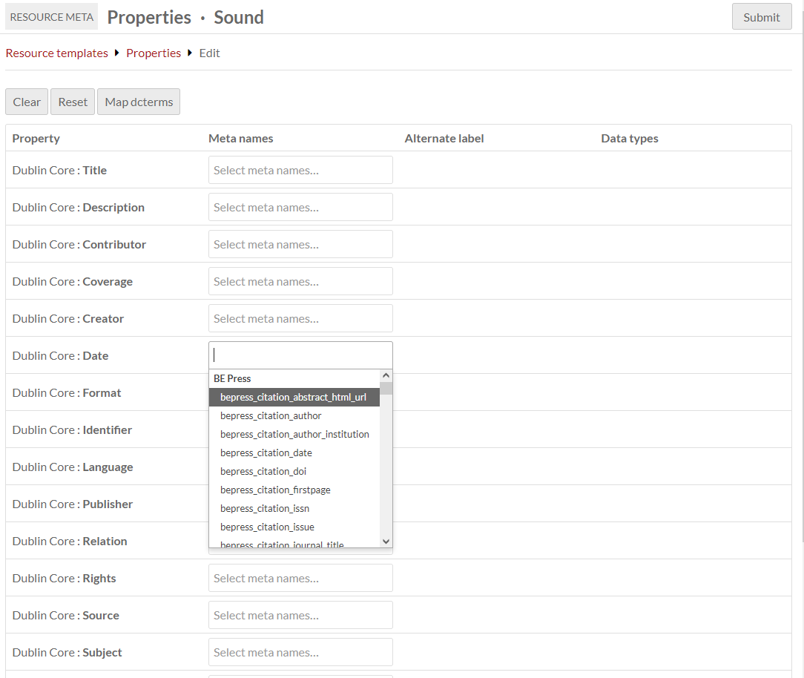

# Resource Meta

The [Resource Meta module](https://omeka.org/s/modules/ResourceMeta/){target=_blank} allows installation users to output resource metadata (items, item sets, and media) as [`<meta>` elements in the HTML](https://www.w3schools.com/tags/tag_meta.asp){target=_blank} of their site pages. Meta values are applied via [resource templates](../content/resource-template.md): a metadata property in a template, such as `dcterms:creator`, can be set to output as a meta tag, such as `<meta name="dcterms.creator" content="Shakespeare, William">` inside the `<head>` tag of the public page. 

Resource Meta settings can be viewed by users at every level, and can be modified by users at the Editor, Supervisor, and Global Admin levels. 

Meta elements are used for search engine optimization and indexing of the most relevant page content. This module offers commonly-used meta elements for the indexing and discoverability of academic resources, including BE Press, Highwire Press, EPrints, and PRISM, as well as Dublin Core Elements and Dublin Core Terms for other resource types.

## Mapping metadata to meta tags

Select Resource Meta from the Modules tab of the left-hand navigation. You will see all of the installation's resource templates listed on a page, with an indication of how many meta tags are already applied to the properties in each template (the "Meta names count"). 

Click the pencil icon shown on each template to modify its meta settings. You will be taken to a display of all of the resource template's properties, with a dropdown to select from available meta elements. 

Every field in the resource template can be mapped to one or more meta elements. Your choices are:

- BE Press
- Dublin Core Elements
- Dublin Core Terms
- Highwire Press
- EPrints
- PRISM.

You can automatically map Dublin Core Terms properties in your resource templates to Dublin Core Terms meta tags, with the "Map dcterms" button at the top of the screen. Otherwise you must select meta tags manually from the available dropdown. You can map Dublin Core Terms automatically and then manually add more tags, for example, you can serve the `dcterms:title` field to other title fields, including `bepress_citation_title` and Highwire Press `citation_title`. Note that pressing the "Map dcterms" button will erase existing mappings. 

To erase all current mappings, press "Clear". To undo that erasure, press "Reset". Be sure to save your edits. 

To check that the module is working as intended, go to a public page for an item using the resource template with mappings. View the page source and look inside the `<head`> tag for `<meta>` elements corresponding to your settings. 

## Uses

If you are using Omeka to make academic resources available, for example with intent to [have items indexed by Google Scholar](https://scholar.google.com/intl/en/scholar/inclusion.html#indexing){target=_blank}, you may wish to select one of the four publishing options, all of which are supported. [More information about these four options and academic resource discoverability can be found here](http://div.div1.com.au/div-thoughts/div-commentaries/66-div-commentary-metadata){target=_blank}.

For another example, if you wish your Omeka items to be [indexed and imported by Zotero](https://zotero-manual.github.io/adding-items/#generic-translators){target=_blank}, you may wish to use Highwire Press, Dublin Core, and PRISM. 

For meta elements that serve up Omeka resources for dynamic display on social media websites, install the [Sharing module](sharing.md).