# Site Pages

Pages form the content of your [sites](../sites/index.md). A site can have one or many pages, and these pages can be [organized, using Navigation](site_navigation.md), into a linear storyline (such as for virtual exhibits) or in a more hierarchical tree. 

Manage the pages for a site by navigating to the Sites section on the left-hand navigation of the admin dashboard. Select the site for which you want to manage the pages and click either the title or the edit (pencil) button to edit that site. 

Once you are editing the site, click the Pages link in the left-hand navigation.

When you create a new site, Omeka S automatically adds a page titled "Welcome" with a single HTML block (see below). You can edit this page or delete it.

## Browse pages
The Pages tab will display all of your pages in their navigation order. Child pages will display below the parent page with one or more `-` (dash) characters before the page title.

Every page is listed with its Title, buttons to view (box with an arrow coming out), edit (pencil), or delete (trash can) the page, the page's slug, and its last-modified date. 


Use the [Navigation](site_navigation.md) screen of the site to set the order of pages, including setting child and parent pages.

## Add a page
From the site you are working on, click the Pages link in the left-hand sidebar. Then click the "Add new page" button on the upper right corner of the window.

To add a page you must enter a **Title**. You can also enter a **URL slug**. Both of these can be edited later. A title is required to create the page. If you do not enter a slug, Omeka S will create one from the page title. A slug is the page’s portion of the URL and can only contain letters, numbers, and hyphens; no other characters are allowed.

In addition, there is a checkbox for "Add to navigation". If checked, the page will automatically be added to the end of the main [navigation](../sites/site_navigation.md) for the site, at the top level. If you do not check this box, you can manually add the page to the site navigation and arrange it from the Navigation page.


The eye icon, to the left of the "Cancel" and "Add" buttons, is a toggle to set the visibility of your page. If the toggle is set to public (no line), then anyone can see the page. If the toggle is set to private (line through the eye icon), the page will only be visible to logged-in users of the Omeka S installation who have site permissions (Supervisors and Global Admins will always be able to see private pages). This will include its appearance in the navigation. Pages are visible by default. 

Clicking or hitting enter on the eye icon toggles between public and private. 

Page is public: {style="display:inline;"}

Page is private: {style="display:inline;"}

Once you have entered this information, click the "Add" button in the upper right hand corner of the browser window. You will be automatically taken to that page's edit view (see below). 

## Edit a page  
After clicking the Pages link, select the page you wish to edit by clicking the name of the page or the edit button (pencil).

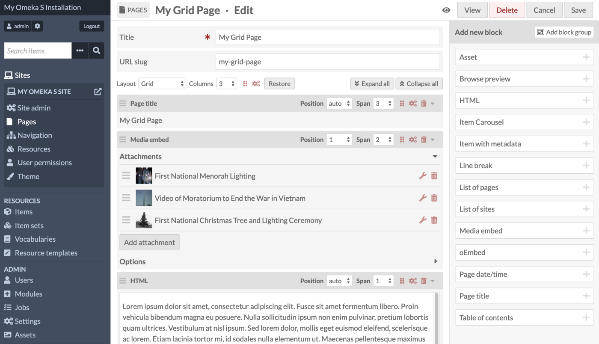

The edit view for a page will display the page's title across the top. In the upper right is the public/private toggle (the eye icon), and buttons to view the public version (in a new tab), delete the page, cancel changes, or save changes. Changes will not display on the public side of your site until after they have been saved.

At the top of the work area are fields for the page title and URL slug. You can edit these at any time, but remember that the slug must be unique within the site (e.g. you cannot have two pages with the slug "welcome" on the same site).

### From the public side
If you are on the admin side and click "View" in the upper right-hand corner of a page, it will take you to the public view for that page. 

As you are browsing the public side of your site, you can edit the page you are viewing if you are currently logged in and the [user bar option is turned on in Site Settings](../sites/site_settings.md#general-settings). 

The user bar, which appears across the top of the page, includes a link to edit the current page - circled in red in the below image. 


We recommend keeping a tab open to the public page and refreshing it to check the results of your changes. Remember to look at your page at different browser heights and widths to ensure objects flow and wrap as intended. You may also wish to check the display of your page on a mobile device. 

### Layout mode
There are two options for laying out the blocks on your page: **Normal flow** and **Grid**. 

**Normal flow** provides a view where the blocks stack one upon the next to build the page. With this layout, you can set blocks to float right and left, take up the full width, or center the content in the full width. When blocks (such as media) are floated alongside an HTML block, the text will flow and wrap around the floated block. Floated blocks take up a maximum of one-third of the page's total width. 

**Grid** is a user-defined column system, based on [the CSS Grid layout](https://developer.mozilla.org/en-US/docs/Web/CSS/CSS_grid_layout){target=_blank}, that allows the user to finely-tune the placement and width of the blocks in a page. With this choice you can define the number of columns you want to work with in your page, from 1 to 12; blocks can be set to occupy one or more of the columns, next to each other in rows. 

#### Configuration
Next you will have the option to apply configuration settings to the entire page. Clicking on the gear icon will open the Page layout configuration menu. 

In **Normal flow**, you will be able to select a [template for the page](#page-templates) if the site theme provides one.

In **Grid**, you will see two buttons:

- The Preview Layout button will preview the layout in the right-hand drawer. This will show you all the blocks currently on the page and their width in terms of the columns on the page. It will also show block groups with an extra outline around the group's contents. 
- The Configure Layout button (gear icon) will allow you to select a [template for the page](#page-templates), and define the gaps (in pixels) between the columns and rows of blocks.
- If you make a mistake in your grid page layout settings, you can reset the page to the most recently saved version by clicking the "Restore" button that appears to the right of these buttons.

##### Page templates

Themes offer the ability to provide shortcuts on page development. By selecting a page template from the dropdown in the configuration menu, you can apply different design variations as provided by theme developers. Read the [developer documentation](https://github.com/omeka/omeka-s/wiki/4.1-RC){target=_blank} for more information on how to offer page templates. 

Once you have selected a site theme with page templates included, such as [Foundation](site_theme.md#foundation-theme-settings), you can select a page to edit and use the configuration menu to view available templates. Foundation currently offers a fixed-width (default) or full-width template option (visible where the navigation menu is set as a horizontal dropdown rather than a column). 

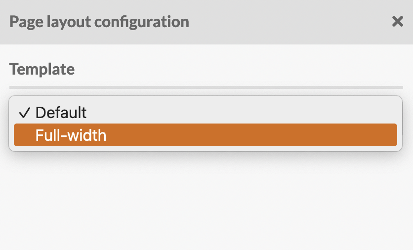

### Add blocks

Once you have made your layout choices, you are ready to add blocks to the page.

On the right-hand side you can choose to add a new block to your page by selecting one of the following elements:

- Asset
- Browse preview
- HTML
- Item with metadata
- Line break
- List of pages
- List of sites
- Media embed
- oEmbed
- Page date/time
- Page title
- Table of contents.

If you have the relevant modules installed, you may also have the following page blocks:

- [Collecting](../modules/collecting.md)
- [Data visualization](../modules/datavisualization.md)
- [Item Carousel](../modules/itemcarouselblock.md)
- [Map by attachments](../modules/mapping.md)
- [Map by query](../modules/mapping.md).

Some blocks come with default configurations to make setup and previewing easy. For example, the page date/time block automatically is set to show the medium-detail version of both created and modified dates. 

Other blocks require manual settings immediately when adding them to the page. For example, you cannot add an oEmbed block without entering a URL immediately; you cannot save the page with this field blank. 

See a detailed explanation of each block in the [Page blocks](#page-blocks) section.

#### Block groups

New in Omeka S 4.1, you can now group page blocks together. This allows you to assign layout settings to the group, which will behave like a normal block in the layout of the page. Block groups can be styled like blocks, below, with a background color or image that spans around all of its contents, and with classes, internal padding, and alignments. 

At the top of the right-hand drawer, next to the "Add new block" title, you will see a white button that says "Add block group". 

When a group is added to a page, you can drag and drop blocks inside it. You can then drag the block group around like any other block. To remove a block from a group, you can simply drag it out, or delete it. Deleting a block group will delete all of its contents. 

### Block settings

In the Normal flow or Grid layout, you can configure each block with the gear icon that shows in its title bar. This will deploy the Block layout configuration menu in the right-hand drawer, which contains the following options:

**Template**: If your theme provides one, you can select a template to apply to the block from the dropdown menu. For example, [the Foundation theme](site_theme.md#foundation-theme-settings) allows you to set the Browse preview block to its own list or grid display, ignoring the settings of the site itself. Not every page block will have available templates. 

**Class** allows you to type in a specific class to apply styles to the block. 

**Alignment** includes two settings: Block alignment and Text alignment. 

Block alignment has different options whether you are using [Grid](#grid) or [Normal flow](#normal-flow) layout. See the sections below for more details. 

The text alignment can be:

- Default
- Left
- Center
- Right 
- Justified (full).

Text alignment will affect the contents of the block, including images, text, and links. For example, you can have a block floated to the left of the page, with all of its text and images text-aligned right.

**Constraints** allows you to set a maximum width and/or a minimum height for the block. 

**Padding** allows you to enter numbers (in pixels) for the top, left, right, and bottom padding inside the block. You may wish to utilize this when setting a background image or color on an HTML block filled with text; the background will extend to the full width of the block, while padding can be used to keep text from touching the edges. 

**Background** allows you to select a background for the block: either a color ([using a hexadecimal or word value](https://www.w3schools.com/html/html_colors.asp){target=_blank}) or an image, from the assets available in the installation. 

If you choose an image, the three dropdown menus below will be useful: 

- The **Vertical** anchor position allows you to select [Default, Top, Center, or Bottom positioning for the background asset](https://www.w3schools.com/cssref/pr_background-position.php){target=_blank}.
- The **Horizontal** anchor position allows you to select Default, Left, Center or Right positioning for the background asset.
- **Size** allows you to you select [Default, Cover, or Contain for the background asset](https://www.w3schools.com/cssref/css3_pr_background-size.php){target=_blank}.

Once you have configured the block, click "Apply changes". You must save the block settings and then save the page settings in order to see your changes on the public side. 

#### Normal flow

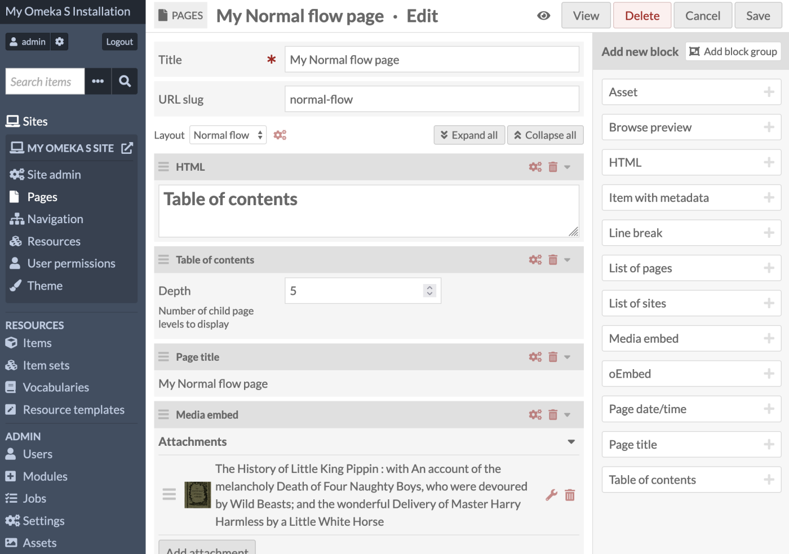

**Block alignment**, in **normal flow**, allows you to choose one of the four block positions: 

- Default
- Float Left
- Float Right
- Center. 

Floating blocks left or right will cause them to occupy a maximum of one-third of the page, and may be smaller, depending on the block's contents. For example, a Media embed block with a 200-pixel thumbnail and a short title or caption will only occupy 200 pixels plus padding. If the text in the block is longer, the block will take up its full allowable width before wrapping the text. 

An HTML block positioned just underneath a floated block (i.e. the next object on the page) will occupy the rest of the width of the page, and will wrap around the floated block if applicable. This is true whether the floated block is floated left or right. 

A center-aligned block in normal flow will not allow floats on either side - it will take up the full width of the page. Only a default-aligned block will wrap around another block. 

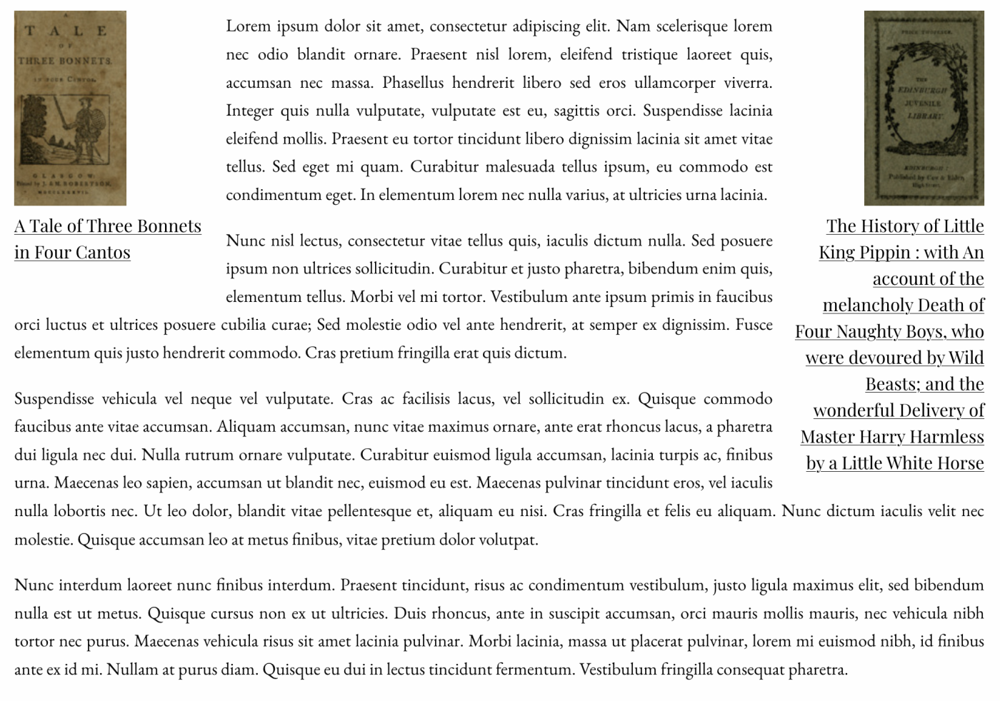

The image above shows, in order: 

- A media embed block floated left, with default-aligned text,
- A media embed block floated right, with right-aligned text,
- An HTML block set to default alignment, wrapping around the media blocks, with justified text.

#### Grid

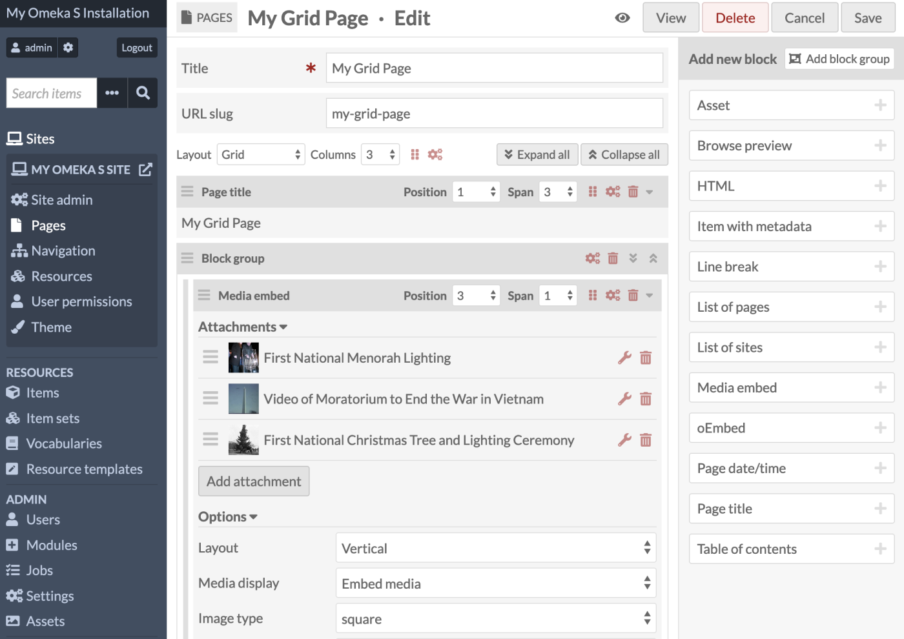

In Grid layout you can select the placement and width of each block based on the [number of columns you have set for the page](#configuration). 

- For each block, you can declare its starting "Position," meaning the column number where the block will begin. You can also set the position to "Auto", meaning it will start wherever there is space for it to fit. You will see the "Position" dropdown reflect the number of columns of your page, minus the "Span" of the block (its width). For example, a 6-column page with a block set to span 3 columns will be allowed to start in column 1, 2, 3, or 4. 
	
- Each block has a "Span" setting that determines the width of the block. The dropdown will offer choices from "1" to the number of columns set for the page. If you select the maximum number of columns, this block will span the full width of the page; anything less will leave whitespace or allow space for another block to occupy the same row. 

Using these two settings, the blocks in your page will organize themselves into rows based on your selections. To fit two items in a row, set each to span a number that will add up to the number of columns on the page or less. All the blocks in a row will have the same height; there is no text wrapping in the Grid layout. 

You may wish to employ one or more empty columns in every row as a design element, for intentional whitespace. Combine this with the column gap and row gap settings to achieve your desired aesthetic. 

To see a schema of how your blocks are positioned on the page, click on the Layout preview button (an icon of blocks in a grid), which will reveal a mockup in the right-hand drawer.

Note that each page block will have a width calculated as follows:
- First find the total width of the browser window alloted to page content - minus any sidebars, and with maximum widths determined by your theme. 
- Then divide that by the number of columns. For example, a 1200-pixel-width container divided by 4 columns will give 300 pixels each.
- Then account for the width of column gaps from the page settings (default is 10 pixels), and the number of gaps between blocks. For example, a 2-column block next to another 2-column block in a 4-column grid will be: 1200 pixels, minus 30 for all 3 of the column gaps, divided by 4 columns, times 2 for a 2-column block, plus 10 pixels to span across one of the gaps, for a final width of 595 pixels each.
- A block will calculate its width based on its own span setting, and take into account all potential column gaps, whether there is other content in the row or not. This keeps the grid layout neat on the front-end regardless of each row's contents.
- Keep in mind that the total available space will depend on the device used, and the size of the browser window. Omeka themes have fallbacks for narrow mobile widths, which may result in your page blocks displaying at one per row. 

You can also set the positioning of content within each block with the **Block alignment** dropdown, found under **Alignment**. 

In the **Grid** page layout, Block alignment offers you:

- Default
- Left
- Right
- Center.

This will determine the position of the block's contents inside its spans. A page title, for example, is set to span the full width of the page by default, but choosing left, right, or center alignment will move the content to the designated spot, constraining the container tightly around the content and leaving whitespace in the rest of the span. This is most visible when using a background color or image on blocks. 

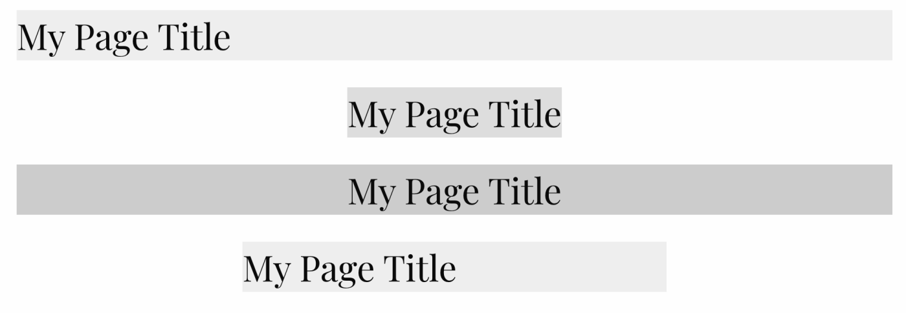

The image above shows, in order:

- A page title block set to default alignment, span 4 (of 4 columns), position auto;
- A page title block set to center alignment, span 4, position auto;
- A page title block set to default alignment with centered text, span 4, position auto;
- A page title block set to default alignment, span 2, position 2. 

Note that the second page title is still spanning all 4 columns on the page and nothing can be positioned to either side of it. 

### Delete and reorder blocks
You can delete any of the blocks by clicking on the trash can icon located in the upper right corner of the block. 


Change the order of blocks by clicking on the three horizontal lines on the upper left corner of any block and then dragging and dropping it to the desired location.

## Page blocks

Page blocks are designed to offer an array of authoring tools for whatever kind of page you may be writing. Third-party and user-submitted modules may add other page blocks to the ones built and maintained by the Omeka team. 

### Asset

Displays files that are not media attached to items (such as a logo or banner). Users may upload new assets or select from existing assets.

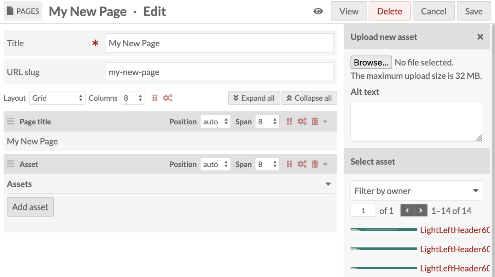

Once an asset is selected, the user has the option to include additional asset information:

- Page link: Select a page from within the site, so that the asset becomes a link to it. The selected page's title will also appear as a text link above or beside the asset.
- Alternative link title: If a page link is set above, you can control the text display here. If nothing is entered, the link will default to the page's title.
- Caption: Text that will be displayed below or near the asset, not linked.


Display of these elements will depend on the theme and any [templates](#block-settings) that are available. 

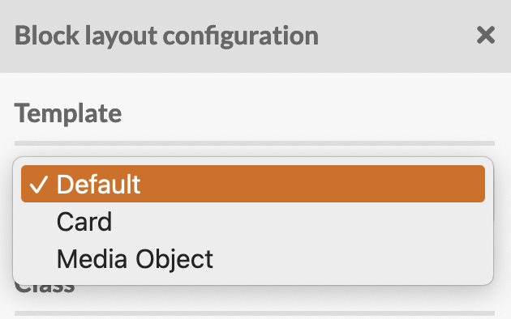

Below is the Asset page block with the same asset chosen and the same link set, with each of the three in the Foundation template settings - Default, Card, and Media Object:

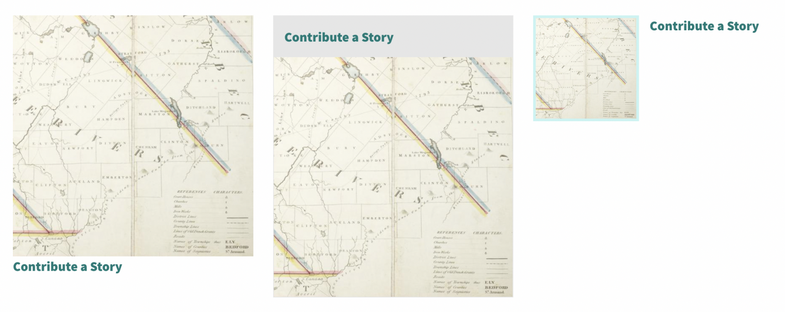

Click "Apply changes" to save your settings, then save the page.

### Browse preview

Adds a block of resources on a page, identically to the "Items" and other browse page included with your Omeka site.

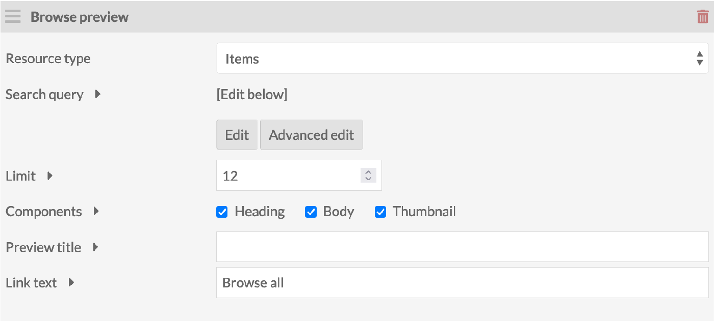

From the **Resource type** dropdown, choose the kind of resource you want to display in the block: Items, Item Sets, or Media. 

Using the **Search query** element interface, select your subset of resources, or leave it blank.

Click the "Edit" button to reveal the advanced search interface in the drawer. Once you are satisfied with the subset of resources in your search, clicking the "Apply" button will set the subset of resources for the Browse block.

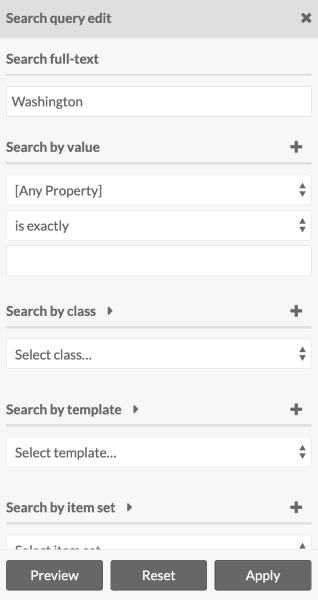

Once a query has been set, you can click "Edit" to update the universe of resources. You can click "Advanced Edit" to directly edit the query string. Finally, you can "Clear" a query to start over. If you have cleared a search in error, you can "Restore" it.

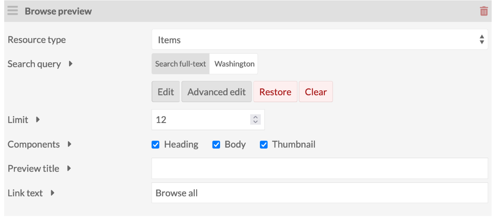

The **Limit** field lets you set the number of resources to display in the block; any additional results from your query can be accessed on a search page linked from the block (you set the text of the link in the **Link text** field below).

The **Components** field lets you decide what to display in your browse for each resource: the Heading, the Body, and/or the Thumbnail. If not set in your [site settings](site_settings.md#browse), Heading defaults to resource title and Body to resource description.

The **Preview Title** field sets the heading above the browse section on the page.

The **Link text** field sets the link text at the bottom of the block - the block will only display as many results as you set in the **Limit** field above.

The Browse preview block has a template option in some themes. For example, the Foundation theme allows you to override the site settings for browsing with the options of displaying resources in a list or grid in this block. 

### HTML

Creates an HTML box in which you can add formatted text and links. When you click in the box, a formatting menu will display above the text field. 

Basic block: 


With formatting menu open:


You can embed content from elsewhere on the internet using iFrames or other embed codes in the HTML block:

1. Click into the HTML block content area to show the formatting menu and then click on the button labeled "Source".  This will open a dialog box where you can write HTML content.
1. Copy and paste the embed code into the source code editor. For example, here is the embed code from an Omeka screencast hosted on Vimeo. 
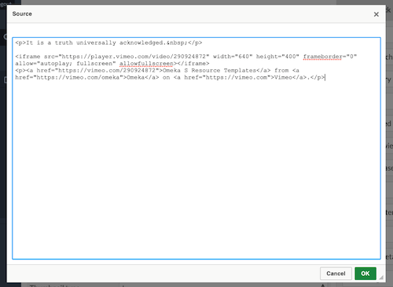
1. Click the green "OK" button at the bottom of the editor. 
1. Your embedded material should show up in the HTML block either as a gray rectangle or as the embedded content. 
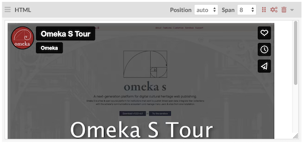

If you have the [Zotero Citations module](../modules/zoterocitation.md) installed, you can insert a Zotero bibliography into this field. Look for the Zotero button in the formatting menu (a big red Z). 

### Item with metadata

Displays an item along with all associated metadata (entered when creating or editing the [item](../content/items.md)), identically to the item-view page in your theme. 

Add attachments in the same manner as the [media embed](site_pages.md#media-embed) page block.


Many themes will not show the primary media in this display, although some do. Here is the page block in the Center Row theme:

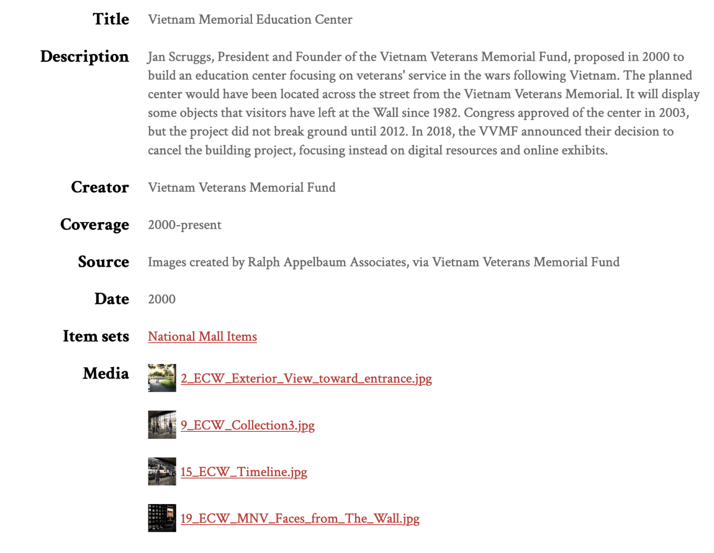

### Line break

Adds a transparent or opaque line break to the page. Select whether the line is transparent or opaque from the dropdown.


In Normal flow layout, the line break block will clear all blocks and floats. 
In Grid layout, you can set the length of the line using the Span setting:


### List of pages

Displays a bullet list of linked pages. You may select from pages that are within the site. Other navigation items, such as Custom URLs and Browse pages, are not available.

Click the "Add pages" button in the block to reveal a drawer that contains all of the pages in the site. Click on the individual page to add it to the list.


You may drag and nest pages into any order.


### List of sites

Displays a list of all of the sites on your Omeka S installation, similarly to the "Index of sites" page that can be shown at the root of your installation. This block has the following options:

- Sort sites by: Alphabetical order (A-Z); Oldest first; Newest first. By default this is set to alphabetical. 
- Maximum number of sites allows you to limit the number of sites that display in the block. If left blank, all sites will display.
- A checkbox to allow viewers to page through the full list of sites, if a display limit is set.
- A checkbox to show site summaries.  
- A checkbox to show site thumbnails.
- A checkbox to exclude the current site from the list. 


This block can be useful if you designate one site as the "home" site for your installation, which has general information about the institution or your collection, and then use this to link visitors to a collection of digital exhibits or essays that build off your collection. 

Here is the List of Sites block as displayed in the Papers theme, with pagination, summaries, and thumbnails:


### Media embed

Displays one or more pieces of media associated with items in the site's item pool. 

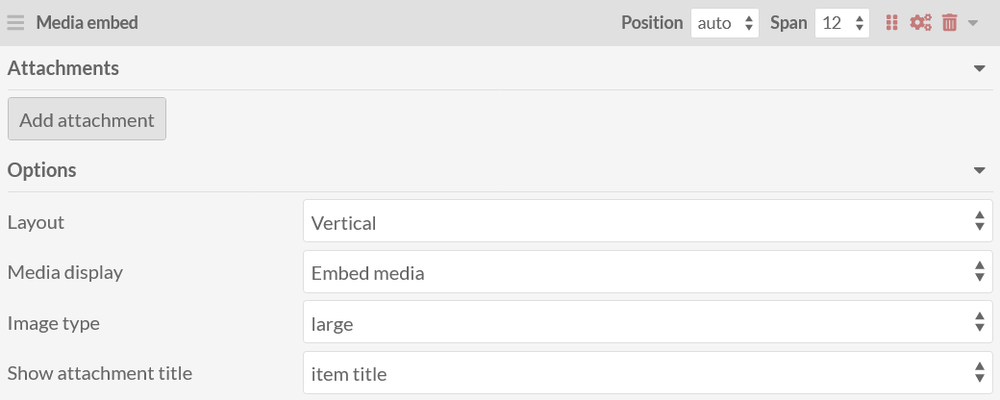

The Media block has the following options: 

- Layout: choose from vertical or horizontal layout. A horizontal row of items will contain a maximum of 4 before wrapping to a new row, depending on the width of the page block.
- Media display: choose to display the original uploaded media, or the Omeka-generated thumbnails only. If you embed media, videos, IIIF manifests, and other rich files will display at their original size, as well as audio players, depending on the width of the page block. If you choose thumbnails only, you will see derivative video thumbnails, and fallback images for media such as audio. Images will always show a derivative, the size chosen from one of the thumbnail sizes in the next dropdown. Note that you can only embed a PDF viewer using this block if the [PDF Embed module is installed and active](https://omeka.org/s/modules/PdfEmbed/){target=_blank}; otherwise a derivative image will display. 
- Image type: choose from large, medium, and square thumbnail sizes for any images you have added to the set. These sizes are set [at an installation level](../configuration.md#thumbnails), but may appear smaller depending on the width of the page block.
- Set the attachment title as:
	- item title (title of the attached item);
	- media title (title of the specific piece of media you selected from the item); or
	- no title.

Each item added to the Media embed block can also have a rich-text caption that displays under the title. 

To **add media to the block**, click the "Add attachment" button. 

On loading, the drawer will show a list of your items, most recent first. You can select from the first page, page through using the forward and back arrows, or search using the search bar. You can select from the first page, page through using the forward and back arrows, or search using the search bar. 


 
If you have a large number of items to navigate, or multiple items with the same title, you can use the "Filter search" options by clicking the triangle button to the right of its label. 
 
These options are:

- Filter by class: opens a dropdown to select from all of the classes for the vocabularies in the Omeka installation.
- Filter by item set: opens a dropdown to select from all item sets in the installation (not just those added to the site on which you are working).
- Filter by item ID: you can put in the specific Omeka ID for an item. 

Once you have applied your changes to the filter, you must click the search button (magnifying glass icon) to apply the filters and run the search.  


Once you’ve selected an item, the drawer will shift to that item’s information. You can add a caption and select which media (if more than one) you want to use. To return to the list of items, click the "Select item" button at the top of the drawer. Be sure to click the "Apply changes" button at the bottom of the drawer. 

If you wish to display multiple media from the same item, add the same item to the media embed block multiple times and manually choose the media for each entry. 


To add multiple items at once, click the "quick add" slider just above the list of items in the right hand drawer. This will add a checkbox to the left of each item. Check the boxes of those items you want to add to the block, then click the "Add selected" button at the bottom of the drawer.


!!! note
	In the Normal Flow layout (not in Grid), if you want media to appear beside a block of text, place a media block *above* an HTML block and choose either left or right for alignment. In the example below, the media has a thumbnail type of "medium", alignment "right," and attachment title of the "item title": 

	

	Placing a media block *after* an HTML block in the Normal flow layout will cause the media to appear below the end of the HTML block contents.

	In  Grid layout, you can place a media block before or after an HTML block and determine the placement based on the span and position you assign it.

### oEmbed

Allows you to embed media from third-party websites such as Flickr, Vimeo, YouTube, SoundCloud, and more. You can usually input the URL directly from your browser, or the link provided by the sharing feature from your chosen site. 

For example, links in these formats should all work: 

- https://vimeo.com/381092531
- https://www.youtube.com/watch?v=W8r-tXRLazs
- https://youtu.be/W8r-tXRLazs?feature=shared

You cannot save the page without any URL in the oEmbed block, and you can't rewrite the URL after the page has been saved.


After saving the URL you can view the Advanced settings, which includes information for the formatting of the oEmbed (uneditable), and a checkbox to refresh the oEmbed.

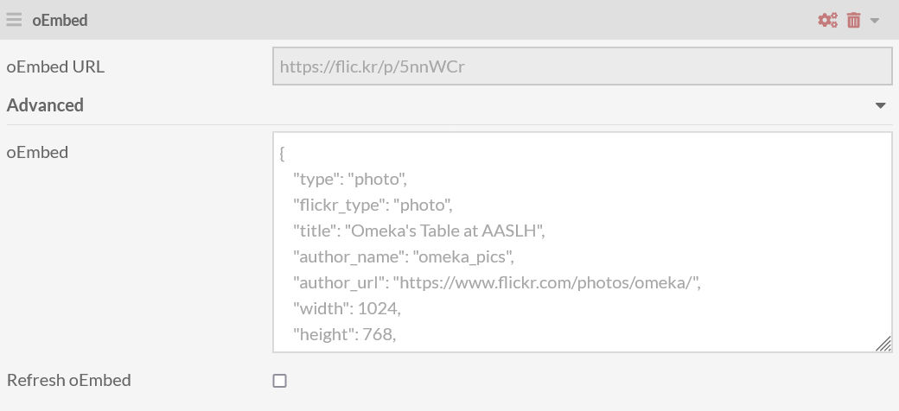

The source of the media will send a hard-coded size that you cannot modify, except to place the oEmbed in a smaller container. In the Normal layout, the oEmbed placement will be determined by the float. In Grid layout, it will span the number of columns that you choose.

Depending on which site the embed is from, there will be different features available inside the media display. Some examples include:

- Flickr: includes buttons to share on Facebook, Tumblr, X, and Pinterest, or to take you to the media on Flickr. The caption, creator, and attribution are also featured.
- Vimeo: includes buttons to like, add to watch later, and share. In addition to the play and volume controls, there are options to enable closed captions, view a transcript, view settings, make the video full screen, or view the video on Vimeo.
- Youtube: includes buttons to make the video full screen and watch the video on YouTube.

You may find [oEmbed's provider list](https://oembed.com/providers.json){target=_blank} helpful.

!!! note
	Note that you can embed media from many of the oEmbed-enabled sites in other ways, which may allow you more styling and customization control. For example, you can add a Youtube video to an item and then display it with the Media embed block, or paste the embed code offered on Vimeo or Flickr into an HTML page block.

### Page date and time

Displays the page's first-created date, and/or last-modified date, with or without a precise timestamp.


You have the option of displaying the created, modified, or both dates, as well as formatting for dates and times. If you choose to display both date and time, it will appear with "at" between the two values:

```
<p>Page created: September 6, 2022 at 7:17:35 PM GMT</p>

<p>Page modified: September 7, 2022 at 9:38:39 PM GMT</p>
```

Date format options:

- None
- Short (`7/6/22`)
- Medium (`Sep 6, 2022`)
- Long (`September 6, 2022`)
- Full (`Tuesday, September 6, 2022`).

Time format options:

- None
- Short (`7:17 PM`)
- Medium (`7:17:35 PM`)
- Long (`7:17:35 PM GMT`)
- Full (`7:17:35 PM GMT`).

### Page title

Displays the title of the page. This block is added by default to every new page, but can be deleted or rearranged. The page's title displays inside an `<h2>` tag. 

### Table of contents
If the page has child pages, you can add a TOC block for those pages. This is not a table-of-contents for the whole site, only for things that sit underneath the current page. 

If the Omeka theme already displays a table of contents by default, inserting this block into your page will replace that display. For example, the Papers theme will show all the child pages of the current page just under the breadcrumb; if the TOC page block is added to the page, that will disappear. In Thanks Roy, the TOC subnavigation appears in a column to the left of the page content; if the TOC page block is added to the page, that column will disappear and the page contents will take up more screen width. 

The Depth option allows you to set how many levels of child pages you want to display. The default is 1. Please enter a whole number. You cannot leave this blank. 


Add and arrange pages using the [Site Navigation](site_navigation.md) settings. If you wish to display pages from across the site, or in a custom order, use the [List of pages block](#list-of-pages). 

Note that you can turn on or off the page subnavigation in the [site settings](site_settings.md#general-settings). 

### Other blocks
For module-specific blocks, such as [Collecting](../modules/collecting.md) or [Mapping](../modules/mapping.md), see the documentation for that module.

## Delete a page
To delete a page, go to the Pages section of the relevant site. Click the delete (trash can) button at the right end of the row for that page. 

A drawer will open on the right side of the page asking you to confirm that you wish to delete the page, with the name of the page displayed under the confirmation button. To proceed, click the "Confirm delete" button. Otherwise, click the "X" in the upper right corner of the drawer to cancel.


