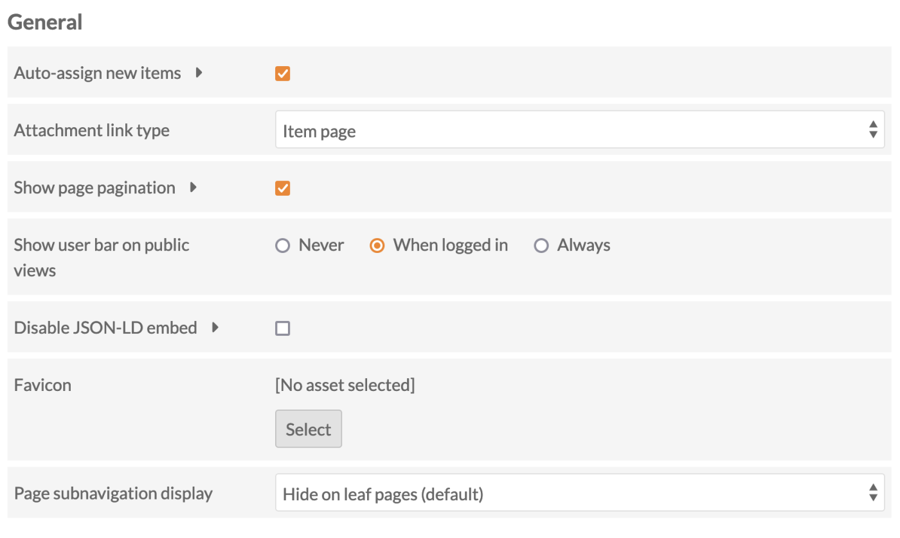
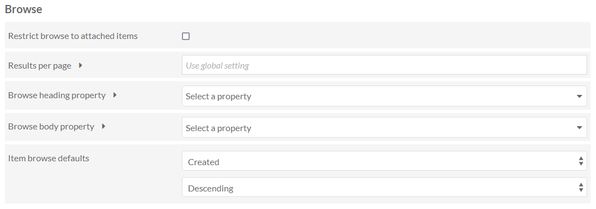
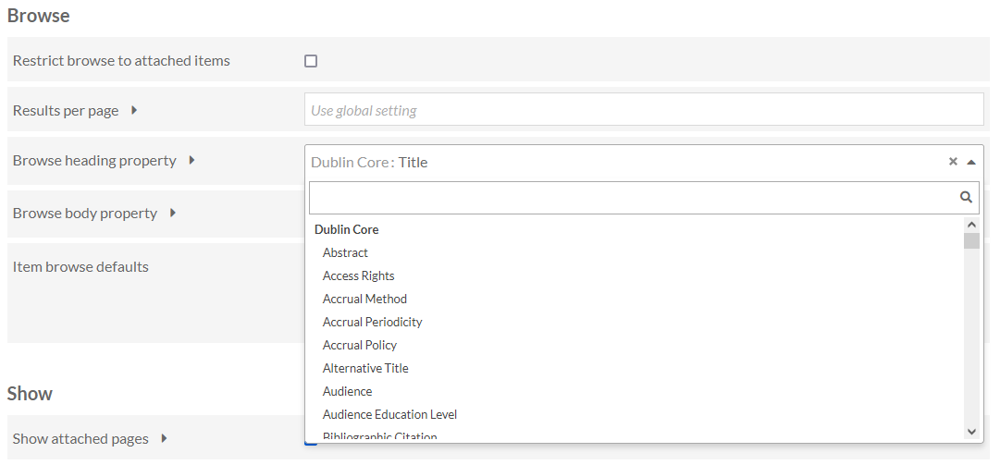

# Site Admin

The Site Admin page allows you to manage the main settings for the site on which you are working. Changes will only be applied to this site and will not change other sites' settings. 

In the left-hand navigation, once you have select a site from the Sites page, it is the first link under the site title, represented with a gear icon. 

The Site Admin page has two tabs: Info and Settings.

## Info 
The site info settings for an Omeka S site are where you can change the basic info for the site - the same information you entered when you created the site. You can change the:

* **Title**: a text field. 
* **Slug**: the URL for your site.
* **Summary**: the brief description of what it is about which will appear on your installation's landing page and on the [list of sites](../sites/site_pages.md#list-of-sites). 
* **Thumbnail** - an image for your site which will appear on your installation's landing page and on the [list of sites](../sites/site_pages.md#list-of-sites).

In the upper right hand corner of the window on this tab, you can use buttons to:

- Set your site as public or private using the eye icon
- Delete the site
- Cancel making changes
- Save your changes.

The **make public/private** button (eye icon) is used to both indicate and set whether the site is visible to the public or only to users of this Omeka S installation 

Site is public: {style="display:inline;"}

Site is private: {style="display:inline;"}

## Settings
The Settings page is divided into three sections: **General**, **Browse**, and **Search**. 

To implement any changes you make, click "Save" at the top right of the browser window when you are done. To leave without saving changes, click "Cancel".

### General settings

**Auto-assign new items**: a checkbox which sets whether new items are automatically added to the site. If checked, every new item will be added to the site, regardless of the item's owner. Note that item owners may unassign their items from the site at any time, in the item's edit pages.

**Attachment link type**: sets the target of links from attachments you add to [site page blocks](../sites/site_pages.md#page-blocks) (for example, in an [item showcase](../sites/site_pages.md#item-showcase)). It offers a dropdown with the following options:

- Item page: clicking on the attachment takes users to the item page associated with the attached media.
- Media page: clicking on the attachment takes users to the media page.
- Direct link to file: clicking on the attachment takes user to the file alone. 

**Embed media on item pages**: when checked, any linked media (such as videos) will be embedded on the item pages. When unchecked, site visitors will click through to view playable media.

**Show page pagination**: when checked, "Previous" and "Next" links will display at the bottom of every page in the site, proceeding through your navigation. If unchecked, these links will not display.

**Show user bar on public views**: sets whether there is a bar across the top of public site pages which allow users to access the admin side of the site. 

When users are logged in, the user bar has the following options:

- Installation Title: takes you back to the installation admin.
- Site Title: takes you back to the landing page for managing the site (site/show).
- Resource view: depending on what you are viewing, this is a link to the admin side management for [Pages](../sites/site_pages.md), [Items](../content/items.md), or [Item Sets](../content/item-sets.md).
- Edit link for that page, item set, or item. 
- User's display name: takes you to your user page.
- Logout: logs out current user.

When users are not logged, the user bar only displays a login option.

The options for this setting are:

- Never
- When identified (when logged in) 
- Always.

**Disable JSON-LD embed**: Check this box to disable JSON-LD embedding on resource browse and show pages.

### Language

**Locale** is dropdown menu to select the language code for this site. By default this will be set to the same as the global locale setting for the entire Omeka S installation. To change, select a language from the dropdown menu.

**Filter values based on the site locale** is a checkbox to restrict visible values to those that match the site language setting and those that do not have a locale ID.

**Show language labels for values** is a checkbox to control the visibility of the language label for each value on show pages.

### Browse settings

**Restrict browse to attached items** is a checkbox. If checked, the Browse functions of your site will only show items which have been added to a page block. If unchecked, browse pages and blocks on your site will include all items in the Item Pool.

**Results per page** sets the number of results per page on browse pages by entering a number. If left blank, the site will use the default from the [global settings](../admin/settings.md).

Depending on the [site theme](../sites/site_theme.md), you may want to make this a multiple of 4 for a more elegant display. Note that using very large numbers (50, 75, 100) may cause browse pages to load slowly.

**Browse heading property** sets which property to use as the heading for each resource on a browse page. By default, this is Dublin Core: Title. The dropdown allows you to select from all available vocabularies, and includes a search bar to quickly find the desired property.

**Browse body property** sets which property to use as the body text for each resource on a browse page. By default, this is Dublin Core: Description. The dropdown allows you to select from all available vocabularies, and includes a search bar to quickly find the desired property.

### Show 

**Attached Pages**: When this box is checked, site pages to which an item is attached will display on the public view of that item.

**Value Annotation**: When this box is checked, Value Annotations will be visible on the public views for resources (items, item sets, media).

### Search 

**Search type** is a dropdown which allows you to set from which site(s) the search bar generates results: 

- This site: only return results from this site.
- All sites: return results for all sites on the installation. 

**Search resources** is a series of checkboxes which let you select which types of resources are searched from the main search field on the site. Select from: site pages, items, and item sets. You can select all if you want.

**Templates** allows you to limit the properties for advanced item or item set search to only properties included in a template or templates. When this field is empty, the "Search by Value" on the advanced search will display all properties from all vocabularies in the Omeka S installation. Applying a template not only limits the options in the dropdown, it also includes your alternate labels for properties: 

Click in the field to add a template; you can add more than one template by clicking in the field again.

**Restrict to templates** will restrict search results to only those items which are using the selected templates. 
