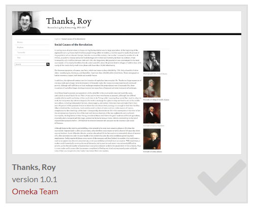
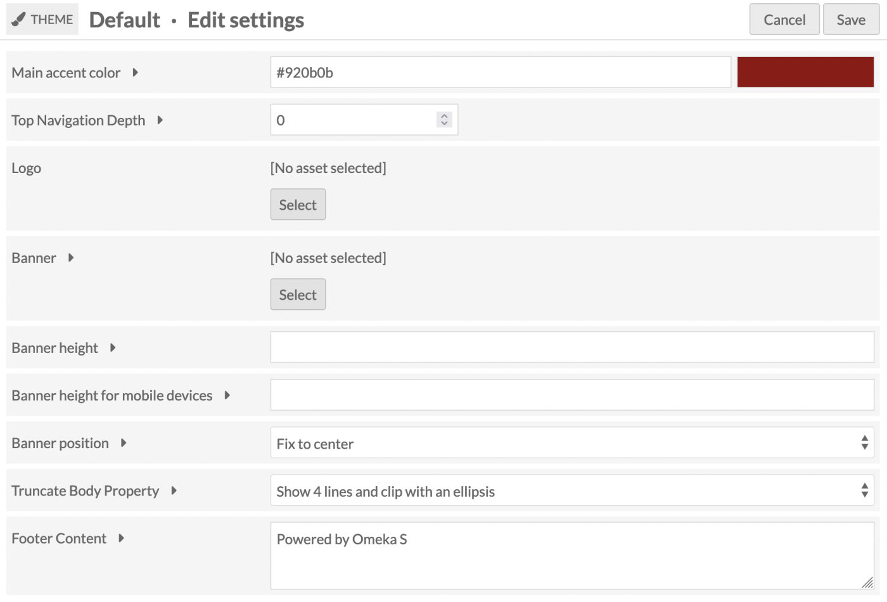
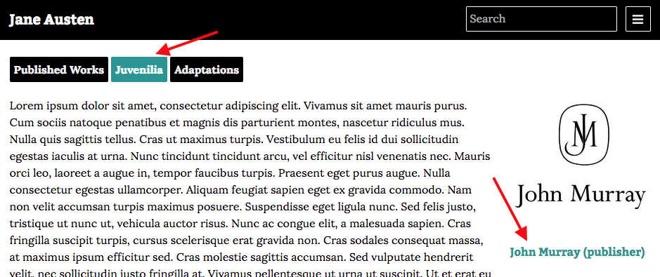

# Theme Selection

The Theme section of the Site menu allows you to select the theme for your site, and to set theme-specific settings. 

## Install a theme

In order to appear on the **Themes** page for sites, themes must be manually added to the `/themes` folder of the installation, using an FTP program or an SSH connection.

To add a theme to the site using FTP:

1. Download the zipped theme to your computer.
1. Open your FTP client, log on to the server that houses the Omeka S install and navigate to the `/themes` folder (this should be located in the main folder of the install).
1. Upload the zipped theme to the `/themes` folder .
1. Unzip the theme.

You can also use git to clone a theme directly from the git repository. Do this only if you are comfortable with git.

To **uninstall a theme**, simply delete the folder from the `/themes` directory in your Omeka S installation. All settings on that theme, from all sites, are saved elsewhere and will not be deleted. This means you can reinstall the theme again at a later date and recover your settings.

To **update a theme**:

1. Download the new version of the theme you would like to update.
1. Open your FTP client and log on to the server that houses the Omeka S install.
Navigate to the `/themes` folder.
1. Move the old copy of the theme to your computer.
1. Upload the zipped folder for the latest version of the theme to the `/themes` folder.
1. In your FTP client, unzip the new version theme.
1. On the Omeka S installation dashboard, go to a Site, then to the Themes page, and verify that you are seeing the new version of the theme.
1. Check to be sure your settings have been preserved and there are no errors. After this, you can safely delete the old theme folder that you saved to your computer.

## Select a theme

Currently installed themes will be available for selection in the process of [adding a new site](../sites/index.md). Click to the "Theme" tab before saving to select one, then save your site. If you do not select a theme, your new site will use the Default theme.

When you navigate to the Theme screen of a site, the currently active theme will appear on the top of the page.

A large image of the active theme appears on the left, with the theme title, version, creator, and a button to "Edit theme settings" on the right.

Below the current theme are tiles for all other installed themes. The tiles have a small image of the theme in action, the theme name and version, and a link to the creator of the theme. 

To switch themes, click on the theme which you want to use. It will highlight slightly in gray, with a checkbox in the lower right-hand corner of the theme tile. 

Click the "Save" button in the upper right-hand corner of the window to save changes. Click the "Cancel" button to leave without saving your changes. 

## Theme settings

Theme settings allow you to customize aspects of the site's theme, such as adding a logo to the top or writing footer text. 

To edit the settings of your selected theme, click on the button labeled "Edit theme settings" to the right of the current theme thumbnail.

Note that your settings for a specific theme on a site will be saved when you change themes. For example, if you customized the footer for the default theme, then switched to using The Daily for a while, then switched back to the default theme, your custom footer would still be there.

### Settings options

Depending on which theme you have selected, you may see any of the following setting options:

#### Logo

(All themes)

Upload a asset (file) to function as a logo in the header of your site. Allowed file types are: jpg, gif, png, svg, and svgz.

This asset is not associated with any of the items, and will be stored separately; once uploaded to a site you will be able to select it again without re-uploading even if you change themes for a while. Any asset uploaded to one site will be available for all sites on the installation.

To upload a logo, click the "Select" button. This will open a sidebar where you can either upload a new file from your computer or choose from assets already uploaded to the installation.

Note that the logo completely replaces the header, including the site title, for the site, so you may want to consider an image with text if it is important to you that users see the site title.

To remove a logo, click the "Clear" button in that block (only visible when a logo is active) and save changes.

#### Footer content

(All themes)

A text field in which you can enter content to appear in the footer of the site.

By default, the message is "Powered by Omeka S".

You can add HTML formatting to the text by manually adding the tags. 

#### Top Navigation Depth

(Default, Cozy, Foundation)

Top Navigation Depth allows you the limit the depth of the top navigation menu on the public side of the site.  The default setting, 0, does not restrict the number of levels of the top navigation menu. Setting it to one would only show the top-level pages or links of your site.

#### Color Selection

(Default, Cozy, The Daily)

The themes Default, Cozy, and The Daily include an option to enter values for the *main accent color*; Cozy also has an option for the *navigation background color*.

The Main Accent color is used for link text and on-hover colors, as in the image below: 

The navigation background color sets the color of the navigation sidebar for the theme. 

Edit either field by typing a color value into the field. Either a triplet or a six-character hexadecimal code will work. Once you have entered a valid value, the color bar on the left will automatically update to show the color entered, even without saving changes.

The default values are stored in the prompt text for the field. For the Cozy theme, the default values are: the main accent color is `087b94` and the navigation background color is `bfdcdc`.

### Layout for browse pages 

(Center Row, Foundation)

Select how to display items within their browse views.

* **Grid**: Items are organized into rows and columns. This is recommended for items that prominently feature images.
* **List**: Items are stacked into a single column.
* **Toggle (default: grid)**: Site visitors can choose to display the browse views as grids or lists, with grids as the default.
* **Toggle (default: list)**: Site visitors can choose to display the browse views as grids or lists, with lists as the default.

#### Foundation theme settings

Foundation is a theme that comes with a few default stylesheets for fast prototyping or getting started with modifying themes. As a result, it has some unique settings. For more information on using Foundation, including working with Sass, see the [theme ReadMe file](https://github.com/omeka-s-themes/foundation-s/blob/master/README.md){target=_blank}.

Settings not described above: 

* **Stylesheet:** The theme provides 4 style options.
	  * **Default** uses ZURB Foundation's default styles for prototyping, which are all viewable in their documentation under the [Kitchen Sink](https://get.foundation/sites/docs/kitchen-sink.html){target=_blank}.
	  * **Revolution** aims to capture the feel of old documents and juxtaposes it with a bright red accent. It includes a textured paper background image.
	  * **Sea Foam** offers a clean, friendly look with a teal palette.
	  * **Inkwell** features a high contrast serif family for its typography, as well as sunny yellow accents.
* **Navigation layouts:** Global navigation can display as a **horizontal top bar with optional dropdown menus** or a **left vertical column**.
* **Show Top Navigation Child Pages:** Toggle display of child pages within the main navigation. If unchecked, only the top-level navigation will display. 
* **Layout for Show Pages:** Resource metadata can show display as **stacked** with properties as headings above their values, or **inline** with properties as headings inline with their values.
* **Truncate Body Property:** Set how much of the browse body property displays on the browse page. You can:
	* **Show full value** which displays all of the property text. 
	* **Show 4 lines and fade out** which displays 4 lines of text with a fade at the end of the text block.
	* **Show 4 lines and ellipsis** which displays 4 lines of text concluding with an ellipsis (...).